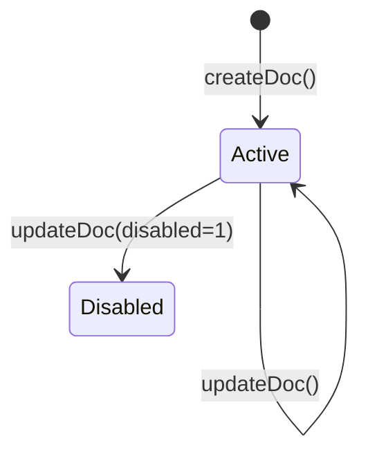
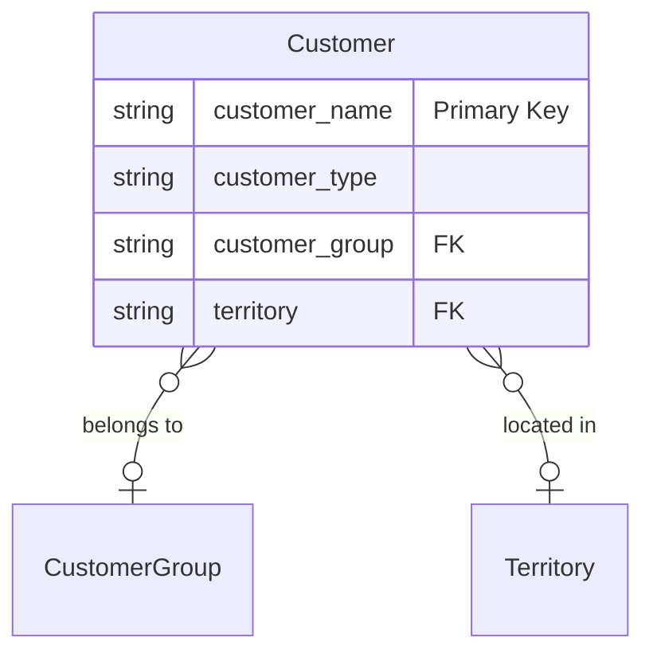
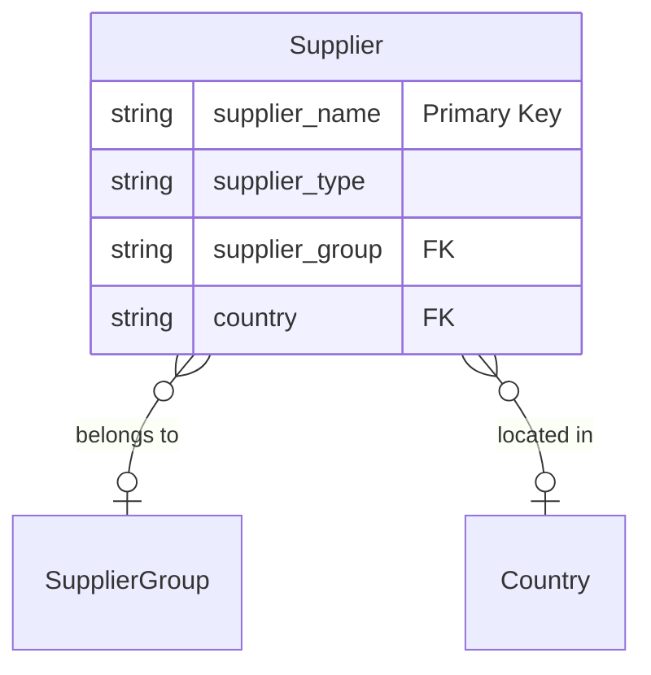

# Customer, Supplier — Canonical Entity Documentation

**Domain:** Master Data — Business Partners.
**Status:** `DOCUMENTED` (this package, MD-R2, 2026-09-22).
**Frontend routes:** `/master-data/customers`, `/master-data/suppliers` (list/detail/create each).

**Business Partner unification remains an open architecture decision, not implemented.** The
shipped "Business Partner domain" package only grouped Customer and Supplier under one Sidebar
section and route prefix — it did **not** unify them at the data or component level. ERPNext keeps
them as two fully separate DocTypes (confirmed live, both schemas pulled independently this
session), and this document documents them separately for that reason. See
`docs/master-data-architecture.md` §10 item 1 — this package does not resolve that question, and
does not introduce a unified model.

## Source of truth
- **Live schema**: `mcp__ceylon-stack__get_doctype_fields("Customer" | "Supplier")`, 2026-09-22 —
  `VERIFIED`.
- **Live sample data**: `mcp__ceylon-stack__list_documents` for both doctypes, 2026-09-22 —
  `VERIFIED`.
- **Frontend code**: `apps/frontend/src/app/(app)/master-data/{customers,suppliers}/`,
  `CustomerForm.tsx`, `SupplierForm.tsx`. `CODE-INFERRED`, cited file:line.

---

## 1. Customer

### Identity / naming
`customer_name` (Data, **required**). Live sample data (`VERIFIED`) confirms the document `name`
equals `customer_name` exactly — e.g. `"Colombo Steel Fabricators (Pvt) Ltd"`,
`"Ishara Jayawardena"`, `"Kasun Fernando"` — **name-field naming is the active mode on this
instance**, not the `naming_series` field also present in the schema (`CUST-.YYYY.-`). Standard
ERPNext gates this choice via Selling Settings' `cust_master_name` field; this instance's live data
confirms which mode is actually active without needing to read that setting directly.

### Important fields (live schema, `VERIFIED`) — ~50 total, key ones below

| fieldname | label | fieldtype | required | Link target |
|---|---|---|---|---|
| customer_name | Customer Name | Data | **yes** | — |
| customer_type | Customer Type | Select | **yes** | Company / Individual / Partnership |
| customer_group | Customer Group | Link | no | Customer Group |
| territory | Territory | Link | no | Territory |
| default_currency | Billing Currency | Link | no | Currency |
| default_price_list | Price List | Link | no | Price List |
| payment_terms | Payment Terms Template | Link | no | Payment Terms Template |
| customer_primary_address | Customer Primary Address | Link | no | **Address** |
| customer_primary_contact | Customer Primary Contact | Link | no | **Contact** |
| mobile_no / email_id / first_name / last_name | — | Read Only (derived) | no | — |
| accounts | Default Accounts | Table | no | Party Account |
| credit_limits | Credit & Overdue Limits | Table | no | Customer Credit Limit |
| is_internal_customer / represents_company | — | Check / Link | no | — / Company |
| companies | Allowed to transact with | Table | no | Allowed To Transact With |
| tax_id / tax_category / tax_withholding_category | — | Data/Link | no | — |
| disabled / is_frozen | — | Check | no | — |
| lead_name / opportunity_name / prospect_name | — | Link | no | Lead / Opportunity / Prospect |
| sales_team | Sales Team | Table | no | Sales Team |
| default_sales_partner | Sales Partner | Link | no | Sales Partner |
| portal_users | Customer Portal Users | Table | no | Portal User |

**Important relationship finding (`VERIFIED`):** Customer has **no direct field** pointing at a
general Address or Contact collection. `customer_primary_address`/`customer_primary_contact` are
single-record pointers only (populated after the fact), plus two dashboard-only `address_html`/
`contact_html` HTML widget fields. The actual Customer↔Address / Customer↔Contact many-to-many
relationship lives on the **Address/Contact side**, via their own `links` Dynamic Link child table
— see `secondary-masters.md`.

### Required fields
`customer_name`, `customer_type`.

### Link fields
`customer_group → Customer Group`, `territory → Territory`, `default_currency → Currency`,
`default_price_list → Price List`, `payment_terms → Payment Terms Template`,
`customer_primary_address → Address`, `customer_primary_contact → Contact`,
`represents_company → Company`, `default_sales_partner → Sales Partner`,
`lead_name/opportunity_name/prospect_name → Lead/Opportunity/Prospect`.

### Child tables
`accounts` (Party Account), `credit_limits` (Customer Credit Limit), `companies` (Allowed To
Transact With), `sales_team` (Sales Team), `portal_users` (Portal User), `supplier_numbers`
(Supplier Number At Customer). None read/written by this frontend.

### Lifecycle / docstatus
No `docstatus` field in the live schema returned — `VERIFIED` absent from the declared field list.
Note: `get_doctype_fields` returns only the doctype's own declared fields, not framework-level
metadata (`is_submittable` etc.) — the absence of a `docstatus` field is strong but indirect
evidence, consistent with standard ERPNext (Customer is not submittable), tagged
`DOCUMENTATION-INFERRED` for the submittability conclusion itself. See `MD-UNV-002`.

### Create/update/delete restrictions
- Create/update require `customer_name` (`apps/frontend/src/app/(app)/master-data/customers/actions.ts:30,50`,
  `CODE-INFERRED`).
- Fields actually sent, both create and update: `customer_name`, `customer_type`, `customer_group`,
  `territory`, `disabled` (`customers/actions.ts:18-26`) — **no other Customer field is exposed
  anywhere in this frontend.**
- Delete: not exposed (confirmed, whole-folder grep for `deleteDoc` returns zero matches).

### `allow_on_submit`
Not applicable — not submittable.

### Cross-document dependencies
Sales Order/Quotation/Delivery Note/Sales Invoice `customer` field; Work Order's optional
`sales_order` chain traces back to a Customer indirectly. Not re-enumerated here — see Sales
domain's own backend doc (does not exist yet — `docs/backend/02-sales/` is a real, open gap, see
`docs/ceylon-stack-master-backlog.md` §4/§6 CURRENT RELEASE item 4).

### Stock / accounting / manufacturing implications
`accounts` (Party Account) child table carries per-Company receivable-account overrides in standard
ERPNext (`DOCUMENTATION-INFERRED`, not confirmed against real records this session — no
`Party Account` sample was pulled). `credit_limits` governs standard ERPNext credit-limit
enforcement on Sales documents — not exercised by this frontend's own validation, relies entirely
on ERPNext's server-side check.

### Frontend route
`/master-data/customers` (list), `/master-data/customers/[name]` (detail/edit — no separate
read-only view, edit form renders directly), `/master-data/customers/new` (create).
`CODE-INFERRED`.

### Document Flow & Lifecycle

The Customer document is draftless.

### Entity Relationship Mapping

### Field Mapping & Translation Table

| ERPNext Native Field | Frontend Usage (`CustomerForm.tsx`) | Future Custom Backend (RDBMS) | Description & Notes |
| :--- | :--- | :--- | :--- |
| `customer_name` | `customer_name` | `id` (UUID / PK) | Primary Key. |
| `customer_type` | `customer_type` | `customer_type` (Enum) | |
| `customer_group` | `customer_group_id` | `customer_group_id` (FK) | |
| `territory` | `territory_id` | `territory_id` (FK) | |
| `disabled` | `disabled` | `is_active` (Boolean) | Inverted logic (1 = Disabled). |

Bespoke `CustomerForm.tsx` (not generic `MasterForm` — explicit comment,
`apps/frontend/src/components/MasterForm.tsx:16-22`: "Customer stays hand-rolled since Customer has
bespoke layout"). `disabled` checkbox is edit-only (`CustomerForm.tsx:66-71`).

### Current API / actions used (`CODE-INFERRED`)
- `createCustomerAction` → `createDoc<{name:string}>("Customer", fields)`
  (`customers/actions.ts:34`).
- `updateCustomerAction` → `updateDoc("Customer", name, fields)` (`customers/actions.ts:53`).
- List → `listDocs<CustomerRow>("Customer", {fields:["name","customer_name","customer_type",
  "customer_group","territory","disabled","mobile_no","email_id","default_currency"],
  orderBy:"modified desc"})` + `getCount("Customer")` (`customers/page.tsx:18-33`).
- Detail → `getDoc<CustomerDoc>("Customer", name)`, typed with only `name, customer_name,
  customer_type, customer_group?, territory?, disabled` (`customers/[name]/page.tsx:21`).
- No linked-Address/Contact display or edit anywhere on the Customer detail page —
  `AddressContactFields.tsx` is used only in Sales transactional docs (Quotation/Sales
  Order/Invoice/Delivery Note), confirmed by grep, **not** referenced under `master-data/customers`.

### Backend hooks/methods relied upon
None beyond standard REST create/read/update found in this frontend.

### Migration considerations
- Name-field naming (confirmed live) means `customer_name` doubles as both business identity and
  Frappe `name` — same rename-safety question flagged for Item applies here too
  (`docs/master-data-architecture.md` §10 item 2's Item-specific framing generalizes to any
  name-field-autonamed master; not previously stated this explicitly for Customer — worth carrying
  forward as its own open question, see `MD-UNV-004`).
- `customer_primary_address`/`customer_primary_contact` are `FRAPPE_CURRENT_BEHAVIOR` single-pointer
  conveniences layered on top of the real Dynamic Link relationship — a native backend's
  `REQUIRED_CEYLON_BEHAVIOR` is the many-to-many Party↔Address/Contact relationship itself, not
  necessarily this specific "primary pointer" shortcut field.

---

## 2. Supplier

Structurally near-identical to Customer — same shape, different field names.

### Identity / naming
`supplier_name` (Data, **required**). Live sample data (`VERIFIED`) confirms `name === supplier_name`
exactly — e.g. `"Lanka Metal & Coatings Supplies (Pvt) Ltd"`, `"MA Inc."`,
`"Summit Traders Ltd."` — name-field naming is active, not the `naming_series` field also present
(`SUP-.YYYY.-`).

### Important fields (live schema, `VERIFIED`)

| fieldname | label | fieldtype | required | Link target |
|---|---|---|---|---|
| supplier_name | Supplier Name | Data | **yes** | — |
| supplier_type | Supplier Type | Select | **yes** | Company / Individual / Partnership |
| supplier_group | Supplier Group | Link | no | Supplier Group |
| country | Country | Link | no | Country |
| default_currency / default_price_list / payment_terms | — | Link | no | Currency / Price List / Payment Terms Template |
| supplier_primary_address | Primary Address | Link | no | **Address** |
| supplier_primary_contact | Primary Contact | Link | no | **Contact** |
| accounts | Per-Company Accounts | Table | no | Party Account |
| is_internal_supplier / represents_company | — | Check / Link | no | — / Company |
| companies | Allowed to transact with | Table | no | Allowed To Transact With |
| tax_id / tax_category / tax_withholding_category | — | Data/Link | no | — |
| is_transporter | Is Transporter | Check | no | — |
| on_hold / hold_type / release_date | Block Supplier | Check/Select/Date | no | — |
| disabled / is_frozen | — | Check | no | — |
| portal_users | Supplier Portal Users | Table | no | Portal User |

Same relationship pattern as Customer, `VERIFIED`: no direct general Contact/Address collection
field — only `supplier_primary_address`/`supplier_primary_contact` single pointers, plus HTML
dashboard widgets. Real relationship lives on Address/Contact's `links` Dynamic Link table.

### Required fields
`supplier_name`, `supplier_type`.

### Link fields
`supplier_group → Supplier Group` (no dedicated frontend screen exists for Supplier Group — see
`docs/master-data-architecture.md` §10 item 5, still open), `country → Country`,
`supplier_primary_address → Address`, `supplier_primary_contact → Contact`,
`represents_company → Company`.

### Child tables
`accounts`, `companies`, `portal_users`, `customer_numbers` (Customer Number At Supplier). None
read/written by this frontend.

### Lifecycle / docstatus
No `docstatus` field in the live schema — same tiering as Customer: `VERIFIED` absent from declared
fields, submittability conclusion itself `DOCUMENTATION-INFERRED`. See `MD-UNV-002`.

### Create/update/delete restrictions
- Fields sent, both create and update: `supplier_name`, `supplier_type`, `supplier_group`,
  `country`, `disabled` (`apps/frontend/src/app/(app)/master-data/suppliers/actions.ts:18-26`) —
  identical shape to Customer's, `customer_*`→`supplier_*` and `territory`→`country`.
- Required: `supplier_name` (`suppliers/actions.ts:30,50`).
- Delete: not exposed (confirmed).

### `allow_on_submit`
Not applicable — not submittable.

### Cross-document dependencies
Purchase Order/Receipt/Invoice/RFQ/Supplier Quotation `supplier` field. See Buying domain's own
backend doc (does not exist yet — same open gap as Sales, see `docs/ceylon-stack-master-backlog.md`
§6 NEXT).

### Stock / accounting / manufacturing implications
Same `accounts` per-Company payable-account pattern as Customer, `DOCUMENTATION-INFERRED`, not
confirmed against real records this session.

### Frontend route
`/master-data/suppliers` (list/detail/create). `CODE-INFERRED`.

### Document Flow & Lifecycle

The Supplier document is draftless.

### Entity Relationship Mapping

### Field Mapping & Translation Table

| ERPNext Native Field | Frontend Usage (`SupplierForm.tsx`) | Future Custom Backend (RDBMS) | Description & Notes |
| :--- | :--- | :--- | :--- |
| `supplier_name` | `supplier_name` | `id` (UUID / PK) | Primary Key. |
| `supplier_type` | `supplier_type` | `supplier_type` (Enum) | |
| `supplier_group` | `supplier_group_id` | `supplier_group_id` (FK) | |
| `country` | `country_id` | `country_id` (FK) | |
| `disabled` | `disabled` | `is_active` (Boolean) | Inverted logic (1 = Disabled). |

Bespoke `SupplierForm.tsx` (`apps/frontend/src/components/SupplierForm.tsx`) — structurally
near-identical to `CustomerForm.tsx`; `disabled` edit-only.

### Current API / actions used (`CODE-INFERRED`)
- `createSupplierAction` → `createDoc("Supplier", fields)` (`suppliers/actions.ts:34`).
- `updateSupplierAction` → `updateDoc("Supplier", name, fields)` (`suppliers/actions.ts:53`).
- List → `listDocs<SupplierRow>("Supplier", {fields:["name","supplier_name","supplier_type",
  "supplier_group","country","disabled","mobile_no","email_id","default_currency"]})` +
  `getCount("Supplier")` (`suppliers/page.tsx:18-33`).
- No Address/Contact display/edit on Supplier pages either.

### Backend hooks/methods relied upon
None beyond standard REST create/read/update.

### Migration considerations
Same as Customer — name-field naming, rename-safety open question generalizes here too.

---

## Cross-cutting: Business Partner relationship gap (real, not just a documentation gap)

**Finding, `VERIFIED`/`CODE-INFERRED` combined:** ERPNext's canonical Customer/Supplier↔Contact/
Address relationship (the `Dynamic Link` child table on Contact/Address — see
`secondary-masters.md`) is **not exercised by this frontend at all**:
- Contact and Address list pages are global, unfiltered — no `filters` argument scopes them to any
  parent record.
- Neither `createContactAction` nor `createAddressAction` writes a row to the `links` child table —
  Contacts/Addresses created through `/master-data/contacts` or `/master-data/addresses` are not
  attached to any Customer/Supplier through this UI.
- Neither the Customer nor Supplier detail page displays or edits a linked Address/Contact list, or
  exposes `customer_primary_address`/`customer_primary_contact` (Supplier equivalents) at all.
- `AddressContactFields.tsx` (which does select `customer_address`/`contact_person`/
  `shipping_address_name`) is wired into **Sales transactional documents only** (Quotation, Sales
  Order, Sales Invoice, Delivery Note) — not into the Master Data Customer/Supplier screens.

This is a real functional gap in the shipped Business Partner domain package, not merely something
this documentation pass failed to notice — see `MD-UNV-003` in the unverified-behaviours register.
It does not block this package (documentation only) but should inform any future Master Data or
CRM package touching Customer/Supplier↔Contact/Address linkage — including the CRM dependency map
in `docs/master-data-architecture.md` §12, which assumes Customer/Contact/Address already
interoperate correctly.

## Error Handling & Admin Logging

*   **User-Facing Errors**: Exceptions (e.g., missing fields, duplicate names, validation rules) are caught and surfaced via `humanizeError(e)`, which translates HTTP 403 / 409 and extracts Frappe's native `_server_messages` into readable UI alerts.
*   **Admin Observability**: All network failures, HTTP non-200 responses, and ERPNext exceptions are wrapped in `ErpNextError` and forwarded asynchronously to the centralized Admin Observability center (`smart_factory.api.observability`).
*   **Traceability**: Every error log is tagged with a `correlationId` that is safe to display to the user for support ticketing, ensuring backend exceptions can be traced exactly to the frontend action that caused them.

## Cancellation Rules & Dependencies

Master Data entities in ERPNext (like Item, Customer, Supplier, Warehouse) are Draftless. They do not have a `docstatus` field and cannot be "Cancelled" (`cancelDoc` does not apply).
*   Instead of cancellation, these entities use a `disabled` flag (`disabled = 1` or `disabled = 0`) to deactivate them.
*   The frontend exposes this `disabled` checkbox on the edit forms for these entities, allowing them to be soft-deleted or hidden from transactional dropdowns without breaking historical relational integrity.
