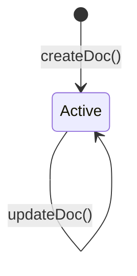
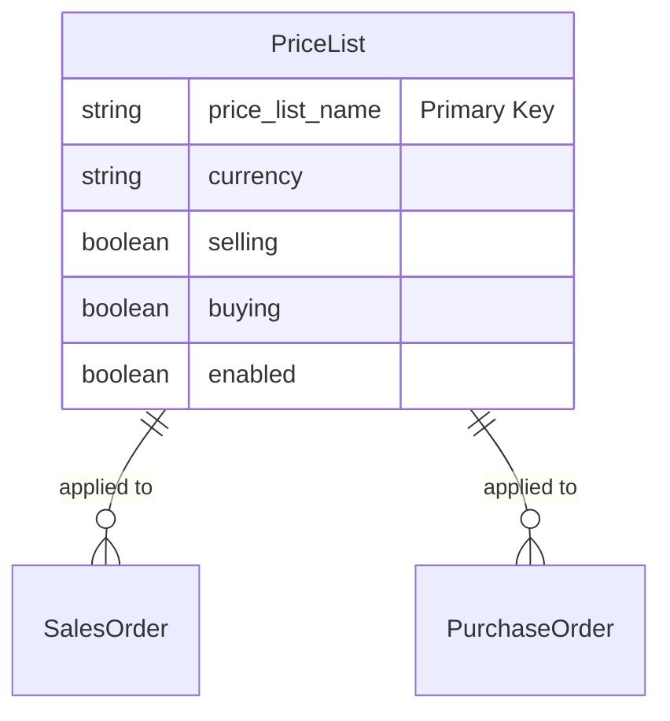

# Price List

## Future Backend Decoupling Strategy

`Price List` is a core Master Data entity used to group item pricing structures (e.g., "Standard Selling", "Standard Buying", "Wholesale"). It governs which currency is applied and what context the prices are valid in.

If migrated away from ERPNext to a custom backend, this maps cleanly to a `PriceList` table. Note that this entity only defines the *list itself*; the actual prices per item are native to Frappe's `Item Price` entity (which is currently handled automatically by Frappe when an item is added to an order, and not explicitly managed via a dedicated frontend screen in our current architecture).

## Field Mapping & Translation Table

### Header Level

| ERPNext Native Field | Frontend Usage (actions.ts) | Future Custom Backend (RDBMS) | Description & Notes |
| :--- | :--- | :--- | :--- |
| `price_list_name` | `price_list_name` | `id` (UUID / Primary Key) | The primary identifier. |
| `currency` | `currency` | `currency_code` (String) | Currency for all items in this list. |
| `selling` | `selling` | `is_selling` (Boolean) | Valid for Sales Orders/Invoices. |
| `buying` | `buying` | `is_buying` (Boolean) | Valid for Purchase Orders/Receipts. |
| `enabled` | `enabled` | `is_active` (Boolean) | Governs whether the list is selectable. |

## Document Flow & Lifecycle

Like most Master Data in this architecture, `Price List` is a Draftless document. It does not go through a submit/cancel lifecycle.

## Entity Relationship Mapping

## Error Handling & Admin Logging

*   **User-Facing Errors**: Exceptions (e.g., missing fields, duplicate names, validation rules) are caught and surfaced via `humanizeError(e)`, which translates HTTP 403 / 409 and extracts Frappe's native `_server_messages` into readable UI alerts.
*   **Admin Observability**: All network failures, HTTP non-200 responses, and ERPNext exceptions are wrapped in `ErpNextError` and forwarded asynchronously to the centralized Admin Observability center (`smart_factory.api.observability`).
*   **Traceability**: Every error log is tagged with a `correlationId` that is safe to display to the user for support ticketing, ensuring backend exceptions can be traced exactly to the frontend action that caused them.

## Cancellation Rules & Dependencies

`Price List` is a Draftless entity. It does not have a `docstatus` field and cannot be "Cancelled" (`cancelDoc` does not apply).
*   Instead of cancellation, this entity uses an `enabled` checkbox to deactivate it. 
*   The frontend exposes this checkbox on the edit form, allowing the Price List to be soft-deleted or hidden from transactional dropdowns (like Sales Order creation) without breaking historical relational integrity for existing orders.
