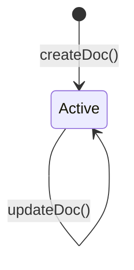
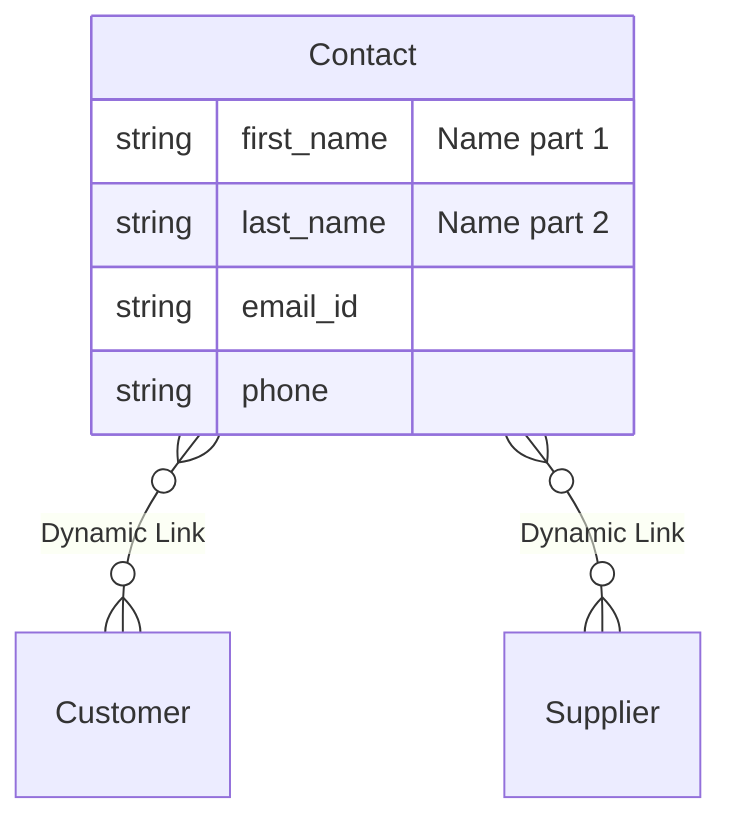
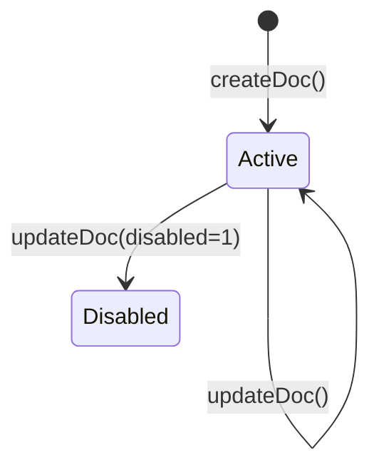
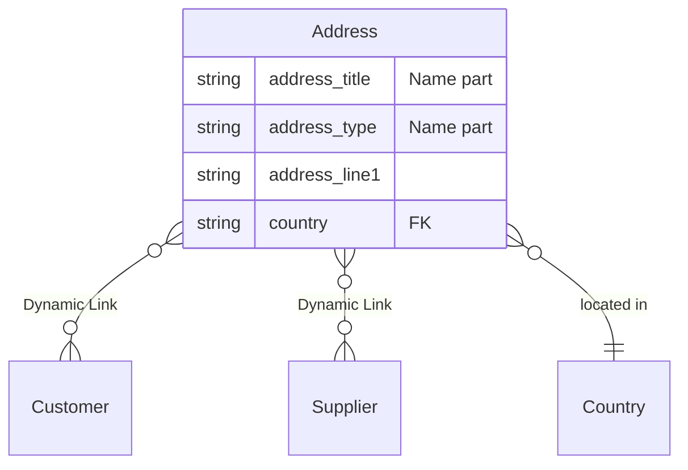
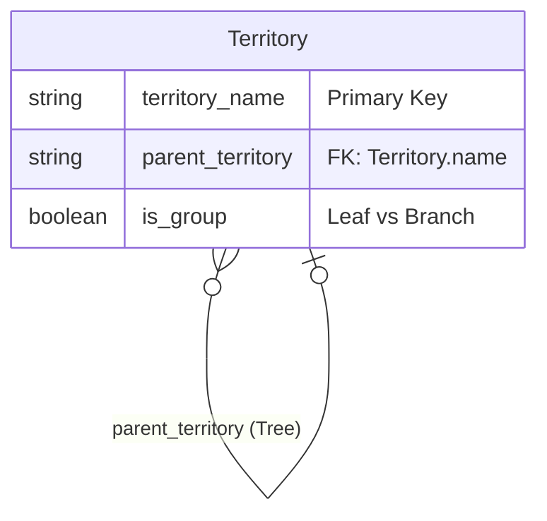

# Contact, Address, Territory — Canonical Entity Documentation

**Domain:** Master Data — Business Partners (Contact, Address) / Sales setup (Territory, still
classified under Business Partners routing per `docs/master-data-architecture.md` §5).
**Status:** `DOCUMENTED` (this package, MD-R2, 2026-09-22).
**Frontend routes:** `/master-data/contacts`, `/master-data/addresses`, `/master-data/territories`
(list/detail/create each).

## Source of truth
- **Live schema**: `mcp__ceylon-stack__get_doctype_fields` for `Contact`, `Address`, `Territory`,
  and `Dynamic Link`, 2026-09-22 — `VERIFIED`.
- **Live sample data**: `mcp__ceylon-stack__list_documents` for Contact and Territory, 2026-09-22 —
  `VERIFIED`. Address returned **zero live records** on this instance — its naming pattern could
  not be sample-verified this session.
- **Frontend code**: `apps/frontend/src/app/(app)/master-data/{contacts,addresses,territories}/`.
  `CODE-INFERRED`, cited file:line.

---

## 1. Contact

### Identity / naming
No `naming_series` field in the live schema (unlike Customer/Supplier) — `VERIFIED` absent. Live
sample data (`VERIFIED`): `name="Frontend Integration"` (`first_name="Frontend Integration"`,
`last_name=null`), `name="Niroshan"` (`first_name="Niroshan"`, `last_name=""`) — confirms `name`
derives from `first_name` (with `last_name` appended when present, standard ERPNext convention).
Neither sample exercised a naming collision, so the exact collision-suffix format (e.g. `-1`, `-2`)
is **not** confirmed this session — `NEEDS_VERIFICATION` for that specific detail only; the
first-name-driven base pattern itself is `VERIFIED`.

### Important fields (live schema, `VERIFIED`)

| fieldname | label | fieldtype | required | Link target |
|---|---|---|---|---|
| first_name / middle_name / last_name / full_name | — | Data | no | — |
| email_id | Email Address | Data | no | — (option `Email`) |
| user | User Id | Link | no | User |
| address | Address | **Link** | no | **Address** |
| status | Status | Select | no | Passive / Open / Replied |
| salutation | Salutation | Link | no | Salutation |
| designation / company_name / department | — | Data | no | — |
| gender | Gender | Link | no | Gender |
| phone / mobile_no | — | Data | no | (option `Phone`) |
| image | Image | Attach Image | no | — |
| email_ids | Email IDs | **Table** | no | Contact Email |
| phone_nos | Contact Numbers | **Table** | no | Contact Phone |
| **links** | Links | **Table** | no | **Dynamic Link** |
| is_primary_contact | — | Check | no | — |

**Dynamic Link mechanism — `VERIFIED` exactly as expected.** Contact's `links` field is a Table with
options `Dynamic Link`. `get_doctype_fields("Dynamic Link")` (`VERIFIED`) returns: `link_doctype`
(Link → DocType, required), `link_name` (fieldtype **Dynamic Link**, required, resolved at runtime
by whatever `link_doctype` names), `link_title` (Read Only). This confirms the standard mechanism
precisely: a Contact attaches to a Customer/Supplier/Lead/etc. via a row in its own `links` table
with `link_doctype="Customer"` (or "Supplier", etc.) and `link_name="<record name>"` — **not** a
direct field on Contact. Contact separately has its own direct `address` Link (→ Address) field —
a different, single-value relationship (the contact person's own postal address), distinct from the
Dynamic Link attachment mechanism.

### Required fields
None are `reqd:1` at the schema level (`VERIFIED`) — Contact's only practical requirement comes
from this frontend's own validation (`first_name` required, see below), not from ERPNext's schema
itself.

### Link fields
`user → User`, `address → Address` (single postal address), `salutation → Salutation`,
`gender → Gender`, plus the `links` Dynamic Link mechanism for party attachment.

### Child tables
`email_ids` (Contact Email), `phone_nos` (Contact Phone), `links` (Dynamic Link). None read/written
by this frontend — confirmed below.

### Lifecycle / docstatus
No `docstatus` field — `VERIFIED` absent from declared fields; submittability conclusion
`DOCUMENTATION-INFERRED` per `MD-UNV-002`.

### Create/update/delete restrictions
- `createContactAction`/`updateContactAction` send: `first_name, last_name, email_id, phone,
  mobile_no, company_name, designation` (`apps/frontend/src/app/(app)/master-data/contacts/actions.ts:10,18,37`,
  `CODE-INFERRED`). Required: `first_name` (`contacts/actions.ts:14,34`).
- **Neither action ever writes to the `links` table.** A Contact created through this UI is not
  attached to any Customer/Supplier — see the cross-cutting finding below.
- Delete: not exposed (confirmed).

### `allow_on_submit`
Not applicable — not submittable.

### Cross-document dependencies
Referenced from `customer_primary_contact`/`supplier_primary_contact` (single-pointer, see
`customer-supplier.md`) and, in the real ERPNext model, from any party record via `links`. Sales
transactional docs (Quotation/Sales Order/Invoice/Delivery Note) select an existing Contact by name
via `AddressContactFields.tsx`'s `contact_person` field — `CODE-INFERRED`, confirmed by grep, that
component is not used under `master-data/contacts`.

### Stock / accounting / manufacturing implications
None directly — Contact is a pure communication/identity record, not itself financially or
stock-relevant.

### Frontend route
`/master-data/contacts` (list — **global, unfiltered**, no `filters` argument passed to `listDocs`,
`CODE-INFERRED` `contacts/page.tsx:27-32`), `/master-data/contacts/[name]`,
`/master-data/contacts/new`.

### Document Flow & Lifecycle

The Contact document is draftless.

### Entity Relationship Mapping

### Field Mapping & Translation Table

| ERPNext Native Field | Frontend Usage (`MasterForm`) | Future Custom Backend (RDBMS) | Description & Notes |
| :--- | :--- | :--- | :--- |
| `first_name` | `first_name` | `first_name` (String) | PK derived from this. |
| `last_name` | `last_name` | `last_name` (String) | |
| `email_id` | `email` | `email` (String) | |
| `phone` | `phone` | `phone` (String) | |
| `mobile_no` | `mobile_no` | `mobile_no` (String) | |
| `company_name` | `company_name` | `company_name` (String) | |
| `designation` | `designation` | `designation` (String) | |

Generic `MasterForm` with a locally-defined `FieldSpec[]` (`contacts/new/page.tsx:4-12`,
`contacts/[name]/page.tsx:17-25`), all plain text fields. Uses shared `humanizeError`/
`fieldsFromFormData` helpers (`apps/frontend/src/lib/masterActions.ts`).

### Current API / actions used (`CODE-INFERRED`)
`createContactAction` → `createDoc("Contact", fields)` (`contacts/actions.ts:18`).
`updateContactAction` → `updateDoc("Contact", name, fields)` (`contacts/actions.ts:37`).
List → `listDocs<ContactRow>("Contact", {fields:["name","first_name","last_name","email_id",
"phone","mobile_no","company_name"], orderBy:"modified desc"})` — no filter.

### Backend hooks/methods relied upon
None beyond standard REST create/read/update.

### Migration considerations
The Dynamic Link mechanism (`link_doctype`/`link_name` polymorphic association) is a
`FRAPPE_ONLY_IMPLEMENTATION_DETAIL` pattern for "this record can attach to any of several parent
types." `REQUIRED_CEYLON_BEHAVIOR` is a genuine many-to-many Party↔Contact relationship — a native
backend could implement this as a proper join table instead of a polymorphic link, without losing
any real product behavior. **Prerequisite to migrating this correctly:** the frontend gap in
`MD-UNV-003` (this UI doesn't write `links` at all) needs a product decision before or during
migration — porting "no linkage" as the native behavior would be porting a bug, not a feature.

---

## 2. Address

### Identity / naming
No `naming_series` field (consistent with Contact). **Could not sample-verify from live data this
session — zero Address records exist on this instance** (`list_documents("Address", ...)` returned
an empty result set, `VERIFIED` as in "confirmed empty," not a tool failure). Standard ERPNext
convention (`DOCUMENTATION-INFERRED`, not confirmed) is an autoname combining `address_title` (or
the first linked party's name) with `address_type`, numeric-suffixed on collision. Flagged
`NEEDS_VERIFICATION` — see `MD-UNV-005`.

### Important fields (live schema, `VERIFIED`) — full field list, 16 fields

| fieldname | label | fieldtype | required | options |
|---|---|---|---|---|
| address_title | Address Title | Data | no | — |
| address_type | Address Type | Select | **yes** | Billing/Shipping/Office/Personal/Plant/Postal/Shop/Subsidiary/Warehouse/Current/Permanent/Other |
| address_line1 | Address Line 1 | Data | **yes** | — |
| address_line2 | Address Line 2 | Data | no | — |
| city | City/Town | Data | **yes** | — |
| county / state | — | Data | no | — |
| country | Country | Link | **yes** | Country |
| pincode | Postal Code | Data | no | — |
| email_id / phone / fax | — | Data | no | — |
| is_primary_address | Preferred Billing Address | Check | no | — |
| is_shipping_address | Preferred Shipping Address | Check | no | — |
| disabled | Disabled | Check | no | — |
| **links** | Links | **Table** | no | **Dynamic Link** |

**Dynamic Link mechanism — `VERIFIED` for Address too**, identical to Contact: `links` field, Table,
options `Dynamic Link`. Address has **no** direct `customer`/`supplier` field — attachment is
entirely through this child table. Unlike Contact, Address has no separate direct Link field of its
own (`links` is the only relationship mechanism).

### Required fields
`address_type`, `address_line1`, `city`, `country` — `VERIFIED` live schema, and independently
corroborated by this frontend's own validation requiring the identical four fields
(`apps/frontend/src/app/(app)/master-data/addresses/actions.ts:24-30`, `CODE-INFERRED`) — a
confirmed-correct alignment between frontend and schema.

### Link fields
`country → Country`, plus the `links` Dynamic Link mechanism.

### Child tables
`links` (Dynamic Link) only.

### Lifecycle / docstatus
No `docstatus` field — `VERIFIED` absent; submittability `DOCUMENTATION-INFERRED` per `MD-UNV-002`.

### Create/update/delete restrictions
- Fields sent: `address_title, address_type, address_line1, address_line2, city, state, country,
  pincode, email_id, phone, disabled` (`addresses/actions.ts:10-21,39,59`, `CODE-INFERRED`).
- Required, enforced in `validate()`: `address_type`, `address_line1`, `city`, `country`
  (`addresses/actions.ts:24-30`).
- **`links` is never written by this frontend** — same orphan-record situation as Contact.
- Delete: not exposed (confirmed).

### `allow_on_submit`
Not applicable — not submittable.

### Cross-document dependencies
Referenced from `customer_primary_address`/`supplier_primary_address` (single-pointer). Sales
transactional docs select an existing Address by name via `AddressContactFields.tsx`'s
`customer_address`/`shipping_address_name` fields — not used under `master-data/addresses`.

### Stock / accounting / manufacturing implications
`address_type` includes a `"Warehouse"` option — Warehouse's own schema separately carries its own
inline address fields (`address_line_1`, `city`, `state`, `pin` — see `warehouse.md`) rather than
linking to a standalone `Address` record; the two are independent mechanisms for the same concept
across different doctypes, `VERIFIED` by comparing both live schemas, not previously documented
anywhere in this repo.

### Frontend route
`/master-data/addresses` (list — global, unfiltered, `CODE-INFERRED` `addresses/page.tsx:26-31`),
`/master-data/addresses/[name]`, `/master-data/addresses/new`.

### Document Flow & Lifecycle

The Address document is draftless.

### Entity Relationship Mapping

### Field Mapping & Translation Table

| ERPNext Native Field | Frontend Usage (`MasterForm`) | Future Custom Backend (RDBMS) | Description & Notes |
| :--- | :--- | :--- | :--- |
| `address_title` | `title` | `title` (String) | |
| `address_type` | `type` | `type` (Enum) | Billing, Shipping, etc. |
| `address_line1` | `line1` | `line1` (String) | |
| `address_line2` | `line2` | `line2` (String) | |
| `city` | `city` | `city` (String) | |
| `state` | `state` | `state` (String) | |
| `country` | `country_id` | `country_id` (FK) | |
| `pincode` | `postal_code` | `postal_code` (String) | |
| `disabled` | `disabled` | `is_active` (Boolean) | Inverted logic (1 = Disabled). |

`address_type` options are hardcoded in `addresses/addressTypes.ts:2-15` as a 12-item array —
**confirmed to match the live schema's Select options exactly**, so the frontend constant is in
sync with ERPNext as of this check (`VERIFIED` by direct comparison).

### Current API / actions used (`CODE-INFERRED`)
`createAddressAction` → `createDoc("Address", fields)` (`addresses/actions.ts:39`).
`updateAddressAction` → `updateDoc("Address", name, fields)` (`addresses/actions.ts:59`).
List → `listDocs<AddressRow>("Address", {fields:["name","address_type","city","country",
"disabled"], orderBy:"modified desc"})` — no filter.

### Backend hooks/methods relied upon
None beyond standard REST create/read/update.

### Migration considerations
Same Dynamic Link note as Contact. Additionally: Warehouse's separate inline-address pattern (see
Stock/accounting note above) means a future canonical Address model should decide whether Warehouse
addresses become real `Address` records or stay inline fields — `REQUIRED_CEYLON_BEHAVIOR` not yet
decided, not in scope for this package.

---

## 3. Territory

### Identity / naming
`territory_name` (Data, **required**), no `naming_series` field. Live sample data (`VERIFIED`)
confirms `name === territory_name` exactly: `"All Territories"`, `"Rest Of The World"`,
`"Sri Lanka"`. Name-field naming confirmed live — same pattern as Item/Item Group/UOM/Customer/
Supplier/Warehouse.

### Important fields (live schema, `VERIFIED`) — 8 fields

| fieldname | label | fieldtype | required | Link target |
|---|---|---|---|---|
| territory_name | Territory Name | Data | **yes** | — |
| parent_territory | Parent Territory | Link | no | Territory (self, tree) |
| is_group | Is Group | Check | no | — |
| territory_manager | Territory Manager | Link | no | Sales Person |
| lft / rgt / old_parent | tree internals | Int / Link | no | — (nested-set) |
| targets | Targets | **Table** | no | Target Detail |

Confirmed Frappe Tree doctype (`lft`/`rgt`/`old_parent`/`parent_territory`/`is_group` together,
same pattern as Item Group and Warehouse). No Dynamic Link relationship — Territory is referenced
*from* Customer (`territory` field), it has no reverse field itself.

### Required fields
`territory_name`.

### Link fields
`parent_territory → Territory` (self), `territory_manager → Sales Person`.

### Child tables
`targets` (Target Detail) — not touched by this frontend.

### Lifecycle / docstatus
No `docstatus` field — `VERIFIED` absent; submittability `DOCUMENTATION-INFERRED` per `MD-UNV-002`.

### Create/update/delete restrictions
Fields sent: `territory_name, parent_territory, territory_manager, is_group`
(`apps/frontend/src/app/(app)/master-data/territories/actions.ts:10-11`, `CODE-INFERRED`).
Required: `territory_name` (`territories/actions.ts:15,35`). Delete: not exposed (confirmed).

### `allow_on_submit`
Not applicable — not submittable.

### Cross-document dependencies
Referenced from `Customer.territory`. Sales documents inherit territory context indirectly through
the Customer relationship (via `AddressContactFields.tsx`'s own `territory` field selection on
Sales transactions) rather than directly from this master.

### Stock / accounting / manufacturing implications
None directly — a sales-geography classification dimension only.

### Frontend route
`/master-data/territories` (list — the only one of these three ordered `"name asc"` rather than
`"modified desc"`, `CODE-INFERRED` `territories/page.tsx:24-29`), `/master-data/territories/[name]`,
`/master-data/territories/new`.

### Document Flow & Lifecycle

The Territory document is draftless.

### Entity Relationship Mapping

### Field Mapping & Translation Table

| ERPNext Native Field | Frontend Usage (`MasterForm`) | Future Custom Backend (RDBMS) | Description & Notes |
| :--- | :--- | :--- | :--- |
| `territory_name` | `territory_name` | `id` (UUID / PK) | Primary Key. |
| `parent_territory` | `parent_territory_id` | `parent_id` (FK, self) | Adjacency list representation. |
| `is_group` | `is_group` | `is_group` (Boolean) | Leaf vs Branch logic. |
| `territory_manager` | `territory_manager_id` | `manager_id` (FK) | Maps to Sales Person. |

### Current API / actions used (`CODE-INFERRED`)
`createTerritoryAction`/`updateTerritoryAction` → `createDoc`/`updateDoc("Territory", ...)`
(`territories/actions.ts:19,38`). List → `listDocs("Territory", {fields:["name",
"parent_territory","is_group","territory_manager"], orderBy:"name asc"})`.

### Backend hooks/methods relied upon
None beyond standard REST create/read/update.

### Migration considerations
Tree structure is `FRAPPE_ONLY_IMPLEMENTATION_DETAIL`, same note as Item Group/Warehouse.

---

## NEEDS_VERIFICATION register — this document's contribution

See `docs/backend/99-unverified/unverified-behaviours.md`: `MD-UNV-002` (submittable-status
confirmation method, shared across the domain), `MD-UNV-003` (Customer/Supplier↔Contact/Address
Dynamic Link relationship not wired up in this frontend — the most significant finding in this
document), `MD-UNV-005` (Address autoname pattern, zero live records to sample-verify against).

## Error Handling & Admin Logging

*   **User-Facing Errors**: Exceptions (e.g., missing fields, duplicate names, validation rules) are caught and surfaced via `humanizeError(e)`, which translates HTTP 403 / 409 and extracts Frappe's native `_server_messages` into readable UI alerts.
*   **Admin Observability**: All network failures, HTTP non-200 responses, and ERPNext exceptions are wrapped in `ErpNextError` and forwarded asynchronously to the centralized Admin Observability center (`smart_factory.api.observability`).
*   **Traceability**: Every error log is tagged with a `correlationId` that is safe to display to the user for support ticketing, ensuring backend exceptions can be traced exactly to the frontend action that caused them.

## Cancellation Rules & Dependencies

Master Data entities in ERPNext (like Item, Customer, Supplier, Warehouse, Contact, Address, Territory) are Draftless. They do not have a `docstatus` field and cannot be "Cancelled" (`cancelDoc` does not apply).
*   Instead of cancellation, these entities typically use a `disabled` flag (`disabled = 1` or `disabled = 0`) to deactivate them, though Contact/Territory omit this in the current schema.
*   The frontend exposes this `disabled` checkbox on the edit forms for entities that support it, allowing them to be soft-deleted or hidden from transactional dropdowns without breaking historical relational integrity.
