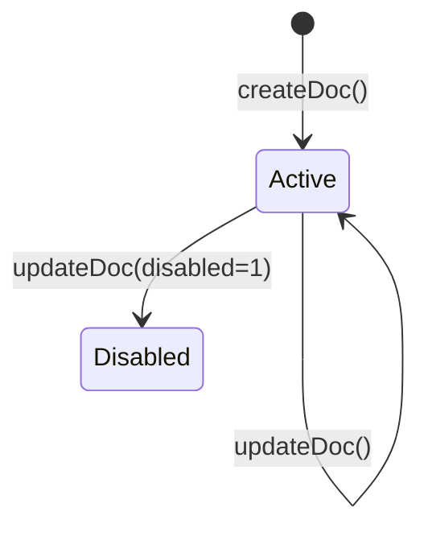
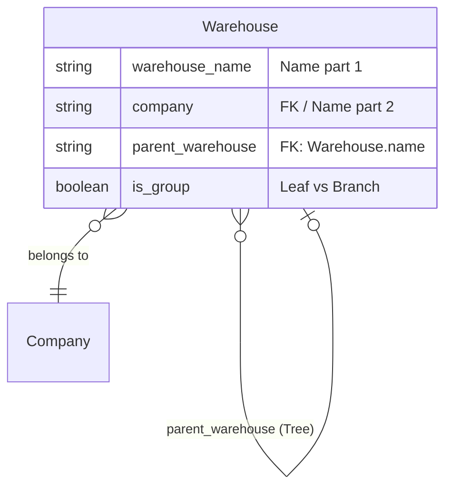

# Warehouse — Canonical Entity Documentation

**Domain:** Master Data — Inventory Structure.
**Status:** `DOCUMENTED` (this package, MD-R2, 2026-09-22).
**Frontend route:** `/master-data/warehouses` (list/detail/create).

## Source of truth
- **Live schema**: `mcp__ceylon-stack__get_doctype_fields("Warehouse")`, 2026-09-22 — `VERIFIED`.
- **Live sample data**: `mcp__ceylon-stack__list_documents("Warehouse", fields=["name",
  "warehouse_name","company"], limit=5)`, 2026-09-22 — `VERIFIED`.
- **Frontend code**: `apps/frontend/src/app/(app)/master-data/warehouses/`. `CODE-INFERRED`,
  cited file:line.

## Identity / naming
`warehouse_name` (Data, **required**) + `company` (Link → Company, **required**). Live sample data
confirms the naming pattern directly (`VERIFIED`, not just inferred): `"All Warehouses - CS"`
(`warehouse_name="All Warehouses"`, `company="Ceylon Stack"`), `"All Warehouses - CSD"`
(same `warehouse_name`, `company="Ceylon Stack (Demo)"`), `"Finished Goods - CS"`, `"Goods In
Transit - CS"`. **Confirmed autoname pattern: `{warehouse_name} - {company abbreviation}`** — the
document `name` is not `warehouse_name` alone, it disambiguates by company abbreviation, which is
why the same `warehouse_name` ("All Warehouses") produces two distinct document names across the
two companies on this instance.

## Important fields (live schema, `VERIFIED`)

| fieldname | label | fieldtype | required | Link target |
|---|---|---|---|---|
| warehouse_name | Warehouse Name | Data | **yes** | — |
| company | Company | Link | **yes** | Company |
| disabled | Disabled | Check | no | — |
| is_group | Is Group Warehouse | Check | no | — |
| parent_warehouse | Parent Warehouse | Link | no | Warehouse (self, tree) |
| is_rejected_warehouse | Is Rejected Warehouse | Check | no | — |
| account | Account | Link | no | Account |
| customer | Customer | Link | no | Customer |
| warehouse_type | Warehouse Type | Link | no | Warehouse Type |
| default_in_transit_warehouse | Default In-Transit Warehouse | Link | no | Warehouse (self) |
| email_id / phone_no / mobile_no | contact fields | Data | no | — |
| address_line_1 / address_line_2 / city / state / pin | address fields | Data | no | — |
| lft / rgt / old_parent | tree internals | Int / Link | no | — (nested-set) |

No child (`Table`) fields at all on Warehouse — `VERIFIED`. Confirmed Frappe Tree doctype
(`lft`/`rgt`/`old_parent` present, same pattern as Item Group).

## Lifecycle / docstatus
No `docstatus`/`amended_from` field in the live schema — `VERIFIED` absent. Not submittable.
Confirmed twice independently: this session's live schema pull, and a prior session's own code
comment (`apps/frontend/src/app/(app)/master-data/warehouses/actions.ts:18-22`: *"Warehouse has no
docstatus field at all (confirmed via the live DocType JSON — no `amended_from`) — create/update
only, no submit/cancel, unlike every other doctype this module builds."*) — `CODE-INFERRED`
corroborating `VERIFIED`.

## Create/update/delete restrictions
- Create/update require `warehouse_name` and `company` (both throw a plain `Error` if blank —
  `apps/frontend/src/app/(app)/master-data/warehouses/actions.ts:23-34`, `CODE-INFERRED`).
- `updateWarehouseAction` redirects with `?saved=1` on success (`actions.ts:76`) — a UX behavior
  not present in Item/Item Group's update actions.
- Delete: not exposed — no `deleteDoc` call anywhere in this route (`CODE-INFERRED`, confirmed by
  the whole-folder grep finding zero `deleteDoc` matches across all of `master-data/`).

## `allow_on_submit`
Not applicable — not submittable.

## Cross-document dependencies
Referenced as a Link target from Stock Entry Detail (`s_warehouse`/`t_warehouse`), Work Order
(`source_warehouse`/`wip_warehouse`/`fg_warehouse` — three independent FK roles, already documented
in `docs/backend/11-relationships/master-erd.md`), Sales/Purchase line items (`warehouse`), Bin
(current stock quantity per Item+Warehouse). Not re-enumerated here — see each transactional
domain's own backend doc for the join details.

## Stock / accounting / manufacturing implications
- **Stock:** the fundamental location dimension for every Stock Ledger Entry and Bin row —
  `FRAPPE_CURRENT_BEHAVIOR`, foundational to ERPNext's stock model.
- **Accounting:** `account` (Link → Account) is a live-schema field for a per-warehouse GL account
  override (used in perpetual inventory / stock-in-transit accounting patterns) — **not exposed in
  this frontend**, `NEEDS_VERIFICATION` whether this instance relies on it (see
  `docs/master-data-architecture.md` §2's note that `account`/`warehouse_type`/`customer` remain
  pre-existing unexposed fields).
- **Manufacturing:** Work Order's `wip_warehouse`/`fg_warehouse` roles are Warehouse-typed; already
  documented in `docs/backend/05-manufacturing/work-order.md`.

## Frontend route
`/master-data/warehouses` (list), `/master-data/warehouses/[name]` (detail/edit),
`/master-data/warehouses/new` (create). `CODE-INFERRED`.

## Document Flow & Lifecycle

The Warehouse document is draftless.

## Entity Relationship Mapping

## Field Mapping & Translation Table

| ERPNext Native Field | Frontend Usage (`MasterForm`) | Future Custom Backend (RDBMS) | Description & Notes |
| :--- | :--- | :--- | :--- |
| `warehouse_name` | `warehouse_name` | `warehouse_name` (String) | Used with Company to form PK. |
| `company` | `company_id` | `company_id` (FK) | Used with Warehouse Name to form PK. |
| `parent_warehouse` | `parent_warehouse_id` | `parent_id` (FK, self) | Adjacency list representation. |
| `is_group` | `is_group` | `is_group` (Boolean) | Leaf vs Branch logic. |
| `disabled` | `disabled` | `is_active` (Boolean) | Inverted logic (1 = Disabled). |

Generic `MasterForm` exposes exactly these 5 fields (`CODE-INFERRED`,
`warehouses/new/page.tsx:11-17`, `warehouses/[name]/page.tsx:32-38`, identical in both). Live-schema
fields **not** exposed anywhere in this frontend: `account`, `is_rejected_warehouse`, `customer`,
all address/contact fields, `warehouse_type`, `default_in_transit_warehouse`.

List page renders a flat table with a Parent column, no tree/indent UI — deliberate simplification,
explicitly commented in code (`CODE-INFERRED`, `warehouses/page.tsx:14-15`: *"Flat list, no
tree/indent UI — per the plan's 'simplified' instruction, matching the CustomerGroup/ItemGroup
master pattern rather than building a real hierarchy view."*).

## Current API / actions used (`CODE-INFERRED`)
- `createWarehouseAction` → `createDoc<{name:string}>("Warehouse", fields)`
  (`warehouses/actions.ts:46`).
- `updateWarehouseAction` → `updateDoc("Warehouse", name, fields)` (`warehouses/actions.ts:69`).
- List → `listDocs<WarehouseRow>("Warehouse", {fields:["name","warehouse_name",
  "parent_warehouse","is_group","disabled"], orderBy:"name asc"})` + `getCount("Warehouse")`
  (`warehouses/page.tsx:27-34`).
- Detail → `getDoc<WarehouseDoc>("Warehouse", name)` (`warehouses/[name]/page.tsx:21`).

## Backend hooks/methods relied upon
None beyond standard REST create/read/update — no whitelisted custom method call found for
Warehouse in this frontend.

## Migration considerations (future Ceylon Stack native backend)
- The `{warehouse_name} - {company abbreviation}` compound naming is
  `FRAPPE_ONLY_IMPLEMENTATION_DETAIL` — a native backend does not need to reproduce this exact
  string format, but does need the underlying `REQUIRED_CEYLON_BEHAVIOR`: warehouse identity is
  scoped per-Company, not global (two Companies can each have their own "All Warehouses" without
  collision).
- Tree structure (`lft`/`rgt`) is `FRAPPE_ONLY_IMPLEMENTATION_DETAIL` — same note as Item Group;
  `is_group`/`parent_warehouse` is the actual required semantic.
- `account`, `customer`, `warehouse_type`, `default_in_transit_warehouse` are `FRAPPE_REFERENCE`
  only, unused by this frontend — do not port speculatively.

## NEEDS_VERIFICATION
See `docs/backend/99-unverified/unverified-behaviours.md` `MD-UNV-002` (submittable-status
confirmation method — resolved for Warehouse by direct schema absence, included for completeness
across the domain) and the `account`/GL-role note above.

## Error Handling & Admin Logging

*   **User-Facing Errors**: Exceptions (e.g., missing fields, duplicate names, validation rules) are caught and surfaced via `humanizeError(e)`, which translates HTTP 403 / 409 and extracts Frappe's native `_server_messages` into readable UI alerts.
*   **Admin Observability**: All network failures, HTTP non-200 responses, and ERPNext exceptions are wrapped in `ErpNextError` and forwarded asynchronously to the centralized Admin Observability center (`smart_factory.api.observability`).
*   **Traceability**: Every error log is tagged with a `correlationId` that is safe to display to the user for support ticketing, ensuring backend exceptions can be traced exactly to the frontend action that caused them.

## Cancellation Rules & Dependencies

Master Data entities in ERPNext (like Item, Customer, Supplier, Warehouse) are Draftless. They do not have a `docstatus` field and cannot be "Cancelled" (`cancelDoc` does not apply).
*   Instead of cancellation, these entities use a `disabled` flag (`disabled = 1` or `disabled = 0`) to deactivate them.
*   The frontend exposes this `disabled` checkbox on the edit forms for these entities, allowing them to be soft-deleted or hidden from transactional dropdowns without breaking historical relational integrity.
