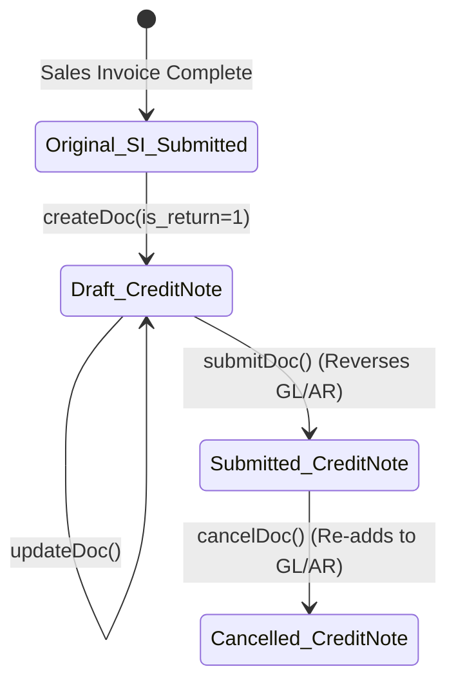

# Credit Note (Specification)

## Future Backend Decoupling Strategy

In ERPNext, a "Credit Note" is not a distinct database table. It is simply a standard **Sales Invoice** where the `is_return` flag is set to `1` and quantities/amounts are supplied as negative values. 

If we migrate to a custom backend (RDBMS), this could be modeled in one of two ways:
1. **Unified Table (Frappe Style)**: Kept within the `Invoice` table using an `invoice_type` enum (`STANDARD` vs `CREDIT_NOTE`) and a self-referencing Foreign Key `return_against_id` pointing back to the original Invoice.
2. **Distinct Table**: Split into a dedicated `CreditNote` table that strictly references the original `Invoice` table. 

For the current Frappe integration, the frontend MUST treat this as a standard Sales Invoice API call (`/api/resource/Sales Invoice`) with special flags.

## Field Mapping & Translation Contract

When Claude implements the `createCreditNoteAction`, it must pass the following specific fields to the `Sales Invoice` API:

### Header Level

| ERPNext Native Field | Required Value / Frontend Mapping | Description & Notes |
| :--- | :--- | :--- |
| `customer` | Same as original Sales Invoice | |
| `company` | Same as original Sales Invoice | |
| `is_return` | `1` (Integer/Boolean) | **CRITICAL**: Tells Frappe this is a credit note, reversing the Accounts Receivable ledger posting. |
| `return_against` | `Original Sales Invoice Name` | **CRITICAL**: The ID (`name`) of the submitted Sales Invoice being credited. |

### Item Level (Sales Invoice Item)

| ERPNext Native Field | Required Value / Frontend Mapping | Description & Notes |
| :--- | :--- | :--- |
| `item_code` | Same as original line | |
| `qty` | **Negative** (e.g., `-5.0`) | **CRITICAL**: Frappe expects negative quantities for returns. |
| `rate` | Same as original line (Positive) | Rate stays positive; the negative `qty` handles the math. |
| `sales_invoice_item` | `Original SI Item Name` | Links the credited row exactly to the original billed row. |
| `delivery_note` | `Sales Return DN Name` | If the credit note is generated from a Sales Return (Delivery Note), it links here. |
| `dn_detail` | `Sales Return Item Name` | If applicable, links to the specific returned DN line. |
| `sales_order` | `Original Sales Order` | Inherited from the original SI or DN. |
| `so_detail` | `Original SO Item` | Inherited from the original SI or DN. |

## Document Flow & Lifecycle

## Implementation Notes for Claude (Frontend)

1.  **Validation**: The frontend UI should force the user to select the quantity/amount they wish to credit, ensuring it does not exceed the originally invoiced quantity.
2.  **Negative Math Transformation**: The frontend UI might display quantities as positive numbers (e.g., "Credit 5 units"), but the backend `actions.ts` **MUST** multiply this `qty` by `-1` before sending it to `createDoc()`.
3.  **Update Stock Checkbox**: A Sales Invoice has an `update_stock` flag. If the original invoice checked this flag (meaning it skipped the Delivery Note phase), the Credit Note should also check `update_stock` to return the items to inventory simultaneously with the financial credit. If a separate Delivery Note (Sales Return) was already processed, `update_stock` MUST be `0`.
