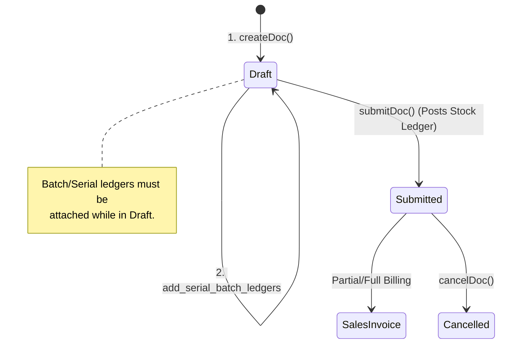
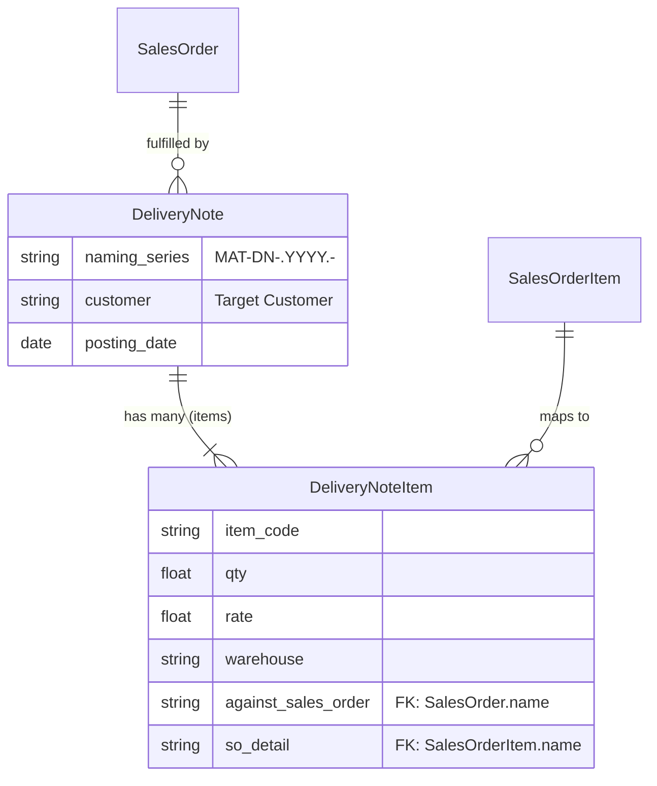

# Delivery Note

## Future Backend Decoupling Strategy

If we migrate to a custom backend, the Delivery Note translates into a standard "Fulfillment" or "Shipment" entity. ERPNext currently handles Serial and Batch numbers in a disjointed way (via separate `Serial and Batch Bundle` ledgers), requiring a two-step API flow in our frontend. 

A custom backend could streamline this drastically by putting Batch/Serial Foreign Keys directly on the Shipment Line Item table, eliminating the two-step draft-and-attach process entirely.

## Field Mapping & Translation Table

### Header Level (Delivery Note)

| ERPNext Native Field | Frontend Usage (actions.ts) | Future Custom Backend (RDBMS) | Description & Notes |
| :--- | :--- | :--- | :--- |
| `name` | `name` | `id` (UUID / Primary Key) | The primary identifier. |
| `naming_series` | `naming_series` (MAT-DN...) | Sequence Generator | Dictates the note number. |
| `customer` | `customer` | `customer_id` (UUID, FK) | Links to the Customer table. |
| `posting_date` | `posting_date` | `shipment_date` (Date) | Date of physical transfer. |
| `company` | `company` | `company_id` (UUID, FK) | Tenant/Company context. |
| `docstatus` | *N/A (Managed by Frappe)* | `status` (Enum) | DRAFT, SUBMITTED, CANCELLED |

### Item Level (Delivery Note Item)

| ERPNext Native Field | Frontend Usage | Future Custom Backend (RDBMS) | Description & Notes |
| :--- | :--- | :--- | :--- |
| `name` | `name` | `id` (UUID / PK) | Row identifier. |
| `parent` | *N/A (Managed by Frappe)* | `delivery_note_id` (UUID, FK) | Link back to the header table. |
| `item_code` | `item_code` | `item_id` (UUID, FK) | Links to the Item/Product table. |
| `qty` | `qty` | `quantity` (Decimal) | Delivered quantity. |
| `warehouse` | `warehouse` | `warehouse_id` (UUID, FK) | Source warehouse. |
| `against_sales_order`| `against_sales_order` | `sales_order_id` (UUID, FK) | Links back to the source Order. |
| `so_detail` | `so_detail` | `sales_order_line_id` (UUID, FK)| Links to exact Order Item row. |
| *Separate Bundle* | `batchSerialEntries` | `batch_id` / `serial_id` (FK) | In a custom DB, batch/serial tracking would live directly on the line or an associated `ShipmentTracking` table. |

## Document Flow & Lifecycle

The Delivery Note handles the physical movement of inventory. Due to Serial and Batch requirements, its creation is a two-step API flow.

## Entity Relationship Mapping

## Conversion Contract (To Sales Invoice)
*   **Quantity Logic**: Line items track invoiced amounts natively, but the frontend calculates remaining to invoice using a dynamic query (`getInvoicedQtyByDnDetail`) against the `Sales Invoice Item` `dn_detail` references.
*   **Lineage Tracking**: When converting, the frontend maps both `dn_detail -> delivery_note` AND `so_detail -> sales_order` (if the DN was created from an SO) so that the resulting Invoice maps back to the ultimate Sales Order for complete traceability.

## Error Handling & Admin Logging

*   **User-Facing Errors**: Exceptions (e.g., missing fields, duplicate names, validation rules) are caught and surfaced via humanizeError(e), which translates HTTP 403 / 409 and extracts Frappe's native _server_messages into readable UI alerts.
*   **Admin Observability**: All network failures, HTTP non-200 responses, and ERPNext exceptions are wrapped in ErpNextError and forwarded asynchronously to the centralized Admin Observability center (smart_factory.api.observability).
*   **Traceability**: Every error log is tagged with a correlationId that is safe to display to the user for support ticketing, ensuring backend exceptions can be traced exactly to the frontend action that caused them.

## Cancellation Rules & Dependencies

Cancellation (cancelDoc) is proactively protected in the frontend to maintain strict data integrity.
*   Before cancelling, the module's ctions.ts explicitly checks for linked downstream records using getConnections().
*   If downstream submitted records exist (e.g., a Receipt or Invoice linked to this document), the cancellation is safely blocked.
*   The system then surfaces a specific error message naming the exact downstream document(s) that the user must cancel first, matching ERPNext's native strict-reversal requirements.
