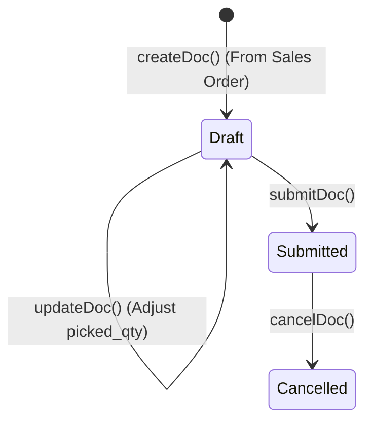

# Pick List

## Future Backend Decoupling Strategy

The `Pick List` acts as an intermediate warehouse-floor document between a `Sales Order` (or Material Request) and a `Delivery Note`. If migrated to a custom backend, this maps to a `PickList` header table and a `PickListItem` child table. 

A critical architectural finding from the current ERPNext implementation is that downstream `Delivery Note` records **do not structurally link back to the Pick List**. Instead, they link directly back to the original `Sales Order`. This makes the `Pick List` an "orchestration" document rather than a strict parent document in the dependency chain. A custom backend should consider establishing a direct FK relationship between `DeliveryNoteItem` and `PickListItem` to improve traceability and simplification of reversals.

## Field Mapping & Translation Table

### Header Level (Pick List)

| ERPNext Native Field | Frontend Usage (actions.ts) | Future Custom Backend (RDBMS) | Description & Notes |
| :--- | :--- | :--- | :--- |
| `name` | `name` | `id` (UUID / Primary Key) | The primary identifier. |
| `company` | `company` | `company_id` (UUID, FK) | Standard context field. |
| `customer` | `customer` | `customer_id` (UUID, FK) | Links to the Customer table. |
| `customer_name` | `customer_name` | `customer_name` (String) | |
| `purpose` | `purpose` | `purpose` (Enum) | e.g. "Delivery". |
| `docstatus` | *N/A (Managed by Frappe)* | `status` (Enum) | DRAFT, SUBMITTED, CANCELLED |

### Item Level (Pick List Item / `locations`)

| ERPNext Native Field | Frontend Usage | Future Custom Backend (RDBMS) | Description & Notes |
| :--- | :--- | :--- | :--- |
| `name` | `name` | `id` (UUID / PK) | Row identifier. |
| `parent` | *Implicit* | `pick_list_id` (UUID, FK) | Link back to the header table. |
| `item_code` | `item_code` | `item_id` (UUID, FK) | Links to the Item/Product table. |
| `qty` | `qty` | `requested_qty` (Decimal) | Amount requested to be picked. |
| `picked_qty` | `picked_qty` | `picked_qty` (Decimal) | Amount actually pulled from stock. |
| `warehouse` | `warehouse` | `warehouse_id` (UUID, FK) | Where the item was picked from. |
| `sales_order` | `sales_order` | `sales_order_id` (UUID, FK) | Link to source Sales Order. |
| `sales_order_item` | `sales_order_item` | `so_line_id` (UUID, FK) | Link to source Sales Order row. |
| `delivered_qty` | `delivered_qty` | `delivered_qty` (Decimal) | Natively tracked by ERPNext upon Delivery Note submission. |

## Document Flow & Lifecycle

The Pick List is a transactional document with a Draft -> Submit -> Cancel lifecycle.

## Entity Relationship Mapping

```mermaid
erDiagram
    SalesOrder ||--o{ PickList : "generates"
    PickList ||--|{ PickListItem : "contains"
    SalesOrderItem ||--o{ PickListItem : "maps to"
    
    PickList {
        string purpose "e.g. Delivery"
        string customer "FK"
        string company "FK"
    }

    PickListItem {
        string item_code
        float qty
        float picked_qty
        float delivered_qty
        string warehouse "FK"
        string sales_order "FK"
        string sales_order_item "FK"
    }
```

## Conversion Contracts

*   **From Sales Order**: Re-derives lines using `Sales Order Item.qty - Sales Order Item.picked_qty` (a native, live Float field on the Sales Order Item).
*   **To Delivery Note**: Re-derives lines using `Pick List Item.picked_qty - Pick List Item.delivered_qty`. 
*   **Architectural Quirk**: The generated Delivery Note line uses `against_sales_order` and `so_detail` pointing directly to the Sales Order. It does NOT point to the Pick List. ERPNext tracks the `delivered_qty` on both the Pick List Item and the Sales Order Item simultaneously.

## Error Handling & Admin Logging

*   **User-Facing Errors**: Exceptions (e.g., missing fields, duplicate names, validation rules) are caught and surfaced via `humanizeError(e)`, which translates HTTP 403 / 409 and extracts Frappe's native `_server_messages` into readable UI alerts.
*   **Admin Observability**: All network failures, HTTP non-200 responses, and ERPNext exceptions are wrapped in `ErpNextError` and forwarded asynchronously to the centralized Admin Observability center (`smart_factory.api.observability`).
*   **Traceability**: Every error log is tagged with a `correlationId` that is safe to display to the user for support ticketing, ensuring backend exceptions can be traced exactly to the frontend action that caused them.

## Cancellation Rules & Dependencies

*   **Lack of Proactive Blocking**: Unlike Sales Order or Delivery Note, `Pick List` lacks a proactive `getConnections()` check in `actions.ts`. This is because Delivery Notes carry no stored back-reference to the Pick List they were created from (see Conversion Contracts above).
*   **Server-Side Rejection**: ERPNext's native validation still runs server-side to prevent cancellation if linked Delivery Notes exist. The resulting failure is caught and bubbled up via `humanizeError(e)`.
