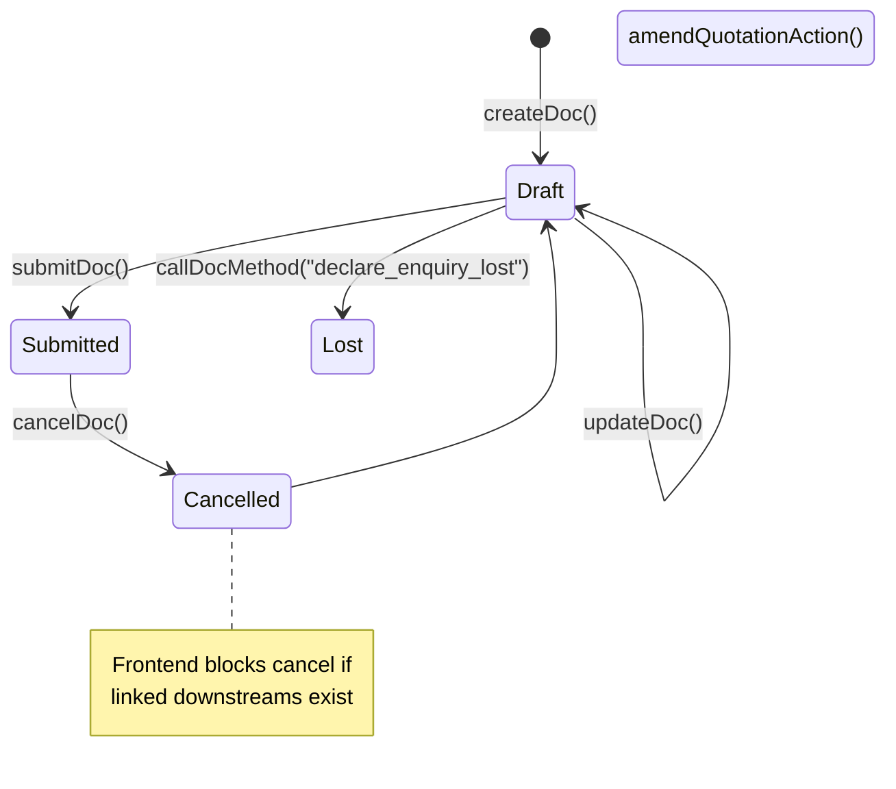
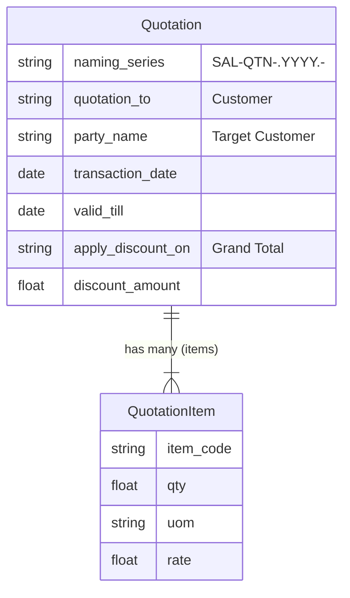

# Quotation

## Future Backend Decoupling Strategy

While Ceylon Stack currently relies on ERPNext as a headless backend, the frontend API payload is designed to be highly translatable. If we eventually replace ERPNext with a custom Node/Go/Python backend, we can map these exact frontend fields to a standard relational database schema. 

Instead of Frappe's dynamic `DocType` and `Dynamic Link` structures, a custom backend would use strict Foreign Keys (UUIDs or BigInts) and normalized tables. The tables below detail the current ERPNext fields, what the frontend uses, and how they would translate to a custom database schema.

## Field Mapping & Translation Table

### Header Level (Quotation)

| ERPNext Native Field | Frontend Usage (actions.ts) | Future Custom Backend (RDBMS) | Description & Notes |
| :--- | :--- | :--- | :--- |
| `name` | `name` | `id` (UUID / Primary Key) | The primary identifier for the document. |
| `naming_series` | `naming_series` (SAL-QTN...) | Sequence Generator | In a custom backend, this would just dictate the auto-increment or sequence prefix. |
| `party_name` | `party_name` | `customer_id` (UUID, FK) | Links to the Customer table. |
| `transaction_date` | `transaction_date` | `document_date` (Date) | The date the quotation was made. |
| `valid_till` | `valid_till` | `expiry_date` (Date) | Optional validity date. |
| `order_type` | `order_type` | `order_type` (Enum) | Hardcoded to "Sales". |
| `company` | `company` | `company_id` (UUID, FK) | Tenant/Company context. |
| `currency` | `currency` | `currency_code` (String) | E.g. USD, LKR. |
| `selling_price_list` | `selling_price_list` | `price_list_id` (UUID, FK) | Link to Price List table. |
| `apply_discount_on` | `apply_discount_on` | `discount_target` (Enum) | E.g. "Grand Total" or "Net Total". |
| `additional_discount_percentage`| `additional_discount_percentage`| `discount_percentage` (Decimal)| Document level discount. |
| `discount_amount` | `discount_amount` | `discount_amount` (Decimal) | Document level discount. |
| `docstatus` | *N/A (Managed by Frappe)* | `status` (Enum) | Enum: DRAFT, SUBMITTED, CANCELLED, LOST |

### Item Level (Quotation Item)

| ERPNext Native Field | Frontend Usage | Future Custom Backend (RDBMS) | Description & Notes |
| :--- | :--- | :--- | :--- |
| `name` | `name` | `id` (UUID / PK) | Row identifier. |
| `parent` | *N/A (Managed by Frappe)* | `quotation_id` (UUID, FK) | Link back to the header table. |
| `item_code` | `item_code` | `item_id` (UUID, FK) | Links to the Item/Product table. |
| `qty` | `qty` | `quantity` (Decimal) | Requested quantity. |
| `uom` | `uom` | `uom_id` (UUID, FK) | Links to Unit of Measure table. |
| `rate` | `rate` | `unit_price` (Decimal) | Price per unit. |
| `price_list_rate` | `price_list_rate` | `base_price` (Decimal) | Original price before line discounts. |

## Document Flow & Lifecycle

The Quotation document follows a standard submit-cancel lifecycle. The frontend proactively guards the cancellation process to maintain data integrity.

## Entity Relationship Mapping

## Conversion Contract (To Sales Order)

When converting a Submitted Quotation to a Sales Order, the linkage fields are established on the target document's child row.
*   **Quantity Logic**: Line items track `ordered_qty`. Conversion enforces that requested quantity does not exceed `qty - ordered_qty`.
*   **Linkage Fields**: Uses `prevdoc_docname` and `quotation_item` on the Sales Order Item row to trigger ERPNext's native bookkeeping.

## Error Handling & Admin Logging

*   **User-Facing Errors**: Exceptions (e.g., missing fields, duplicate names, validation rules) are caught and surfaced via humanizeError(e), which translates HTTP 403 / 409 and extracts Frappe's native _server_messages into readable UI alerts.
*   **Admin Observability**: All network failures, HTTP non-200 responses, and ERPNext exceptions are wrapped in ErpNextError and forwarded asynchronously to the centralized Admin Observability center (smart_factory.api.observability).
*   **Traceability**: Every error log is tagged with a correlationId that is safe to display to the user for support ticketing, ensuring backend exceptions can be traced exactly to the frontend action that caused them.

## Cancellation Rules & Dependencies

Cancellation (cancelDoc) is proactively protected in the frontend to maintain strict data integrity.
*   Before cancelling, the module's ctions.ts explicitly checks for linked downstream records using getConnections().
*   If downstream submitted records exist (e.g., a Receipt or Invoice linked to this document), the cancellation is safely blocked.
*   The system then surfaces a specific error message naming the exact downstream document(s) that the user must cancel first, matching ERPNext's native strict-reversal requirements.
