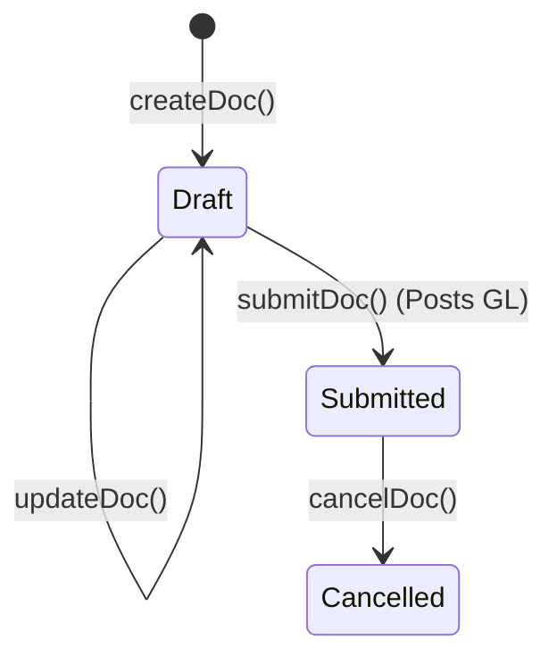
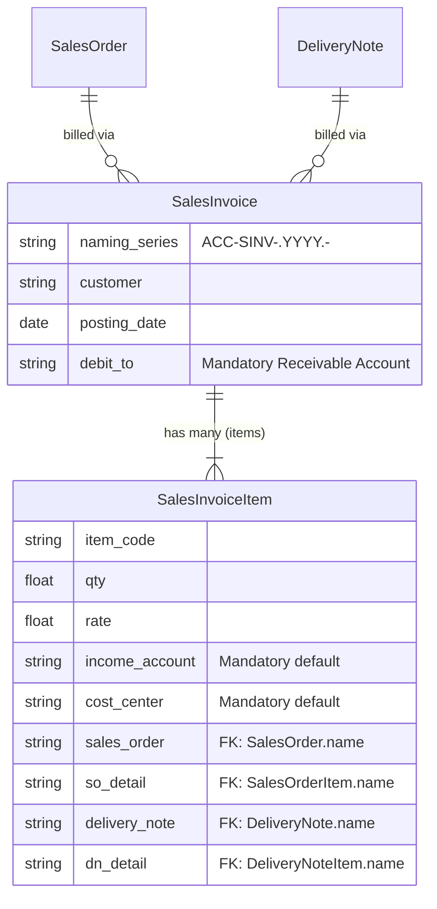

# Sales Invoice

## Future Backend Decoupling Strategy

If we migrate to a custom backend, the Sales Invoice maps directly to an Accounts Receivable (AR) Invoice table. 
ERPNext forces the inclusion of `income_account` and `cost_center` on every single row dynamically. A custom backend would typically abstract this away, relying on the `Item` definitions or `CustomerGroup` to infer revenue accounts at the time of posting to the General Ledger, simplifying the frontend payload.

## Field Mapping & Translation Table

### Header Level (Sales Invoice)

| ERPNext Native Field | Frontend Usage (actions.ts) | Future Custom Backend (RDBMS) | Description & Notes |
| :--- | :--- | :--- | :--- |
| `name` | `name` | `id` (UUID / Primary Key) | The primary identifier. |
| `naming_series` | `naming_series` (ACC-SINV...) | Sequence Generator | Dictates the invoice number. |
| `customer` | `customer` | `customer_id` (UUID, FK) | Links to the Customer table. |
| `posting_date` | `posting_date` | `invoice_date` (Date) | Date of invoice posting. |
| `company` | `company` | `company_id` (UUID, FK) | Tenant/Company context. |
| `debit_to` | `debit_to` | `receivable_account_id` (FK) | AR account for GL posting. |
| `docstatus` | *N/A (Managed by Frappe)* | `status` (Enum) | DRAFT, SUBMITTED (POSTED), CANCELLED |

### Item Level (Sales Invoice Item)

| ERPNext Native Field | Frontend Usage | Future Custom Backend (RDBMS) | Description & Notes |
| :--- | :--- | :--- | :--- |
| `name` | `name` | `id` (UUID / PK) | Row identifier. |
| `parent` | *N/A (Managed by Frappe)* | `invoice_id` (UUID, FK) | Link back to the header table. |
| `item_code` | `item_code` | `item_id` (UUID, FK) | Links to the Item/Product table. |
| `qty` | `qty` | `quantity` (Decimal) | Billed quantity. |
| `income_account` | `income_account` | *Inferred by backend* | ERPNext forces this frontend; custom backend would derive this from Item settings. |
| `cost_center` | `cost_center` | *Inferred by backend* | Likewise, derived by backend. |
| `sales_order` | `sales_order` | `sales_order_id` (UUID, FK) | Links back to the source Order. |
| `so_detail` | `so_detail` | `sales_order_line_id` (UUID, FK)| Links to exact Order Item row. |
| `delivery_note` | `delivery_note` | `shipment_id` (UUID, FK) | Links back to source Delivery. |
| `dn_detail` | `dn_detail` | `shipment_line_id` (UUID, FK) | Links to exact Delivery Item row. |

## Document Flow & Lifecycle

The Sales Invoice finalizes the financial transaction, posting to the General Ledger upon submission.

## Entity Relationship Mapping

The Sales Invoice can be sourced from either a Sales Order or a Delivery Note. The ER diagram below shows how it links back to both potential sources to maintain the audit trail.

## Error Handling & Admin Logging

*   **User-Facing Errors**: Exceptions (e.g., missing fields, duplicate names, validation rules) are caught and surfaced via humanizeError(e), which translates HTTP 403 / 409 and extracts Frappe's native _server_messages into readable UI alerts.
*   **Admin Observability**: All network failures, HTTP non-200 responses, and ERPNext exceptions are wrapped in ErpNextError and forwarded asynchronously to the centralized Admin Observability center (smart_factory.api.observability).
*   **Traceability**: Every error log is tagged with a correlationId that is safe to display to the user for support ticketing, ensuring backend exceptions can be traced exactly to the frontend action that caused them.

## Cancellation Rules & Dependencies

Cancellation (cancelDoc) is proactively protected in the frontend to maintain strict data integrity.
*   Before cancelling, the module's ctions.ts explicitly checks for linked downstream records using getConnections().
*   If downstream submitted records exist (e.g., a Receipt or Invoice linked to this document), the cancellation is safely blocked.
*   The system then surfaces a specific error message naming the exact downstream document(s) that the user must cancel first, matching ERPNext's native strict-reversal requirements.
