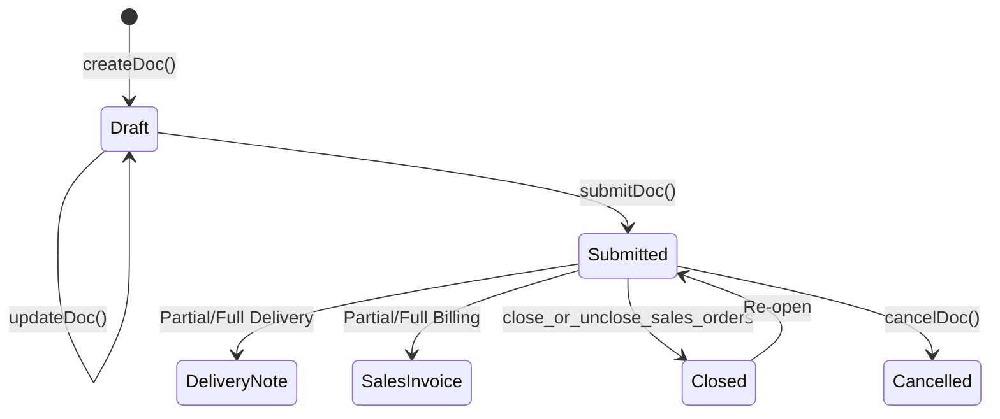
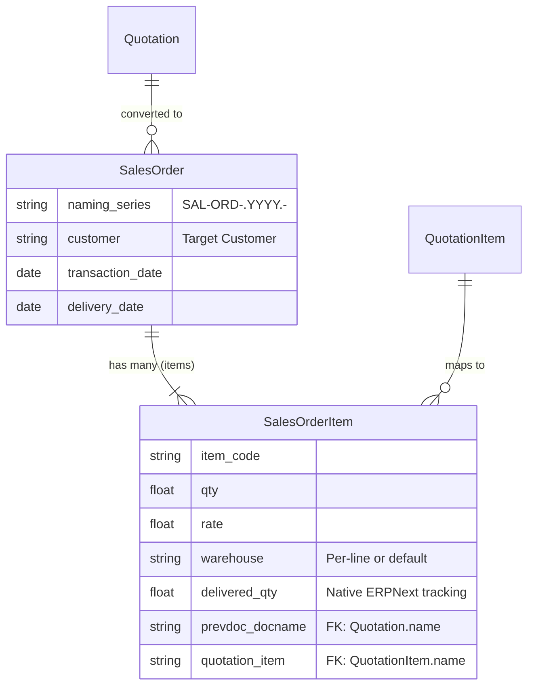

# Sales Order

## Future Backend Decoupling Strategy

If we migrate away from ERPNext to a custom backend, the Sales Order will remain the central hub for fulfillment. Instead of Frappe's dynamic document links (`prevdoc_docname`), a custom database would use explicit foreign keys linking Sales Order lines back to Quotation lines. 

The tables below detail how the current ERPNext fields mapped in our frontend would translate to a standard relational database schema.

## Field Mapping & Translation Table

### Header Level (Sales Order)

| ERPNext Native Field | Frontend Usage (actions.ts) | Future Custom Backend (RDBMS) | Description & Notes |
| :--- | :--- | :--- | :--- |
| `name` | `name` | `id` (UUID / Primary Key) | The primary identifier. |
| `naming_series` | `naming_series` (SAL-ORD...) | Sequence Generator | Dictates the order number (e.g. ORD-001). |
| `customer` | `customer` | `customer_id` (UUID, FK) | Links to the Customer table. |
| `transaction_date` | `transaction_date` | `order_date` (Date) | Date order was placed. |
| `delivery_date` | `delivery_date` | `expected_delivery_date` | Expected fulfillment date. |
| `company`, `currency` | `company`, `currency` | `company_id`, `currency_code` | Standard context fields. |
| `po_no`, `po_date` | `po_no`, `po_date` | `customer_po`, `po_date` | Customer's reference PO. |
| `docstatus` | *N/A (Managed by Frappe)* | `status` (Enum) | DRAFT, SUBMITTED, CLOSED, CANCELLED |

### Item Level (Sales Order Item)

| ERPNext Native Field | Frontend Usage | Future Custom Backend (RDBMS) | Description & Notes |
| :--- | :--- | :--- | :--- |
| `name` | `name` | `id` (UUID / PK) | Row identifier. |
| `parent` | *N/A (Managed by Frappe)* | `sales_order_id` (UUID, FK) | Link back to the header table. |
| `item_code` | `item_code` | `item_id` (UUID, FK) | Links to the Item/Product table. |
| `qty` | `qty` | `quantity` (Decimal) | Requested quantity. |
| `warehouse` | `warehouse` | `warehouse_id` (UUID, FK) | Target fulfillment warehouse. |
| `prevdoc_docname` | *Implicit in actions* | `source_quotation_id` (UUID, FK) | Links to original Quotation Header. |
| `quotation_item` | `quotation_item` | `source_quote_line_id` (UUID, FK)| Links to exact Quotation Item row. |
| `delivered_qty` | `delivered_qty` | `delivered_qty` (Decimal) | Maintained natively by DB triggers/logic. |
| `billed_amt` | *N/A (Frontend queries invoices)*| `invoiced_qty` (Decimal) | Custom backend would store billed qty. |

## Document Flow & Lifecycle

The Sales Order acts as the central hub for fulfillment and billing. It controls the progression into Delivery Notes and Sales Invoices.

## Entity Relationship Mapping

## Conversion Contracts

*   **To Delivery Note**: Uses `against_sales_order` (header) and `so_detail` (child row) on the Delivery Note to trigger ERPNext's native `delivered_qty` bookkeeping on the Sales Order Item.
*   **To Sales Invoice**: Uses `sales_order` and `so_detail` on the Sales Invoice line item. Quantities capped by remaining `billed_qty`.

## Error Handling & Admin Logging

*   **User-Facing Errors**: Exceptions (e.g., missing fields, duplicate names, validation rules) are caught and surfaced via humanizeError(e), which translates HTTP 403 / 409 and extracts Frappe's native _server_messages into readable UI alerts.
*   **Admin Observability**: All network failures, HTTP non-200 responses, and ERPNext exceptions are wrapped in ErpNextError and forwarded asynchronously to the centralized Admin Observability center (smart_factory.api.observability).
*   **Traceability**: Every error log is tagged with a correlationId that is safe to display to the user for support ticketing, ensuring backend exceptions can be traced exactly to the frontend action that caused them.

## Cancellation Rules & Dependencies

Cancellation (cancelDoc) is proactively protected in the frontend to maintain strict data integrity.
*   Before cancelling, the module's ctions.ts explicitly checks for linked downstream records using getConnections().
*   If downstream submitted records exist (e.g., a Receipt or Invoice linked to this document), the cancellation is safely blocked.
*   The system then surfaces a specific error message naming the exact downstream document(s) that the user must cancel first, matching ERPNext's native strict-reversal requirements.
