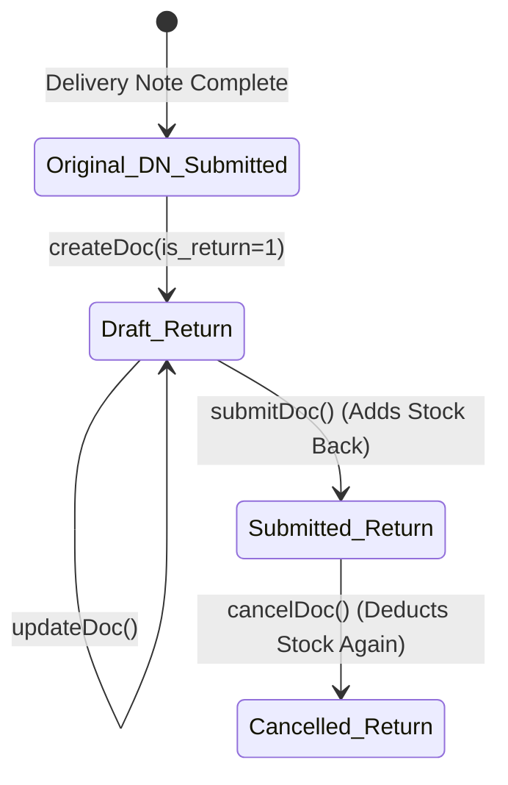

# Sales Return (Specification)

## Future Backend Decoupling Strategy

In ERPNext, a "Sales Return" is not a distinct database table. It is simply a standard **Delivery Note** where the `is_return` flag is set to `1` and quantities are supplied as negative values. 

If we migrate to a custom backend (RDBMS), this could be modeled in one of two ways:
1. **Unified Table (Frappe Style)**: Kept within the `Shipment` / `Fulfillment` table using a boolean `is_return` column and a self-referencing Foreign Key `return_against_id` pointing back to the original Shipment.
2. **Distinct Table**: Split into a dedicated `SalesReturn` table that strictly references the original `Fulfillment` table. 

For the current Frappe integration, the frontend MUST treat this as a standard Delivery Note API call (`/api/resource/Delivery Note`) with special flags.

## Field Mapping & Translation Contract

When Claude implements the `createSalesReturnAction`, it must pass the following specific fields to the `Delivery Note` API:

### Header Level

| ERPNext Native Field | Required Value / Frontend Mapping | Description & Notes |
| :--- | :--- | :--- |
| `customer` | Same as original Delivery Note | |
| `company` | Same as original Delivery Note | |
| `is_return` | `1` (Integer/Boolean) | **CRITICAL**: Tells Frappe this is a return, reversing the stock ledger posting. |
| `return_against` | `Original Delivery Note Name` | **CRITICAL**: The ID (`name`) of the submitted Delivery Note being returned. |

### Item Level (Delivery Note Item)

| ERPNext Native Field | Required Value / Frontend Mapping | Description & Notes |
| :--- | :--- | :--- |
| `item_code` | Same as original line | |
| `qty` | **Negative** (e.g., `-5.0`) | **CRITICAL**: Frappe expects negative quantities for returns to add stock back to the warehouse. |
| `warehouse` | Target Warehouse | The warehouse where the stock is being returned. |
| `dn_detail` | `Original DN Item Name` | Links the returned row exactly to the original shipped row. |
| `against_sales_order` | `Original Sales Order` | If applicable, inherited from the original DN. |
| `so_detail` | `Original SO Item` | If applicable, inherited from the original DN. |
| `batch_no` / `serial_no` | From original selection | If the item is serialized/batched, the exact Serial/Batch used in the original DN must be specified to return it to stock. |

## Document Flow & Lifecycle

## Implementation Notes for Claude (Frontend)

1.  **Validation**: The frontend UI should force the user to select the quantity they wish to return, ensuring it does not exceed the originally delivered quantity.
2.  **Negative Math Transformation**: The frontend UI might display quantities as positive numbers (e.g., "Return 5 units"), but the backend `actions.ts` **MUST** multiply this by `-1` before sending it to `createDoc()`.
3.  **Batch & Serial Reversal**: The complex two-step Batch/Serial bundle process used in standard Delivery Notes may be required in reverse, or Frappe may accept direct `batch_no`/`serial_no` references on the line item since it's an inbound return. This remains a `NEEDS_VERIFICATION` item for the implementation phase.
