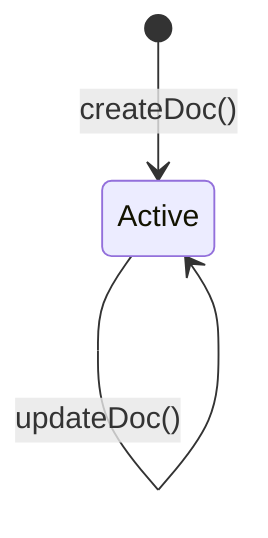
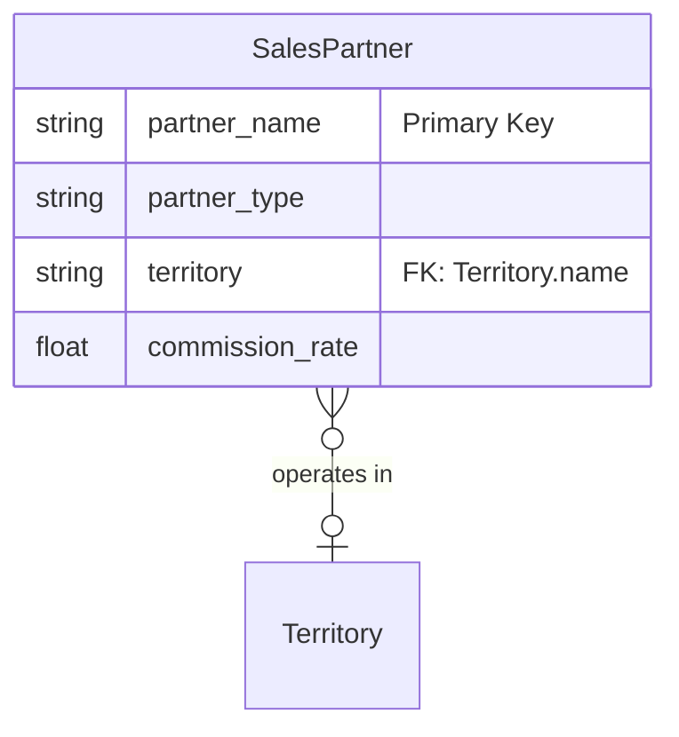
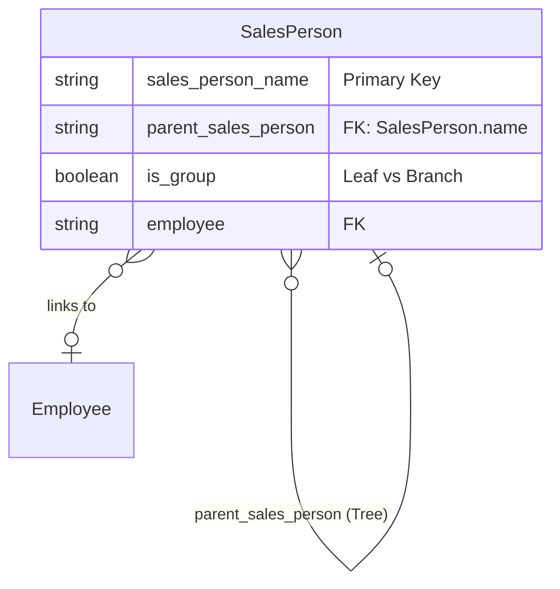
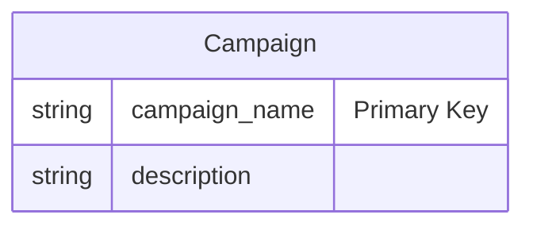

# Secondary Sales Masters (Sales Partner, Sales Person, Campaign)

## Future Backend Decoupling Strategy

These are supporting draftless Master Data entities used in the Sales cycle to track commissions, hierarchy, and marketing efforts. They map cleanly to standard `SalesPartner`, `SalesPerson`, and `Campaign` tables in a custom RDBMS. The `SalesPerson` entity uses a hierarchical Adjacency List pattern (Tree).

## 1. Sales Partner

### Field Mapping & Translation Table

| ERPNext Native Field | Frontend Usage (actions.ts) | Future Custom Backend (RDBMS) | Description & Notes |
| :--- | :--- | :--- | :--- |
| `partner_name` | `partner_name` | `id` (UUID / PK) | Primary Key. |
| `partner_type` | `partner_type` | `partner_type` (Enum) | |
| `territory` | `territory` | `territory_id` (UUID, FK) | Link to Territory. |
| `commission_rate` | `commission_rate` | `commission_rate` (Decimal) | |
| `introduction` | `introduction` | `introduction` (Text) | |

### Document Flow & Lifecycle

### Entity Relationship Mapping

---

## 2. Sales Person

### Field Mapping & Translation Table

| ERPNext Native Field | Frontend Usage (actions.ts) | Future Custom Backend (RDBMS) | Description & Notes |
| :--- | :--- | :--- | :--- |
| `sales_person_name` | `sales_person_name` | `id` (UUID / PK) | Primary Key. |
| `parent_sales_person` | `parent_sales_person` | `parent_id` (FK, self) | Adjacency list representation. |
| `commission_rate` | `commission_rate` | `commission_rate` (Decimal) | |
| `employee` | `employee` | `employee_id` (UUID, FK) | Link to Employee master. |
| `is_group` | `is_group` | `is_group` (Boolean) | Leaf vs Branch logic (Tree). |
| `enabled` | `enabled` | `is_active` (Boolean) | Standard toggle. |

### Document Flow & Lifecycle

### Entity Relationship Mapping

---

## 3. Campaign

### Field Mapping & Translation Table

| ERPNext Native Field | Frontend Usage (actions.ts) | Future Custom Backend (RDBMS) | Description & Notes |
| :--- | :--- | :--- | :--- |
| `campaign_name` | `campaign_name` | `id` (UUID / PK) | Primary Key. |
| `description` | `description` | `description` (Text) | |

### Document Flow & Lifecycle

### Entity Relationship Mapping

---

## Error Handling & Admin Logging

*   **User-Facing Errors**: Exceptions (e.g., missing fields, duplicate names, validation rules) are caught and surfaced via `humanizeError(e)`, which translates HTTP 403 / 409 and extracts Frappe's native `_server_messages` into readable UI alerts.
*   **Admin Observability**: All network failures, HTTP non-200 responses, and ERPNext exceptions are wrapped in `ErpNextError` and forwarded asynchronously to the centralized Admin Observability center (`smart_factory.api.observability`).
*   **Traceability**: Every error log is tagged with a `correlationId` that is safe to display to the user for support ticketing, ensuring backend exceptions can be traced exactly to the frontend action that caused them.

## Cancellation Rules & Dependencies

Master Data entities in ERPNext (like Sales Partner, Sales Person, Campaign) are Draftless. They do not have a `docstatus` field and cannot be "Cancelled" (`cancelDoc` does not apply).
*   Instead of cancellation, these entities typically use an `enabled` or `disabled` flag to deactivate them (if supported by their schema, like `Sales Person`).
*   The frontend exposes this checkbox on the edit forms for entities that support it, allowing them to be soft-deleted or hidden from transactional dropdowns without breaking historical relational integrity.
