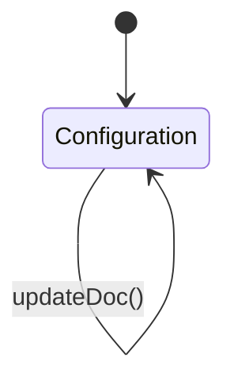

# Selling Settings

## Future Backend Decoupling Strategy

`Selling Settings` is an ERPNext "Single" DocType. Single DocTypes are essentially singleton records used for global configuration—they do not have multiple rows or standard `name` / `docstatus` lifecycles.

In a custom backend (RDBMS), this would typically map to a globally singular `selling_settings` table (with exactly one row enforced) or a key-value `configurations` table (where `module = 'sales'`). 

## Field Mapping & Translation Table

Because this is a configuration object, the mappings primarily govern application behavior (like default values or validation rules).

### Customer Defaults

| ERPNext Native Field | Frontend Usage (actions.ts) | Future Custom Backend (RDBMS) | Description & Notes |
| :--- | :--- | :--- | :--- |
| `cust_master_name` | `cust_master_name` | `customer_naming_strategy` (Enum) | "Customer Name", "Naming Series", or "Auto Name". |
| `customer_group` | `customer_group` | `default_customer_group_id` (UUID, FK) | Fallback default. |
| `territory` | `territory` | `default_territory_id` (UUID, FK) | Fallback default. |

### Pricing Rules

| ERPNext Native Field | Frontend Usage | Future Custom Backend (RDBMS) | Description & Notes |
| :--- | :--- | :--- | :--- |
| `selling_price_list` | `selling_price_list` | `default_price_list_id` (UUID, FK) | The default price list for new transactions. |
| `maintain_same_rate_action` | `maintain_same_rate_action` | `rate_change_action` (Enum) | "Stop" or "Warn". |
| `role_to_override_stop_action` | `role_to_override_stop_action` | `override_role_id` (UUID, FK) | Role that bypasses the strict rate check. |
| `maintain_same_sales_rate` | `maintain_same_sales_rate` | `enforce_consistent_rates` (Boolean) | Warn/stop if item rate changes between Order and Invoice. |
| `editable_price_list_rate` | `editable_price_list_rate` | `allow_rate_edits` (Boolean) | Can users edit the fetched price list rate manually? |
| `fallback_to_default_price_list` | `fallback_to_default_price_list` | `use_fallback_prices` (Boolean) | |
| `validate_selling_price` | `validate_selling_price` | `block_below_cost_sales` (Boolean) | Blocks selling below purchase/valuation rate. |
| `editable_bundle_item_rates` | `editable_bundle_item_rates` | `editable_bundle_rates` (Boolean) | |
| `allow_negative_rates_for_items` | `allow_negative_rates_for_items` | `allow_negative_rates` (Boolean) | |

### Transaction Rules

| ERPNext Native Field | Frontend Usage | Future Custom Backend (RDBMS) | Description & Notes |
| :--- | :--- | :--- | :--- |
| `so_required` | `so_required` | `require_sales_order` (Boolean) | "Yes/No": Force SO before Invoice/Delivery. |
| `dn_required` | `dn_required` | `require_delivery_note` (Boolean) | "Yes/No": Force DN before Invoice. |
| `sales_update_frequency` | `sales_update_frequency` | `sales_update_frequency` (Enum) | "Monthly", "Each Transaction", "Daily". |
| `blanket_order_allowance` | `blanket_order_allowance` | `blanket_order_allowance_pct` (Decimal) | |
| `allow_multiple_items` | `allow_multiple_items` | `allow_duplicate_items` (Boolean) | Can same item be added multiple times to one doc? |
| `allow_against_multiple_purchase_orders` | `allow_against_multiple_purchase_orders` | `allow_multi_po` (Boolean) | |
| `hide_tax_id` | `hide_tax_id` | `hide_tax_id` (Boolean) | |
| `allow_sales_order_creation_for_expired_quotation` | `allow_sales_order_creation_for_expired_quotation` | `allow_expired_quotes` (Boolean) | |
| `dont_reserve_sales_order_qty_on_sales_return` | `dont_reserve_sales_order_qty_on_sales_return` | `reserve_returned_qty` (Boolean) | |
| `enable_cutoff_date_on_bulk_delivery_note_creation` | `enable_cutoff_date_on_bulk_delivery_note_creation` | `enable_bulk_dn_cutoff` (Boolean) | |
| `set_zero_rate_for_expired_batch` | `set_zero_rate_for_expired_batch` | `zero_rate_expired_batch` (Boolean) | |
| `allow_zero_qty_in_quotation` | `allow_zero_qty_in_quotation` | `allow_zero_qty_quotes` (Boolean) | |
| `allow_zero_qty_in_sales_order` | `allow_zero_qty_in_sales_order` | `allow_zero_qty_orders` (Boolean) | |

### Advanced Features & Subcontracting

| ERPNext Native Field | Frontend Usage | Future Custom Backend (RDBMS) | Description & Notes |
| :--- | :--- | :--- | :--- |
| `enable_tracking_sales_commissions` | `enable_tracking_sales_commissions` | `track_commissions` (Boolean) | |
| `enable_discount_accounting` | `enable_discount_accounting` | `enable_discount_accounting` (Boolean) | |
| `enable_utm` | `enable_utm` | `track_utm_campaigns` (Boolean) | |
| `use_legacy_js_reactivity` | `use_legacy_js_reactivity` | *N/A (Frappe Specific)* | Client-side frappe desk specific. |
| `allow_delivery_of_overproduced_qty` | `allow_delivery_of_overproduced_qty` | `allow_overdelivery` (Boolean) | Subcontracting rule. |
| `deliver_secondary_items` | `deliver_secondary_items` | `deliver_secondary_items` (Boolean) | Subcontracting rule. |

## Document Flow & Lifecycle

As a "Single" DocType, there is no lifecycle, no list view, and no creation/cancellation.

## Error Handling & Admin Logging

*   Since `Selling Settings` is globally unique, the frontend action (`updateSellingSettingsAction`) hardcodes the name `Selling Settings` when calling the API.
*   **User-Facing Errors**: Field validation exceptions are caught and surfaced via `humanizeError(e)`, which translates HTTP 403 / 409 and extracts Frappe's native `_server_messages` into readable UI alerts.
*   **Admin Observability**: All network failures, HTTP non-200 responses, and ERPNext exceptions are wrapped in `ErpNextError` and forwarded asynchronously to the centralized Admin Observability center (`smart_factory.api.observability`).
