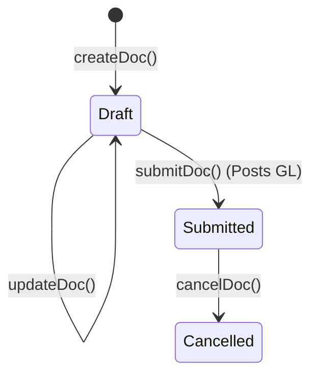
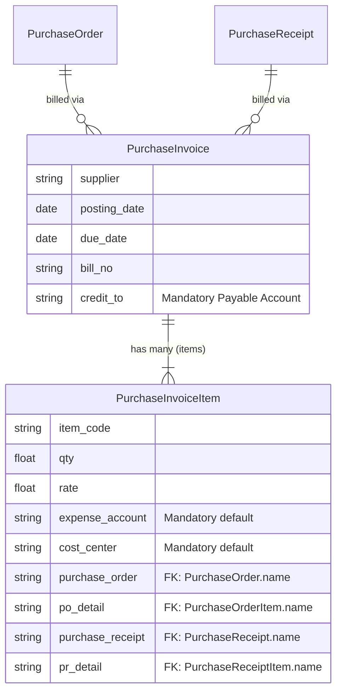

# Purchase Invoice

## Future Backend Decoupling Strategy

The Purchase Invoice finalizes the Accounts Payable (AP) liability. In ERPNext, the `credit_to` (payable account), `expense_account`, and `cost_center` must be explicitly provided. Currently, the frontend hardcodes these dynamically by looking up values from `getBuyingDefaults()`. 
In a custom relational backend, these accounting distribution logic rules would be abstracted to the backend server rather than required in the frontend payload.

## Field Mapping & Translation Table

### Header Level (Purchase Invoice)

| ERPNext Native Field | Frontend Usage (actions.ts) | Future Custom Backend (RDBMS) | Description & Notes |
| :--- | :--- | :--- | :--- |
| `name` | `name` | `id` (UUID / Primary Key) | The primary identifier. |
| `naming_series` | *Auto-assigned by Frappe* | Sequence Generator | Dictates the invoice number. |
| `supplier` | `supplier` | `supplier_id` (UUID, FK) | Links to the Supplier table. |
| `posting_date` | `posting_date` | `invoice_date` (Date) | Date of invoice posting. |
| `due_date` | `due_date` | `due_date` (Date) | Payment due date. |
| `bill_no`, `bill_date` | `bill_no`, `bill_date` | `supplier_invoice_ref` | The supplier's physical invoice #. |
| `credit_to` | `credit_to` | `payable_account_id` (FK) | AP account for GL posting (from defaults). |
| `docstatus` | *N/A (Managed by Frappe)* | `status` (Enum) | DRAFT, SUBMITTED (POSTED), CANCELLED |

### Item Level (Purchase Invoice Item)

| ERPNext Native Field | Frontend Usage | Future Custom Backend (RDBMS) | Description & Notes |
| :--- | :--- | :--- | :--- |
| `name` | `name` | `id` (UUID / PK) | Row identifier. |
| `parent` | *N/A (Managed by Frappe)* | `invoice_id` (UUID, FK) | Link back to the header table. |
| `item_code` | `item_code` | `item_id` (UUID, FK) | Links to the Item/Product table. |
| `qty` | `qty` | `quantity` (Decimal) | Billed quantity. |
| `expense_account` | `expense_account` | *Inferred by backend* | ERPNext forces this frontend; custom backend would derive this natively. |
| `cost_center` | `cost_center` | *Inferred by backend* | Likewise, derived by backend. |
| `purchase_order` | `purchase_order` | `purchase_order_id` (UUID, FK) | Links back to the source PO. |
| `po_detail` | `po_detail` | `purchase_order_line_id` (FK) | Links to exact PO Item row. |
| `purchase_receipt` | `purchase_receipt` | `receipt_id` (UUID, FK) | Links back to source Receipt. |
| `pr_detail` | `pr_detail` | `receipt_line_id` (UUID, FK) | Links to exact Receipt Item row. |

## Document Flow & Lifecycle

The Purchase Invoice posts to the General Ledger upon submission.

## Entity Relationship Mapping

A Purchase Invoice can be sourced directly from a Purchase Order or from a Purchase Receipt.

## Error Handling & Admin Logging

*   **User-Facing Errors**: Exceptions (e.g., missing fields, duplicate names, validation rules) are caught and surfaced via humanizeError(e), which translates HTTP 403 / 409 and extracts Frappe's native _server_messages into readable UI alerts.
*   **Admin Observability**: All network failures, HTTP non-200 responses, and ERPNext exceptions are wrapped in ErpNextError and forwarded asynchronously to the centralized Admin Observability center (smart_factory.api.observability).
*   **Traceability**: Every error log is tagged with a correlationId that is safe to display to the user for support ticketing, ensuring backend exceptions can be traced exactly to the frontend action that caused them.

## Cancellation Rules & Dependencies

Cancellation (cancelDoc) is proactively protected in the frontend to maintain strict data integrity.
*   Before cancelling, the module's ctions.ts explicitly checks for linked downstream records using getConnections().
*   If downstream submitted records exist (e.g., a Receipt or Invoice linked to this document), the cancellation is safely blocked.
*   The system then surfaces a specific error message naming the exact downstream document(s) that the user must cancel first, matching ERPNext's native strict-reversal requirements.
