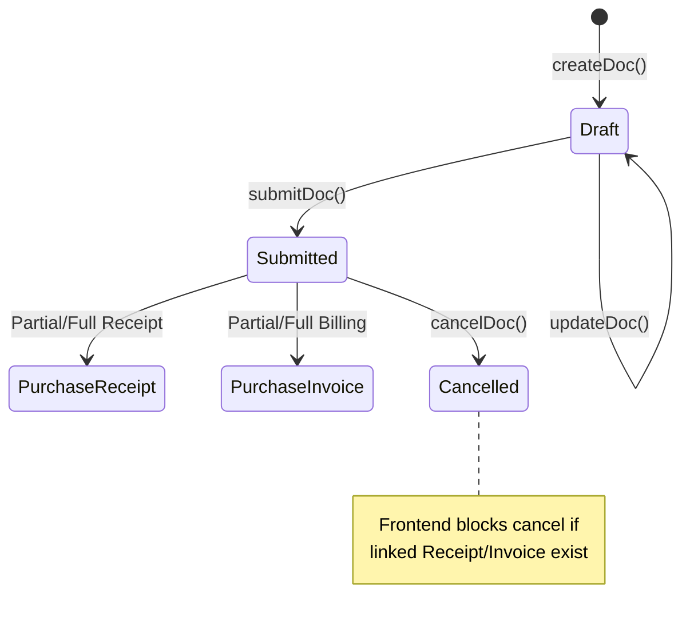
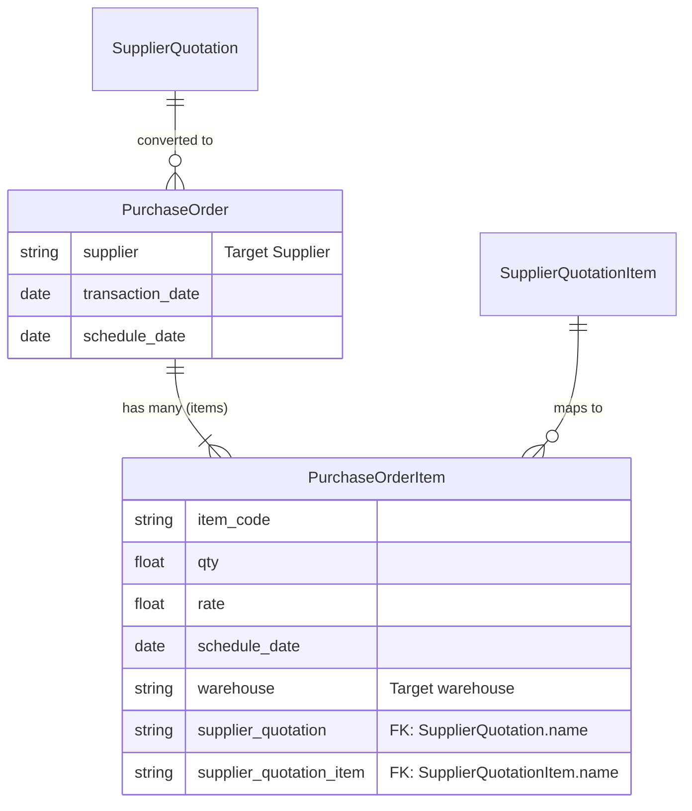

# Purchase Order

## Future Backend Decoupling Strategy

The Purchase Order (PO) is the central commitment document for purchasing. In the current ERPNext architecture, it relies on Frappe's dynamic linkages. If migrated to a custom backend, the PO becomes a standard relational entity (`PurchaseOrder` and `PurchaseOrderItem`) with strict foreign keys linking back to upstream documents like `Supplier Quotation`.

## Field Mapping & Translation Table

### Header Level (Purchase Order)

| ERPNext Native Field | Frontend Usage (actions.ts) | Future Custom Backend (RDBMS) | Description & Notes |
| :--- | :--- | :--- | :--- |
| `name` | `name` | `id` (UUID / Primary Key) | The primary identifier. |
| `naming_series` | *Auto-assigned by Frappe* | Sequence Generator | Dictates the order number (e.g. PUR-ORD-...). |
| `supplier` | `supplier` | `supplier_id` (UUID, FK) | Links to the Supplier/Vendor table. |
| `transaction_date` | `transaction_date` | `order_date` (Date) | Date order was placed. |
| `schedule_date` | `schedule_date` | `expected_delivery_date` | Target delivery date. |
| `company`, `currency` | `company`, `currency` | `company_id`, `currency_code` | Standard context fields from defaults. |
| `docstatus` | *N/A (Managed by Frappe)* | `status` (Enum) | DRAFT, SUBMITTED, CLOSED, CANCELLED |

### Item Level (Purchase Order Item)

| ERPNext Native Field | Frontend Usage | Future Custom Backend (RDBMS) | Description & Notes |
| :--- | :--- | :--- | :--- |
| `name` | `name` | `id` (UUID / PK) | Row identifier. |
| `parent` | *N/A (Managed by Frappe)* | `purchase_order_id` (UUID, FK) | Link back to the header table. |
| `item_code` | `item_code` | `item_id` (UUID, FK) | Links to the Item/Product table. |
| `qty` | `qty` | `quantity` (Decimal) | Requested quantity. |
| `uom`, `stock_uom` | `uom`, `stock_uom` | `uom_id` (UUID, FK) | Unit of measure. In frontend, `stock_uom` is forced to mirror `uom` (conversion=1). |
| `rate` | `rate` | `unit_price` (Decimal) | Price per unit. |
| `schedule_date` | `schedule_date` | `required_by_date` (Date) | Per-line expected delivery date. |
| `warehouse` | `warehouse` | `target_warehouse_id` (UUID)| Destination warehouse for receipt. |
| `supplier_quotation` | `supplier_quotation` | `source_quote_id` (UUID, FK) | Link back to source Supplier Quotation header. |
| `supplier_quotation_item`| `supplier_quotation_item`| `source_quote_line_id` (FK) | Link back to exact source Quote line. |
| `received_qty` | *N/A (Derived by Frappe)* | `received_qty` (Decimal) | Quantity physically received so far. |

## Document Flow & Lifecycle

The Purchase Order initiates the downstream receipt and billing cycles. The frontend explicitly checks for these downstream dependencies before allowing a cancellation.

## Entity Relationship Mapping

## Conversion Contracts

*   **To Purchase Receipt**: Uses `purchase_order` (header) and `purchase_order_item` (child row) on the Purchase Receipt line to trigger ERPNext's native `received_qty` bookkeeping on the PO line.
*   **To Purchase Invoice**: Uses `purchase_order` and `po_detail` on the Purchase Invoice line. Quantities are capped by `billed_qty`, which is calculated dynamically via `getBilledQtyByPoDetail` in the frontend app.

## Error Handling & Admin Logging

*   **User-Facing Errors**: Exceptions (e.g., missing fields, duplicate names, validation rules) are caught and surfaced via humanizeError(e), which translates HTTP 403 / 409 and extracts Frappe's native _server_messages into readable UI alerts.
*   **Admin Observability**: All network failures, HTTP non-200 responses, and ERPNext exceptions are wrapped in ErpNextError and forwarded asynchronously to the centralized Admin Observability center (smart_factory.api.observability).
*   **Traceability**: Every error log is tagged with a correlationId that is safe to display to the user for support ticketing, ensuring backend exceptions can be traced exactly to the frontend action that caused them.

## Cancellation Rules & Dependencies

Cancellation (cancelDoc) is proactively protected in the frontend to maintain strict data integrity.
*   Before cancelling, the module's ctions.ts explicitly checks for linked downstream records using getConnections().
*   If downstream submitted records exist (e.g., a Receipt or Invoice linked to this document), the cancellation is safely blocked.
*   The system then surfaces a specific error message naming the exact downstream document(s) that the user must cancel first, matching ERPNext's native strict-reversal requirements.
