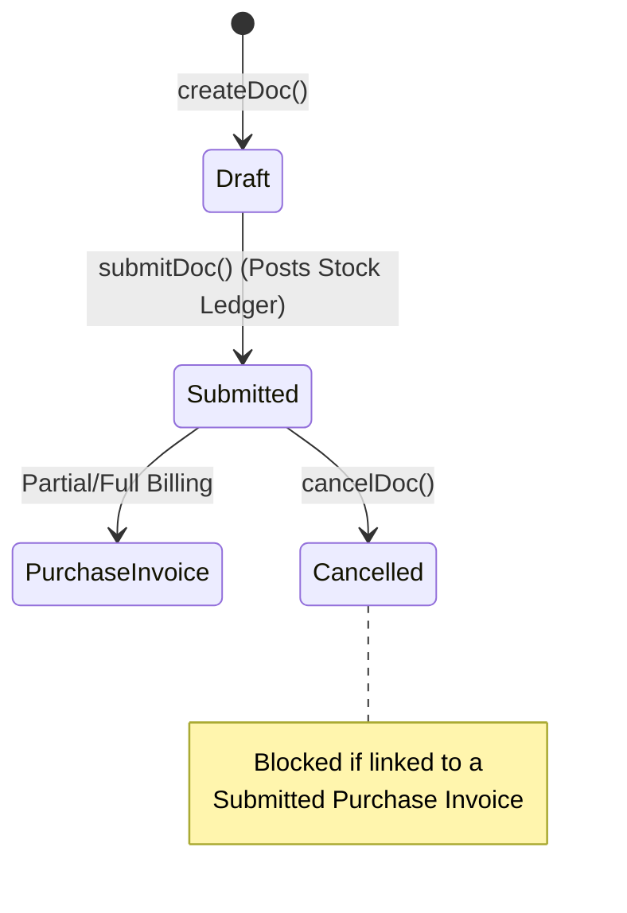
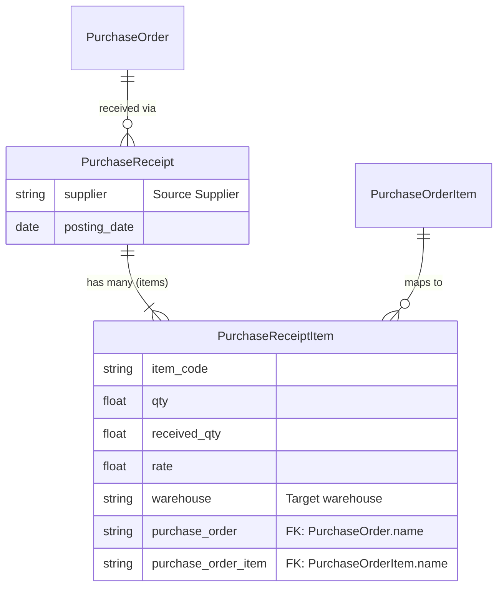

# Purchase Receipt

## Future Backend Decoupling Strategy

The Purchase Receipt manages the inbound movement of stock into inventory. If migrated to a custom backend, this would map directly to a `GoodsReceipt` or `InboundShipment` entity. Unlike Sales Delivery Notes, the current frontend implementation does not explicitly mandate a separate Batch/Serial attach step for PRs, though that architectural capability would be preserved in a custom backend.

## Field Mapping & Translation Table

### Header Level (Purchase Receipt)

| ERPNext Native Field | Frontend Usage (actions.ts) | Future Custom Backend (RDBMS) | Description & Notes |
| :--- | :--- | :--- | :--- |
| `name` | `name` | `id` (UUID / Primary Key) | The primary identifier. |
| `supplier` | `supplier` | `supplier_id` (UUID, FK) | Links to the Supplier table. |
| `posting_date` | `posting_date` | `receipt_date` (Date) | Date of physical receipt into stock. |
| `company`, `currency` | `company`, `currency` | `company_id`, `currency_code` | Standard context fields. |
| `docstatus` | *N/A (Managed by Frappe)* | `status` (Enum) | DRAFT, SUBMITTED (Posts Stock), CANCELLED |

### Item Level (Purchase Receipt Item)

| ERPNext Native Field | Frontend Usage | Future Custom Backend (RDBMS) | Description & Notes |
| :--- | :--- | :--- | :--- |
| `name` | `name` | `id` (UUID / PK) | Row identifier. |
| `parent` | *N/A (Managed by Frappe)* | `receipt_id` (UUID, FK) | Link back to the header table. |
| `item_code` | `item_code` | `item_id` (UUID, FK) | Links to the Item/Product table. |
| `qty`, `received_qty` | `qty`, `received_qty` | `quantity` (Decimal) | Quantity physically received. |
| `warehouse` | `warehouse` | `warehouse_id` (UUID, FK) | Destination warehouse. |
| `rate` | `rate` | `unit_price` (Decimal) | Incoming valuation rate. |
| `purchase_order` | `purchase_order` | `purchase_order_id` (UUID, FK) | Links back to the source PO. |
| `purchase_order_item` | `purchase_order_item` | `purchase_order_line_id` (FK) | Links to exact PO Item row. |

## Document Flow & Lifecycle

Submitting a Purchase Receipt posts the inbound quantities to the Stock Ledger.

## Entity Relationship Mapping

## Conversion Contract (To Purchase Invoice)
*   **Process**: A Submitted Purchase Receipt can be billed via a Purchase Invoice.
*   **Quantity Logic**: The frontend calculates remaining unbilled quantity dynamically using `getBilledQtyByPrDetail` against the `Purchase Invoice Item` `pr_detail` references.
*   **Lineage Tracking**: When converting, the frontend maps both `pr_detail -> purchase_receipt` AND `po_detail -> purchase_order` (if the PR was created from a PO) so the resulting Invoice maintains a complete audit trail back to the origin Order.

## Error Handling & Admin Logging

*   **User-Facing Errors**: Exceptions (e.g., missing fields, duplicate names, validation rules) are caught and surfaced via humanizeError(e), which translates HTTP 403 / 409 and extracts Frappe's native _server_messages into readable UI alerts.
*   **Admin Observability**: All network failures, HTTP non-200 responses, and ERPNext exceptions are wrapped in ErpNextError and forwarded asynchronously to the centralized Admin Observability center (smart_factory.api.observability).
*   **Traceability**: Every error log is tagged with a correlationId that is safe to display to the user for support ticketing, ensuring backend exceptions can be traced exactly to the frontend action that caused them.

## Cancellation Rules & Dependencies

Cancellation (cancelDoc) is proactively protected in the frontend to maintain strict data integrity.
*   Before cancelling, the module's ctions.ts explicitly checks for linked downstream records using getConnections().
*   If downstream submitted records exist (e.g., a Receipt or Invoice linked to this document), the cancellation is safely blocked.
*   The system then surfaces a specific error message naming the exact downstream document(s) that the user must cancel first, matching ERPNext's native strict-reversal requirements.
