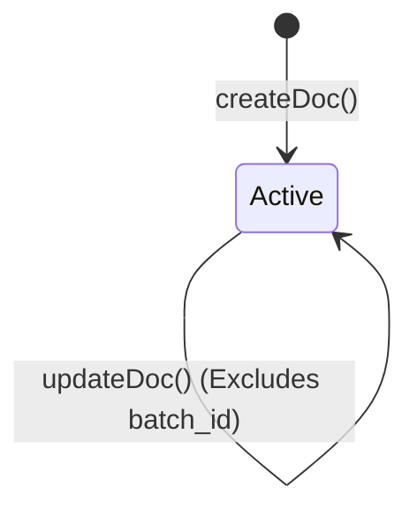
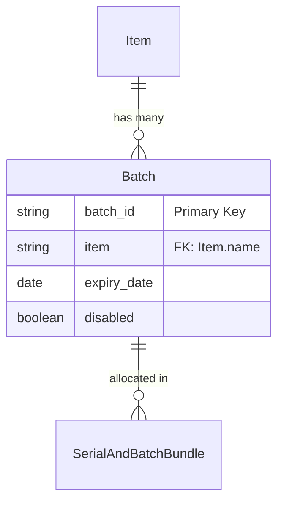

# Batch

## Future Backend Decoupling Strategy

The `Batch` document is a pure Master Data entity in ERPNext for grouping inventory items. It has no draft state (`docstatus`). If migrated to a custom backend, this maps to a standard `InventoryBatch` table. In the custom backend, it might be beneficial to make `batch_id` auto-generated rather than user-provided to prevent collision, but currently it maps directly to user input.

## Field Mapping & Translation Table

| ERPNext Native Field | Frontend Usage (actions.ts) | Future Custom Backend (RDBMS) | Description & Notes |
| :--- | :--- | :--- | :--- |
| `name`, `batch_id` | `batch_id` | `id` (UUID / Primary Key) | The primary identifier. In ERPNext, the ID itself is the PK. |
| `item` | `item` | `item_id` (UUID, FK) | Links to the Item/Product table. |
| `expiry_date` | `expiry_date` | `expiry_date` (Date) | Date the batch expires. |
| `disabled` | `disabled` | `is_active` (Boolean) | Note: Inverted logic (1 = Disabled). |

## Document Flow & Lifecycle

The Batch document is draftless. Once created, its ID cannot be changed.

## Entity Relationship Mapping

## Error Handling & Admin Logging

*   **User-Facing Errors**: Exceptions (e.g., missing fields, duplicate names, validation rules) are caught and surfaced via `humanizeError(e)`, which translates HTTP 403 / 409 and extracts Frappe's native `_server_messages` into readable UI alerts.
*   **Admin Observability**: All network failures, HTTP non-200 responses, and ERPNext exceptions are wrapped in `ErpNextError` and forwarded asynchronously to the centralized Admin Observability center (`smart_factory.api.observability`).
*   **Traceability**: Every error log is tagged with a `correlationId` that is safe to display to the user for support ticketing, ensuring backend exceptions can be traced exactly to the frontend action that caused them.

## Cancellation Rules & Dependencies

Cancellation (`cancelDoc`) is proactively protected in the frontend to maintain strict data integrity.
*   Before cancelling, the module's `actions.ts` explicitly checks for linked downstream records using `getConnections()`.
*   If downstream submitted records exist, the cancellation is safely blocked.
*   The system then surfaces a specific error message naming the exact downstream document(s) that the user must cancel first, matching ERPNext's native strict-reversal requirements.
