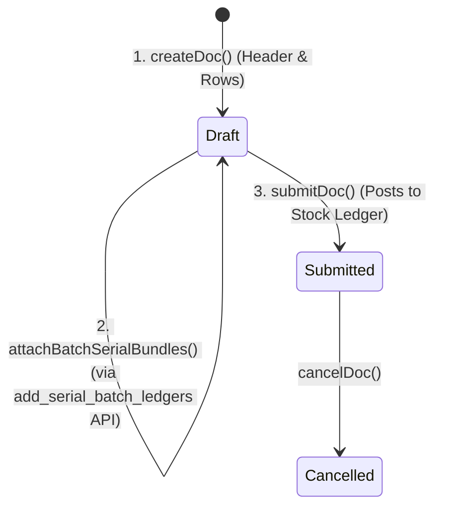
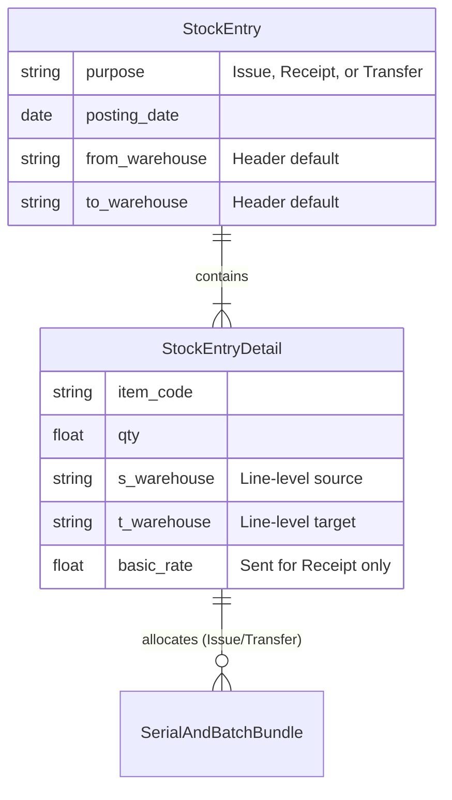

# Stock Entry

## Future Backend Decoupling Strategy

The `Stock Entry` is ERPNext's primary master document for moving physical inventory (Material Issue, Receipt, and Transfer). If migrated to a custom relational backend, this could map to a single `StockMovement` header entity, or be split into dedicated `InboundShipment`, `OutboundShipment`, and `TransferOrder` tables based on the `purpose`.

Currently, the frontend uses a 2-step API creation flow to handle batched/serialized inventory (Draft creation -> Batch/Serial assignment -> Submit). A custom backend should aim to make this a single transactional write to guarantee data integrity.

## Field Mapping & Translation Table

### Header Level (Stock Entry)

| ERPNext Native Field | Frontend Usage (actions.ts) | Future Custom Backend (RDBMS) | Description & Notes |
| :--- | :--- | :--- | :--- |
| `name` | `name` | `id` (UUID / Primary Key) | The primary identifier. |
| `naming_series` | *Hardcoded: `MAT-STE-.YYYY.-`* | Sequence Generator | Dictates the transaction number. |
| `company` | `company` | `company_id` | Standard context field. |
| `posting_date` | `posting_date` | `movement_date` (Date) | Date the stock physically moved. |
| `purpose`, `stock_entry_type` | `purpose` | `movement_type` (Enum) | 'Material Issue', 'Material Receipt', 'Material Transfer'. |
| `from_warehouse` | `from_warehouse` | `source_warehouse_id` | Used for Issue and Transfer. |
| `to_warehouse` | `to_warehouse` | `target_warehouse_id` | Used for Receipt and Transfer. |
| `docstatus` | *N/A (Managed by Frappe)* | `status` (Enum) | DRAFT, SUBMITTED (Posts Stock), CANCELLED |

### Item Level (Stock Entry Detail)

| ERPNext Native Field | Frontend Usage | Future Custom Backend (RDBMS) | Description & Notes |
| :--- | :--- | :--- | :--- |
| `name` | `name` | `id` (UUID / PK) | Row identifier. |
| `parent` | *N/A (Managed by Frappe)* | `movement_id` (UUID, FK) | Link back to the header table. |
| `item_code` | `item_code` | `item_id` (UUID, FK) | Links to the Item/Product table. |
| `qty` | `qty` | `quantity` (Decimal) | Quantity moved. |
| `uom`, `stock_uom` | `uom`, `stock_uom` | `uom_id` (UUID, FK) | Unit of measure. |
| `s_warehouse` | `s_warehouse` | `source_warehouse_id` (FK) | Set on line if purpose is Issue or Transfer. |
| `t_warehouse` | `t_warehouse` | `target_warehouse_id` (FK) | Set on line if purpose is Receipt or Transfer. |
| `basic_rate` | `basic_rate` | `unit_cost` (Decimal) | Explicitly sent ONLY for Material Receipt. For Issue/Transfer, ERPNext calculates this dynamically from valuation. |

## Document Flow & Lifecycle

The Stock Entry uses a distinct two-step creation flow for outbound movements because of how ERPNext requires Batches and Serials to be allocated.

## Entity Relationship Mapping

## Error Handling & Admin Logging

*   **User-Facing Errors**: Exceptions (e.g., missing fields, duplicate names, validation rules) are caught and surfaced via `humanizeError(e)`, which translates HTTP 403 / 409 and extracts Frappe's native `_server_messages` into readable UI alerts.
*   **Admin Observability**: All network failures, HTTP non-200 responses, and ERPNext exceptions are wrapped in `ErpNextError` and forwarded asynchronously to the centralized Admin Observability center (`smart_factory.api.observability`).
*   **Traceability**: Every error log is tagged with a `correlationId` that is safe to display to the user for support ticketing, ensuring backend exceptions can be traced exactly to the frontend action that caused them.

## Cancellation Rules & Dependencies

Cancellation (`cancelDoc`) is proactively protected in the frontend to maintain strict data integrity.
*   Before cancelling, the module's `actions.ts` explicitly checks for linked downstream records using `getConnections()`.
*   If downstream submitted records exist, the cancellation is safely blocked.
*   The system then surfaces a specific error message naming the exact downstream document(s) that the user must cancel first, matching ERPNext's native strict-reversal requirements.
