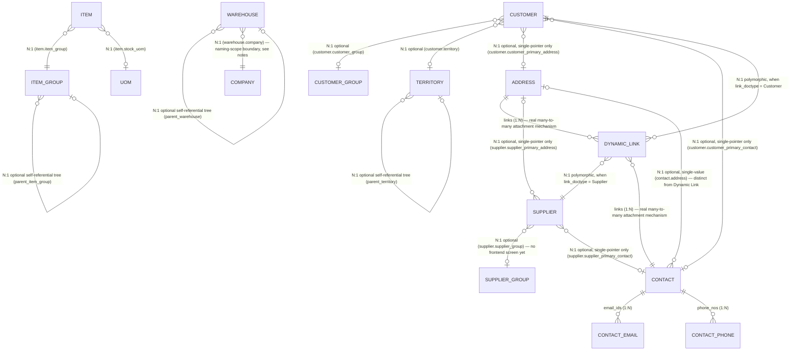
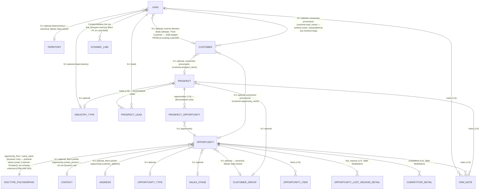

# Master ERD

Per `docs/controls/BACKEND_KNOWLEDGE_POLICY.md` §4/§5. Grows with real implementation — only
entities/relationships currently known from built (or investigated) functionality appear here.
As of 2026-09-17 this covered only the **Manufacturing** entities documented in
`docs/backend/05-manufacturing/`. **Extended 2026-09-22 (MD-R2)** with the **Master Data** entities
documented in `docs/backend/01-master-data/` — see the second diagram below. Sales/Buying/Inventory
transactional entities (Sales Order, Purchase Order, Stock Entry as their own domain, etc.) are
real and shipped but not yet modeled here — add them when their domain gets its own baseline pass.

```mermaid
erDiagram
    WORK_ORDER ||--o{ WORK_ORDER_ITEM : "required_items (1:N)"
    WORK_ORDER ||--o{ WORK_ORDER_OPERATION : "operations (1:N)"
    WORK_ORDER ||--o{ JOB_CARD : "1:N (job_card.work_order)"
    WORK_ORDER ||--o{ STOCK_ENTRY : "1:N (stock_entry.work_order)"
    WORK_ORDER }o--|| BOM : "N:1 (work_order.bom_no)"
    WORK_ORDER }o--|| ITEM : "N:1 (work_order.production_item)"
    WORK_ORDER }o--o| SALES_ORDER : "N:1 optional (work_order.sales_order)"
    WORK_ORDER }o--o| PROJECT : "N:1 optional (work_order.project)"
    WORK_ORDER }o--o| WAREHOUSE : "N:1 x3 optional roles: source / wip / fg"
    WORK_ORDER_ITEM }o--|| ITEM : "N:1 (item_code)"
    WORK_ORDER_ITEM }o--o| WAREHOUSE : "N:1 optional (source_warehouse)"
    BOM ||--o{ BOM_ITEM : "items (1:N)"
    BOM ||--o{ BOM_OPERATION : "operations (1:N)"
    BOM }o--|| ITEM : "N:1 (bom.item)"
    BOM }o--o| ROUTING : "N:1 optional (bom.routing)"
    BOM_ITEM }o--|| ITEM : "N:1 (bom_item.item_code)"
    BOM_ITEM }o--o| BOM : "N:1 optional self-referential (bom_item.bom_no, sub-assembly/nested BOM)"
    BOM_OPERATION }o--|| OPERATION : "N:1 (bom_operation.operation)"
    BOM_OPERATION }o--o| WORKSTATION : "N:1 optional (bom_operation.workstation)"
    PRODUCTION_PLAN ||--o{ PRODUCTION_PLAN_ITEM : "po_items (1:N)"
    PRODUCTION_PLAN ||--o{ PRODUCTION_PLAN_SUB_ASSEMBLY_ITEM : "sub_assembly_items (1:N)"
    PRODUCTION_PLAN ||--o{ MATERIAL_REQUEST_PLAN_ITEM : "mr_items (1:N)"
    PRODUCTION_PLAN ||--o{ PRODUCTION_PLAN_SALES_ORDER : "sales_orders (1:N)"
    PRODUCTION_PLAN ||--o{ PRODUCTION_PLAN_MATERIAL_REQUEST : "material_requests (1:N)"
    PRODUCTION_PLAN ||--o{ PRODUCTION_PLAN_ITEM_REFERENCE : "prod_plan_references (1:N, only when combine_items)"
    PRODUCTION_PLAN_ITEM }o--|| ITEM : "N:1 (item_code)"
    PRODUCTION_PLAN_ITEM }o--|| BOM : "N:1 (bom_no, user-editable per-row override — see production-plan.md multi-BOM section)"
    PRODUCTION_PLAN_ITEM }o--o| SALES_ORDER : "N:1 optional (sales_order)"
    PRODUCTION_PLAN_ITEM }o--o| MATERIAL_REQUEST : "N:1 optional (material_request)"
    PRODUCTION_PLAN_SUB_ASSEMBLY_ITEM }o--|| BOM : "N:1 (bom_no, server-derived from explosion — not a confirmed independent user selector)"
    PRODUCTION_PLAN_SALES_ORDER }o--|| SALES_ORDER : "N:1 (sales_order)"
    PRODUCTION_PLAN_MATERIAL_REQUEST }o--|| MATERIAL_REQUEST : "N:1 (material_request)"
    PRODUCTION_PLAN_ITEM_REFERENCE }o--|| PRODUCTION_PLAN_ITEM : "N:1 (item_reference, only when combine_items)"
    WORK_ORDER }o--o| PRODUCTION_PLAN : "N:1 optional, document-level (work_order.production_plan)"
    WORK_ORDER }o--o| PRODUCTION_PLAN_ITEM : "N:1 optional, row-level by name (work_order.production_plan_item)"
    WORK_ORDER }o--o| PRODUCTION_PLAN_SUB_ASSEMBLY_ITEM : "N:1 optional, row-level by name (work_order.production_plan_sub_assembly_item)"
    MATERIAL_REQUEST_ITEM }o--o| PRODUCTION_PLAN : "N:1 optional (material_request_item.production_plan) — NOT on Material Request parent"
    MATERIAL_REQUEST_ITEM }o--o| MATERIAL_REQUEST_PLAN_ITEM : "N:1 optional, by name (material_request_item.material_request_plan_item back-ref)"
    JOB_CARD }o--|| WORK_ORDER : "N:1 (job_card.work_order)"
    JOB_CARD }o--o| WORKSTATION : "N:1 optional (job_card.workstation)"
    JOB_CARD }o--o| QUALITY_INSPECTION_TEMPLATE : "N:1 optional (job_card.quality_inspection_template)"
    JOB_CARD }o--o| QUALITY_INSPECTION : "N:1 optional (job_card.quality_inspection)"
    STOCK_ENTRY ||--o{ STOCK_ENTRY_DETAIL : "items (1:N)"
    STOCK_ENTRY }o--|| WORK_ORDER : "N:1 (stock_entry.work_order), purpose=Material Transfer for Manufacture"
    STOCK_ENTRY_DETAIL }o--|| ITEM : "N:1 (item_code)"
    STOCK_ENTRY_DETAIL }o--o| ITEM : "N:1 optional (original_item, Item Alternative substitution — MFG-UNV-002)"
```

## Notes

- **Work Order Item and Work Order Operation are child-table entities, not frontend arrays** —
  each has its own field set (see `docs/backend/05-manufacturing/work-order.md`). `is_additional_item`
  on Work Order Item is a real, independently-settable field (set by ERPNext when a Material
  Transfer for Manufacture Stock Entry adds a non-BOM item), not something the frontend infers.
- **Job Card ↔ Work Order is 1:N but Job Card's own create/submit/cancel lifecycle is
  `NEEDS_VERIFICATION`** (`MFG-UNV-004`) — only its fields are read today, via the Work Order
  detail page's Job Cards tab. No dedicated Job Card entity page/detail route exists in the
  frontend yet.
- **Stock Entry ↔ Work Order is filtered by `purpose = "Material Transfer for Manufacture"`** —
  Stock Entry is a general-purpose doctype (other purposes: Material Receipt, Material Issue,
  Manufacture, Repack, etc.) reused across the Stock/Inventory domain; this ERD only models the
  Work Order-linked slice of it. A full Stock Entry entity model belongs in a future
  `docs/backend/04-inventory/` baseline, not here.
- **BOM as an entity (BOM_ITEM/BOM_OPERATION child tables, `quantity` base-qty header field) is
  read-only in the frontend today** — used only for the Work Order create preview
  (`getBomDetails`). BOM's own versioning/approval/costing workflow is `NEEDS_VERIFICATION`
  (`MFG-UNV-009`). Full schema/lifecycle/costing/multi-level investigation (2026-09-19, no
  implementation) in [`docs/backend/05-manufacturing/bom.md`](../05-manufacturing/bom.md).
- **`BOM_ITEM.bom_no` is the nested/sub-assembly BOM pointer** (self-referential to `BOM`) —
  schema-confirmed, not behavior-verified: the one real BOM on this instance has zero sub-assembly
  components, so multi-level explosion, circular-reference protection, and default-BOM selection
  for a multi-BOM sub-assembly item are all `NEEDS_VERIFICATION`.
- **`Operation`, `Routing`, and `Workstation`/`Workstation Type` are real, independent Manufacturing
  masters**, not child entities — confirmed via `list_doctypes` (`istable: 0`). All three are
  read-only-by-value in the frontend today (e.g. Work Order Operation's `workstation` field is
  displayed) with no dedicated list/detail route of their own for any of them — classified
  `BACKEND-SUPPORTED, FRONTEND-MISSING` for a future Manufacturing Masters package, not built or
  canonicalized here.
- **`Production Plan` is a real, independent doctype with zero frontend footprint** — confirmed
  via `list_doctypes`; no route, action, or component references it anywhere in
  `apps/frontend`. Full schema/business-rule/relationship investigation (2026-09-19, source +
  live-schema, no implementation, no live Production Plan document exists to test against) in
  [`docs/backend/05-manufacturing/production-plan.md`](../05-manufacturing/production-plan.md) —
  see `MFG-UNV-012` for what remains unverified. Building it is a future Manufacturing package's
  scope, not this one. This ERD models all six of Production Plan's child-table relationships
  (`po_items`, `sub_assembly_items`, `mr_items`, `sales_orders`, `material_requests`,
  `prod_plan_references`) plus the row-level `Work Order`/`Material Request Item` back-references —
  completed 2026-09-19 per Codex review finding `CX-MFG-PP-002` (the original version modeled only
  the first three and only a document-level Work Order back-reference).
- **Not every Production Plan BOM-bearing field is an equivalent, independently user-overridable
  selector** — corrected 2026-09-19 per `CX-MFG-PP-001`. `PRODUCTION_PLAN_ITEM.bom_no` is
  user-editable; `PRODUCTION_PLAN_SUB_ASSEMBLY_ITEM.bom_no` is server-derived from BOM explosion,
  not confirmed independently user-overridable; `Material Request Plan Item.from_bom` (raw-material
  row) is **read only** per its DocType definition and is deliberately not modeled as a BOM edge
  here — see `production-plan.md`'s "Multiple-BOM support" section for the full distinction. The
  underlying `Item 1───<BOM` (multiple active BOMs per Item) relationship remains valid throughout.
- **The Production Plan → Material Request relationship lives on `Material Request Item` (the
  child row), not on `Material Request` itself** — `Material Request` has no Production Plan field
  at all; only `Material Request Item.production_plan` (and its `material_request_plan_item`
  back-ref to the originating `mr_items` row) does. A future frontend must join through the child
  table.
- **Warehouse appears in three independent FK roles on Work Order** (`source_warehouse`,
  `wip_warehouse`, `fg_warehouse`) — each optional, each a plain Link to the same `Warehouse`
  doctype, not three different entities.

---

## Master Data ERD (added 2026-09-22, MD-R2)

Covers Item, Item Group, UOM, Warehouse, Customer, Supplier, Contact, Address, Territory — see
`docs/backend/01-master-data/` for full per-entity documentation, field-level detail, and
`VERIFIED`/`CODE-INFERRED`/`NEEDS_VERIFICATION` tiering. BOM's relationships are already modeled in
the Manufacturing ERD above (BOM/BOM_ITEM/BOM_OPERATION) — not repeated here.

### Notes

- **The Dynamic Link relationship is the real Customer/Supplier ↔ Contact/Address mechanism** in
  ERPNext (`link_doctype`/`link_name`, polymorphic — resolves to whichever doctype `link_doctype`
  names, not limited to Customer/Supplier). `customer_primary_address`/`customer_primary_contact`
  and their Supplier equivalents are separate, single-value convenience pointers layered on top,
  not the underlying relationship itself — both are modeled above because both are real, live-schema
  `VERIFIED` fields, but they answer different questions ("what is this party's one primary contact"
  vs. "what are all the contacts/addresses attached to this party").
- **This frontend does not populate the Dynamic Link relationship at all** — `MD-UNV-003`. The
  diagram above models ERPNext's real capability, not what the Ceylon Stack UI currently exercises.
  Do not assume a Contact/Address created through `/master-data/contacts` or `/master-data/addresses`
  is actually attached to anything.
- **Warehouse's naming is scoped by Company** (`{warehouse_name} - {company abbreviation}`,
  live-confirmed) — modeled here as a real FK, not previously in this ERD. This is the reason two
  Companies on this instance can each have their own "All Warehouses" without a name collision.
- **Supplier Group has no dedicated frontend screen** — modeled as a real Link field on Supplier
  (`VERIFIED` live schema) because the relationship exists in ERPNext regardless of frontend
  coverage; per `docs/master-data-architecture.md` §10 item 5, whether it needs its own screen
  remains an open product decision.
- **Item Group and Warehouse are both Frappe Tree doctypes** (self-referential `parent_*` field
  plus `lft`/`rgt`/`old_parent` nested-set columns, `VERIFIED` live schema for both) — same pattern
  already noted above for the Manufacturing entities; the frontend deliberately renders both as flat
  lists, not tree/indent UIs (`docs/backend/01-master-data/item.md`, `warehouse.md`).
- **Item's other Link fields** (`brand`, `asset_category`, `variant_of`, `weight_uom`,
  `country_of_origin`, `customs_tariff_number`, `quality_inspection_template`, `default_bom`) are
  real live-schema relationships not modeled in the diagram above — they exist in ERPNext but are
  not exposed anywhere in this frontend's `ItemForm.tsx`, so modeling them here would overstate what
  this frontend actually does. See `docs/backend/01-master-data/item.md`'s field table for the full
  live-schema list.

---

## CRM ERD (added 2026-09-24, `CRM-0`)

Discovery/architecture only — **no CRM frontend exists.** See `docs/backend/16-crm/crm-architecture.md`
for full detail, evidence tiering, and the `NEEDS_VERIFICATION` register this diagram's dashed/uncertain
edges correspond to.

### Notes

- **Neither Lead nor Prospect has a direct Contact/Address Link field** — both rely on the same
  `Dynamic Link` polymorphic child-table mechanism already fully modeled in the Master Data ERD above
  (`Contact.links`/`Address.links`, `link_doctype`/`link_name`), just with `link_doctype = "Lead"` or
  `"Prospect"` instead of `"Customer"`/`"Supplier"`. **Opportunity is the one exception** — its
  `contact_person`/`customer_address` are plain `Link` fields, not a Dynamic Link lookup, confirmed
  live schema.
- **`Opportunity.opportunity_from`/`party_name` is a polymorphic Dynamic-Link-style parent field**
  (not a child table like Contact/Address's `links`) — `opportunity_from` names the target doctype,
  `party_name` (fieldtype `Dynamic Link`) resolves against it. Practical values are `{Lead, Customer,
  Prospect}`, inferred from source usage (`mapper.py`) and the existence of `Prospect Opportunity`,
  not schema-enforced (`CRM-UNV-003`).
- **`Customer.lead_name`/`opportunity_name`/`prospect_name`** (already `VERIFIED` live schema in the
  Master Data ERD's own Customer row, confirmed unpopulated by this frontend in
  `docs/backend/01-master-data/customer-supplier.md`) are exactly the conversion-provenance pointer
  fields ERPNext's native `Lead → Customer` mapper (`erpnext.crm.doctype.lead.mapper._make_customer`,
  `SOURCE VERIFIED`) writes on conversion — see `docs/backend/16-crm/crm-architecture.md` §6/§10.
- **Zero live Lead/Opportunity/Prospect records exist on this instance** — every relationship above is
  schema- and source-verified, not runtime-behavior-verified. See `crm-architecture.md` §21.
