# Master ERD

Per `docs/controls/BACKEND_KNOWLEDGE_POLICY.md` §4/§5. Grows with real implementation — only
entities/relationships currently known from built (or investigated) functionality appear here.
As of 2026-09-17 this covers only the **Manufacturing** entities documented in
`docs/backend/05-manufacturing/`. Sales/Inventory/Buying entities are real and shipped in the
frontend but not yet modeled here — add them when their domain gets its own baseline pass.

```mermaid
erDiagram
    WORK_ORDER ||--o{ WORK_ORDER_ITEM : "required_items (1:N)"
    WORK_ORDER ||--o{ WORK_ORDER_OPERATION : "operations (1:N)"
    WORK_ORDER ||--o{ JOB_CARD : "1:N (job_card.work_order)"
    WORK_ORDER ||--o{ STOCK_ENTRY : "1:N (stock_entry.work_order)"
    WORK_ORDER }o--|| BOM : "N:1 (work_order.bom_no)"
    WORK_ORDER }o--|| ITEM : "N:1 (work_order.production_item)"
    WORK_ORDER }o--o| SALES_ORDER : "N:1 optional (work_order.sales_order)"
    WORK_ORDER }o--o| PROJECT : "N:1 optional (work_order.project)"
    WORK_ORDER }o--o| WAREHOUSE : "N:1 x3 optional roles: source / wip / fg"
    WORK_ORDER_ITEM }o--|| ITEM : "N:1 (item_code)"
    WORK_ORDER_ITEM }o--o| WAREHOUSE : "N:1 optional (source_warehouse)"
    BOM ||--o{ BOM_ITEM : "items (1:N)"
    BOM ||--o{ BOM_OPERATION : "operations (1:N)"
    BOM }o--|| ITEM : "N:1 (bom.item)"
    BOM }o--o| ROUTING : "N:1 optional (bom.routing)"
    BOM_ITEM }o--|| ITEM : "N:1 (bom_item.item_code)"
    BOM_ITEM }o--o| BOM : "N:1 optional self-referential (bom_item.bom_no, sub-assembly/nested BOM)"
    BOM_OPERATION }o--|| OPERATION : "N:1 (bom_operation.operation)"
    BOM_OPERATION }o--o| WORKSTATION : "N:1 optional (bom_operation.workstation)"
    PRODUCTION_PLAN ||--o{ PRODUCTION_PLAN_ITEM : "po_items (1:N)"
    PRODUCTION_PLAN ||--o{ PRODUCTION_PLAN_SUB_ASSEMBLY_ITEM : "sub_assembly_items (1:N)"
    PRODUCTION_PLAN ||--o{ MATERIAL_REQUEST_PLAN_ITEM : "mr_items (1:N)"
    PRODUCTION_PLAN_ITEM }o--|| ITEM : "N:1 (item_code)"
    PRODUCTION_PLAN_ITEM }o--|| BOM : "N:1 (bom_no, per-row override — see production-plan.md multi-BOM section)"
    PRODUCTION_PLAN_ITEM }o--o| SALES_ORDER : "N:1 optional (sales_order)"
    PRODUCTION_PLAN_SUB_ASSEMBLY_ITEM }o--|| BOM : "N:1 (bom_no)"
    WORK_ORDER }o--o| PRODUCTION_PLAN : "N:1 optional (work_order.production_plan)"
    MATERIAL_REQUEST_ITEM }o--o| PRODUCTION_PLAN : "N:1 optional (material_request_item.production_plan) — NOT on Material Request parent"
    JOB_CARD }o--|| WORK_ORDER : "N:1 (job_card.work_order)"
    JOB_CARD }o--o| WORKSTATION : "N:1 optional (job_card.workstation)"
    JOB_CARD }o--o| QUALITY_INSPECTION_TEMPLATE : "N:1 optional (job_card.quality_inspection_template)"
    JOB_CARD }o--o| QUALITY_INSPECTION : "N:1 optional (job_card.quality_inspection)"
    STOCK_ENTRY ||--o{ STOCK_ENTRY_DETAIL : "items (1:N)"
    STOCK_ENTRY }o--|| WORK_ORDER : "N:1 (stock_entry.work_order), purpose=Material Transfer for Manufacture"
    STOCK_ENTRY_DETAIL }o--|| ITEM : "N:1 (item_code)"
    STOCK_ENTRY_DETAIL }o--o| ITEM : "N:1 optional (original_item, Item Alternative substitution — MFG-UNV-002)"
```

## Notes

- **Work Order Item and Work Order Operation are child-table entities, not frontend arrays** —
  each has its own field set (see `docs/backend/05-manufacturing/work-order.md`). `is_additional_item`
  on Work Order Item is a real, independently-settable field (set by ERPNext when a Material
  Transfer for Manufacture Stock Entry adds a non-BOM item), not something the frontend infers.
- **Job Card ↔ Work Order is 1:N but Job Card's own create/submit/cancel lifecycle is
  `NEEDS_VERIFICATION`** (`MFG-UNV-004`) — only its fields are read today, via the Work Order
  detail page's Job Cards tab. No dedicated Job Card entity page/detail route exists in the
  frontend yet.
- **Stock Entry ↔ Work Order is filtered by `purpose = "Material Transfer for Manufacture"`** —
  Stock Entry is a general-purpose doctype (other purposes: Material Receipt, Material Issue,
  Manufacture, Repack, etc.) reused across the Stock/Inventory domain; this ERD only models the
  Work Order-linked slice of it. A full Stock Entry entity model belongs in a future
  `docs/backend/04-inventory/` baseline, not here.
- **BOM as an entity (BOM_ITEM/BOM_OPERATION child tables, `quantity` base-qty header field) is
  read-only in the frontend today** — used only for the Work Order create preview
  (`getBomDetails`). BOM's own versioning/approval/costing workflow is `NEEDS_VERIFICATION`
  (`MFG-UNV-009`). Full schema/lifecycle/costing/multi-level investigation (2026-09-19, no
  implementation) in [`docs/backend/05-manufacturing/bom.md`](../05-manufacturing/bom.md).
- **`BOM_ITEM.bom_no` is the nested/sub-assembly BOM pointer** (self-referential to `BOM`) —
  schema-confirmed, not behavior-verified: the one real BOM on this instance has zero sub-assembly
  components, so multi-level explosion, circular-reference protection, and default-BOM selection
  for a multi-BOM sub-assembly item are all `NEEDS_VERIFICATION`.
- **`Operation`, `Routing`, and `Workstation`/`Workstation Type` are real, independent Manufacturing
  masters**, not child entities — confirmed via `list_doctypes` (`istable: 0`). All three are
  read-only-by-value in the frontend today (e.g. Work Order Operation's `workstation` field is
  displayed) with no dedicated list/detail route of their own for any of them — classified
  `BACKEND-SUPPORTED, FRONTEND-MISSING` for a future Manufacturing Masters package, not built or
  canonicalized here.
- **`Production Plan` is a real, independent doctype with zero frontend footprint** — confirmed
  via `list_doctypes`; no route, action, or component references it anywhere in
  `apps/frontend`. Full schema/business-rule/relationship investigation (2026-09-19, source +
  live-schema, no implementation, no live Production Plan document exists to test against) in
  [`docs/backend/05-manufacturing/production-plan.md`](../05-manufacturing/production-plan.md) —
  see `MFG-UNV-010` for what remains unverified. Building it is a future Manufacturing package's
  scope, not this one.
- **The Production Plan → Material Request relationship lives on `Material Request Item` (the
  child row), not on `Material Request` itself** — `Material Request` has no Production Plan field
  at all; only `Material Request Item.production_plan` does. A future frontend must join through
  the child table.
- **Warehouse appears in three independent FK roles on Work Order** (`source_warehouse`,
  `wip_warehouse`, `fg_warehouse`) — each optional, each a plain Link to the same `Warehouse`
  doctype, not three different entities.
