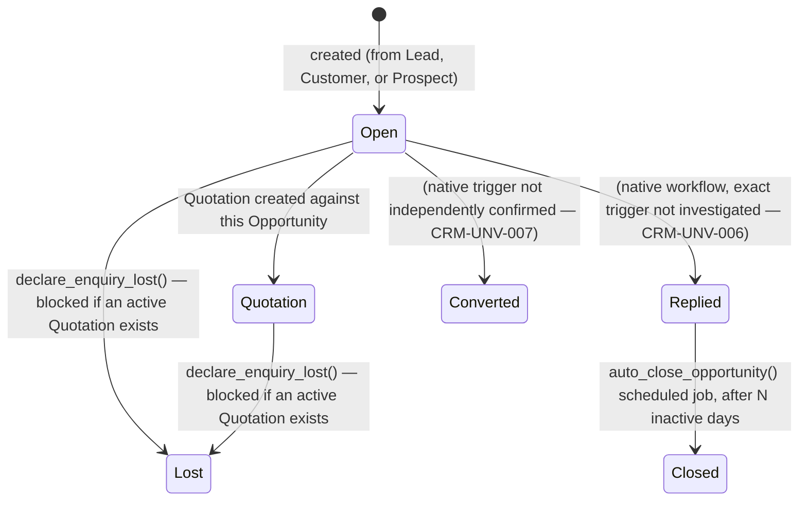

# CRM — Canonical Architecture & V1 Package Plan

**Package:** `CRM-0` — Backend & Architecture Discovery.
**Status:** Discovery/architecture only. **Nothing implemented.** Not self-declared `ACCEPTED` — per
this repo's own governance model (`docs/controls/AGENT_OPERATING_GUIDE.md`), an architecture document
proposing an implementation sequence needs Niroshan's sign-off before `CRM-1` may start, the same
posture `party-contact-address-architecture.md` (`CLAUDE_HANDOFF`) already takes for `MD-REL-1`.
**Scope:** discovery and design only, per `docs/controls/BACKEND_KNOWLEDGE_POLICY.md` §4/§5. No route,
Sidebar entry, form, server action, or ERPNext write occurred while producing this document — every
finding below came from `mcp__ceylon-stack__list_doctypes`/`get_doctype_fields`/`list_documents`
(read-only, live against the real Hetzner instance) plus this session's GitHub source reads (`develop`
branch — evidence provenance disclosed throughout, tagged `SOURCE VERIFIED (GitHub develop)`, never
silently upgraded to `VERIFIED`).

**Folder numbering note:** `docs/controls/BACKEND_KNOWLEDGE_POLICY.md` §4 (written 2026-09-17, before
CRM was scheduled) does not reserve a domain-folder number for CRM among `01-08`. Renumbering existing
folders would break every existing cross-reference in already-committed docs, so this domain is added
as `16-crm/` — a new folder appended after `15-migration/`, not a reuse of the reserved-but-unpopulated
`07-tax/`/`08-workflows/` slots. `docs/backend/README.md` is updated to reflect this addition.

---

## 1. Purpose

Establish the correct ERPNext-backed architecture for Ceylon Stack's CRM functional stream — the
pre-sales/customer-acquisition side of the commercial lifecycle (`Lead → Opportunity → Quotation →
Sales Order → Delivery → Invoice → Payment`) — before any CRM frontend page is built, so `CRM-1` can
be implemented once, correctly, without re-deriving ERPNext's CRM data model from scratch or
duplicating Master Data's already-canonical Customer/Contact/Address entities.

## 2. Scope

In scope: Lead and Opportunity lifecycle, lead conversion, activity architecture, CRM/Sales boundary,
CRM/Master Data boundary, CRM/Finance boundary, ownership/assignment model, permissions, pipeline data
architecture (design only), API architecture (design only), module dependencies, V1 frontend
information architecture (design only), and the `CRM-1`–`CRM-5` package roadmap.

Out of scope (see §22 for the full list): any CRM UI, Kanban, dashboards, campaigns/marketing
automation, AI lead scoring, telephony/WhatsApp/email sync, mobile CRM, a custom workflow/approval
engine, Procurement Bidding, Finance functionality, module provisioning, industry templates.

## 3. ERPNext Entities — Live-Verified Inventory

`mcp__ceylon-stack__list_doctypes(module="CRM")`, live against the real Hetzner instance, `VERIFIED`:

| DocType | istable | Role |
|---|---|---|
| `Lead` | 0 | Core pre-qualification entity |
| `Opportunity` | 0 | Core deal/pipeline entity |
| `Opportunity Item` | 1 | Opportunity line items (product/service interest) |
| `Opportunity Type` | 0 | Reference master (e.g. "Sales", "Support", "Maintenance") |
| `Opportunity Lost Reason` | 0 | Reference master |
| `Opportunity Lost Reason Detail` | 1 | Multi-select child row on Opportunity |
| `Prospect` | 0 | Organization/account-level entity — see §5.3 |
| `Prospect Lead` | 1 | Child table: Leads grouped under a Prospect |
| `Prospect Opportunity` | 1 | Child table: Opportunities grouped under a Prospect |
| `Sales Stage` | 0 | Reference master — single field, `stage_name` |
| `Competitor` / `Competitor Detail` | 0 / 1 | Reference master + Opportunity child row |
| `Campaign` / `Campaign Email Schedule` | 0 / 1 | Marketing campaign entity — out of CRM-1..5 scope |
| `Email Campaign` | 0 | Marketing — out of scope |
| `Contract` / `Contract Template` (+ child tables) | 0 | Legal contract tracking — not investigated, out of scope |
| `CRM Note` | 1 | Generic note child table, shared by Lead/Opportunity/Prospect |
| `CRM Settings` | 0 | Single doctype — see §3.1 |
| `Frappe CRM Allowed User` | 1 | Child table of `CRM Settings` — see §3.1 |
| `Market Segment` | 0 | Reference master |
| `Appointment` / `Appointment Booking Settings` / `Appointment Booking Slots` | 0/0/1 | Scheduling — not investigated, out of scope |

Related, live-verified in the `Selling` module: `Industry Type` (Link target used by
Lead.industry/Opportunity.industry/Prospect.industry), and the already-canonical Customer/Quotation/
Sales Order chain documented elsewhere.

**No Lead, Opportunity, or Prospect records exist on this instance** (`list_documents` returned zero
rows for both Lead and Opportunity, live-checked this session). Every finding below is
**schema-verified and source-verified, not runtime-behavior-verified** — no live conversion, status
transition, or activity-linking flow has ever been observed running on real data. This is the single
largest verification gap this document leaves open; see §21.

### 3.1 Resolved ambiguity: is a separate "Frappe CRM" app involved?

The doctype names `CRM Settings` and `Frappe CRM Allowed User`, plus UTM-tracking fields
(`utm_source`/`utm_medium`/`utm_campaign`) and `qualification_status` on Lead, initially suggested the
standalone Frappe CRM product (a separate app, distinct from ERPNext's built-in CRM module) might be
installed. **Resolved, `VERIFIED`:** `CRM Settings`' own fields
(`enable_frappe_crm_data_synchronization` — a Check field — plus `allowed_users`, a Table MultiSelect
of `Frappe CRM Allowed User`) are ERPNext's **native integration toggle** for *optionally* syncing data
to a separately-hosted standalone Frappe CRM instance — not evidence that such an instance exists or is
connected. `Lead`/`Opportunity`/`Prospect` themselves are confirmed native ERPNext `CRM` module
doctypes (`module: "CRM"` on every entity in §3's table), not entities forked in from another app.
**`NEEDS_VERIFICATION` (`CRM-UNV-001`, low priority, non-blocking):** whether
`enable_frappe_crm_data_synchronization` is actually turned on for this tenant — not fetchable via the
`list_documents` tool (a Single doctype's stored value needs a `getDoc`-equivalent call, not available
this session). Irrelevant to CRM-1..5's own design either way, since Ceylon Stack builds its own
frontend directly against ERPNext's REST API regardless of whether that toggle is on.

## 4. Ceylon Stack Ownership

Per `docs/master-data-architecture.md` §11's table (already states this, reconfirmed here): **CRM
(not yet built) owns Lead, Opportunity, and CRM-specific activities.** It does **not** own Customer,
Contact, Address, Territory, Customer Group, or Item — those remain canonical at `/master-data/*`
(§9). Sales continues to own Quotation, Sales Order, Delivery Note, Sales Invoice (§10).

## 5. Entity Relationships

### 5.1 Lead — canonical model

Live schema (`VERIFIED`, `mcp__ceylon-stack__get_doctype_fields("Lead")`):

| Field group | Fields | Notes |
|---|---|---|
| Identity | `naming_series` (`CRM-LEAD-.YYYY.-`), `lead_name` (Full Name, derived) | Naming mode not independently confirmed live (no records exist — `CRM-UNV-002`, non-blocking, same tier as `MD-UNV-001`) |
| Person | `salutation`, `first_name`, `middle_name`, `last_name`, `job_title`, `gender` | |
| Ownership | `lead_owner` (Link → User) | See §13 |
| Status | `status` (Select, **required**: `Lead / Open / Replied / Opportunity / Quotation / Lost Quotation / Interested / Converted / Do Not Contact`) | See §6 — status does **not** auto-transition on conversion |
| Classification | `type` (Select: `Client / Channel Partner / Consultant`), `request_type` (Select: `Product Enquiry / Request for Information / Suggestions / Other`) | |
| Contact info | `email_id`, `website`, `mobile_no`, `whatsapp_no`, `phone`, `phone_ext` | Flat fields on Lead itself, separate from any linked Contact record (see §5.4) |
| Organization | `company_name`, `no_of_employees`, `annual_revenue`, `industry` (Link → Industry Type), `market_segment` (Link → Market Segment) | |
| Geography | `territory` (Link → Territory — canonical, Master Data-owned), `city`, `state`, `country` (Link → Country) — flat text/Link fields, **no direct Address Link field** | Address relationship goes through Dynamic Link (§5.4), same as Customer/Supplier |
| `customer` | Link → Customer, label **"From Customer"** | Reverse-direction field: a Lead can be created *from* an existing Customer (e.g. repeat-business/upsell lead), not a forward conversion pointer. Do not confuse with conversion (§6) |
| Marketing | `utm_source`/`utm_medium`/`utm_campaign`/`utm_content` | Attribution tracking — `POST-V1`, no source integration exists to populate these yet |
| Qualification | `qualification_status` (Select: `Unqualified / In Process / Qualified`), `qualified_by` (Link → User), `qualified_on` (Date) | A real, separate workflow stage independent of `status` |
| Company scope | `company` (Link → Company) | |
| Flags | `disabled`, `unsubscribed`, `blog_subscriber` | |
| Notes | `notes` (Table → `CRM Note`) | See §8 |
| Dashboard | `address_html`, `contact_html`, `open_activities_html`, `all_activities_html` (all HTML widget fields) | Desk-rendered widgets, not data — this frontend renders its own equivalents, does not consume these directly (consistent with how Customer/Supplier's own `address_html`/`contact_html` are already treated, `customer-supplier.md`) |

**No `docstatus` field returned** — same indirect-absence inference already used throughout
`docs/backend/01-master-data/` (`MD-UNV-002`'s tiering): Lead is `DOCUMENTATION-INFERRED` **not
submittable** (draftless, like Customer/Supplier).

### 5.2 Opportunity — canonical model

Live schema (`VERIFIED`, `mcp__ceylon-stack__get_doctype_fields("Opportunity")`):

| Field group | Fields | Notes |
|---|---|---|
| Identity | `naming_series` (`CRM-OPP-.YYYY.-`, required) | |
| Party | `opportunity_from` (Link → DocType, required), `party_name` (**Dynamic Link**, required, resolved against `opportunity_from`), `customer_name` (Data, denormalized display) | Polymorphic — same Dynamic-Link-style pattern as Contact/Address's `links` table, but here it's the *parent* field, not a child row. Practical value set is `{"Lead", "Customer", "Prospect"}`, inferred from `mapper.py`'s Lead usage and the `Prospect Opportunity` child table's existence — **not** independently confirmed as a hard-enforced allowlist (`CRM-UNV-003`, see §9.3's security note) |
| Status | `status` (Select, required: `Open / Quotation / Converted / Lost / Replied / Closed`) | Narrower than Lead's status enum |
| Classification | `opportunity_type` (Link → Opportunity Type), `sales_stage` (Link → Sales Stage) | `Sales Stage` is a single-field reference master (`stage_name` only) — a flat, unordered list unless the frontend imposes its own ordering (§14) |
| Ownership | `opportunity_owner` (Link → User) | |
| Forecasting | `expected_closing` (Date), `probability` (Percent) | Core pipeline-weighting inputs (§14) |
| Organization | `no_of_employees`, `annual_revenue`, `customer_group` (Link → Customer Group — canonical, Master Data-owned), `industry`, `market_segment`, `website`, `city`, `state`, `country`, `territory` | Mirrors Lead's organization fields — largely redundant once converted from a Lead, since `map_fields()` (source-verified, §6) does not copy most of these automatically |
| Value | `currency`, `conversion_rate`, `opportunity_amount`, `base_opportunity_amount` | |
| Lifecycle | `amended_from` (Link → Opportunity) | **New finding, `VERIFIED` field presence:** `amended_from` only appears on submittable doctypes — its presence, combined with the absence of a returned `docstatus` field (same indirect-inference caveat as everywhere else, `DOCUMENTATION-INFERRED`), is stronger evidence than Lead/Customer/Supplier's simple absence-of-`docstatus` test. **Opportunity is very likely a submittable (Draft/Submitted/Cancelled/Amended) doctype**, unlike Lead — this has real implementation consequences for `CRM-2` (needs Submit/Cancel/Amend handling akin to Quotation, not Customer/Supplier's simple `disabled`-flag pattern). Flagged `CRM-UNV-004`, non-blocking but worth resolving before `CRM-2` scopes its lifecycle actions. |
| Lost handling | `lost_reasons` (Table MultiSelect → Opportunity Lost Reason Detail), `order_lost_reason` (Small Text), `competitors` (Table MultiSelect → Competitor Detail) | Written by `declare_enquiry_lost()`, source-verified (§6) |
| SLA | `first_response_time` (Duration) | |
| Contacts | `contact_person` (Link → Contact), `contact_email`, `contact_mobile`, `whatsapp`, `phone`, `phone_ext`, `customer_address` (Link → Address, label **"Customer / Lead Address"**), `address_display`, `contact_display` | Confirms Opportunity can point at either a Customer's or a Lead's Address through the same field — consistent with the polymorphic `opportunity_from`/`party_name` design |
| Items | `items` (Table → Opportunity Item), `total`, `base_total` | Product/service interest lines — optional, not required for a services-only SME deal |
| Notes | `notes` (Table → CRM Note) | |

### 5.3 Prospect — canonical model, and a V1 scoping recommendation

Live schema (`VERIFIED`): `company_name`, `customer_group`, `no_of_employees`, `annual_revenue`,
`market_segment`, `industry`, `territory`, `prospect_owner` (Link → User), `website`, `fax`, `company`
(required), `address_html`/`contact_html` (dashboard widgets only — **same pattern as Customer/
Supplier**: no direct Contact/Address Link field, relationship via Dynamic Link, §5.4), `leads` (Table
→ Prospect Lead — denormalized child rows: `lead`, `lead_name`, `email`, `mobile_no`, `lead_owner`,
`status`), `opportunities` (Table → Prospect Opportunity), `notes` (Table → CRM Note).

**Prospect is ERPNext's closest native concept to an "Account" or "Organization"** — one Prospect can
aggregate multiple Leads and multiple Opportunities under a single company-level record, the
`leads`/`opportunities` child tables being live denormalized rosters populated by
`add_lead_to_prospect()`/`update_prospect()` (source-verified function names, §6).

**Recommendation: `POST-V1`, not `CRM-1`/`CRM-2` scope.** Lead itself already carries
`company_name`/`industry`/`territory`/`annual_revenue` redundantly; a typical Sri Lankan SME sales
motion is usually one Lead = one decision-maker = one deal, not a multi-contact enterprise account
structure. Building Prospect's three-child-table relationship model adds real implementation
complexity (`CRM-1`'s own "Convert to Prospect"/"Add to Prospect" actions, per `lead.js`'s confirmed
buttons, §6) for a benefit — grouping multiple Leads/Opportunities under one organization — that has
no demonstrated need yet in this product's target market. Revisit if a real multi-contact-per-account
requirement surfaces (e.g. a manufacturing client with several buyers submitting parallel RFQs).

### 5.4 The Contact/Address relationship — reuses the exact mechanism already designed for Master Data

**Critical finding, `SOURCE VERIFIED (GitHub develop)` — this is the single most important
cross-cutting dependency in this document.** Neither Lead nor Prospect has a direct Contact/Address
Link field (only dashboard-only `*_html` widgets, confirmed live schema absence). The real relationship
is the same **Dynamic Link** mechanism `docs/backend/11-relationships/party-contact-address-architecture.md`
already fully designed for Customer/Supplier: `Contact.links`/`Address.links` child rows with
`link_doctype="Lead"` (or `"Prospect"`, or `"Opportunity"` via `customer_address`/`contact_person`
directly rather than a `links` row — Opportunity's Contact/Address fields are plain `Link`s, not a
Dynamic Link lookup, see §5.2).

Confirmed by reading `erpnext.crm.doctype.lead.mapper`'s `_set_missing_values()` (§6): every Lead→
Opportunity and Lead→Quotation conversion **looks up** an existing linked Contact/Address via a
`Dynamic Link` query (`link_doctype=Lead, link_name=<lead>, parenttype=Contact|Address`) — it never
creates one. If nothing is linked, the resulting Opportunity/Quotation simply has no contact/address,
even though the Lead itself carries `email_id`/`mobile_no`/`phone` as flat fields.

**Direct implication for `CRM-1`:** exactly like `MD-REL-1`'s design for Customer/Supplier
(`party-contact-address-architecture.md` §5), `CRM-1`'s Lead create/edit flow should let a Contact/
Address be created **with** `links: [{link_doctype: "Lead", link_name: <lead_name>}]` in the same
request — reusing `createContactAction`/`createAddressAction`'s already-designed optional
`partyDoctype`/`partyName` extension (§5 of that document), with `"Lead"` added to the same
server-side allowlist alongside `"Customer"`/`"Supplier"`. **This is not new design work** — `CRM-1`
consumes an extension point the Master Data relationship architecture already anticipated (that
document's own §16 decision table item 4 explicitly deferred "how much Contact/Address management CRM
exposes" until CRM discovery happened — this is that resolution: CRM reuses the same action layer,
allowlist widened, no new pattern invented).

**A real ERPNext native alternative exists and should be checked before `CRM-1` builds this UI itself:**
`CRM Settings.auto_creation_of_contact` (§3.1) — if enabled server-side, ERPNext's own `Lead.after_insert`
hook (`create_contact()`, source-quoted in §6) automatically creates and Dynamic-Link-attaches a Contact
on every Lead insert, no frontend code required. `CRM-UNV-001` (§3.1) blocks confirming whether this is
already on for this tenant — worth checking before `CRM-1` scopes its own linking UI, since if it's
already enabled, `CRM-1` may only need to *read* the auto-created Contact, not build a create-with-link
flow at all.

## 6. Lead Conversion — the actual mechanism, source-verified

**Resolved, `SOURCE VERIFIED (GitHub develop)`, `erpnext/crm/doctype/lead/mapper.py`** (reached via
`lead.js`'s confirmed "Create" button dotted-paths: `erpnext.crm.doctype.lead.mapper.make_customer` /
`.make_opportunity` / `.make_quotation`) — quoted and analyzed in full this session, not guessed from
field names:

| Conversion | Target | Mechanism | Field mapping | Contact/Address | Lead side effect |
|---|---|---|---|---|---|
| **Lead → Customer** | `Customer` (new doc) | `get_mapped_doc("Lead", ..., set_missing_values)` | `Lead.name → Customer.lead_name`; `company_name → customer_name` (else `lead_name → customer_name` if no company); `customer_type` derived (Company vs Individual) | **Linked only, never created** — `get_default_address("Lead", name)`/`get_default_contact("Lead", name)` populate `customer_primary_address`/`customer_primary_contact` if a linked one already exists | **None.** `Lead.status` is not touched by this call. |
| **Lead → Opportunity** | `Opportunity` (new doc) | `get_mapped_doc`, same pattern | `Lead.doctype → opportunity_from` (literal `"Lead"`); `Lead.name → party_name`; `lead_name → contact_display`; `company_name → customer_name`; `email_id → contact_email`; `mobile_no → contact_mobile`; `lead_owner → opportunity_owner`; `notes → notes` | Same Dynamic Link lookup (§5.4), linked only | **None.** |
| **Lead → Quotation** (direct, bypasses Opportunity entirely) | `Quotation` | `get_mapped_doc` + `quotation_to = "Lead"` explicitly set, then `set_missing_values()`/`set_other_charges()`/`calculate_taxes_and_totals()` run on the target | `Lead.name → party_name` only | Same Dynamic Link lookup, linked only | **None.** |

**Confirmed, no code sets `Lead.status = "Converted"` anywhere in this file or its imports.** The
`status` Select field's enum includes `Opportunity`/`Quotation`/`Converted` as valid *values*, but
nothing in ERPNext's own conversion path writes them — `has_customer()`/`has_opportunity()`/
`has_quotation()`/`has_lost_quotation()` exist purely as **read-only** existence checks (used to drive
which "Create" buttons Desk shows, not to enforce state). **Direct, actionable consequence for
`CRM-1`/`CRM-2`: Ceylon Stack's own conversion action must explicitly set `Lead.status` after calling
the ERPNext mapper equivalent** (e.g. `updateDoc("Lead", name, {status: "Opportunity"})` right after
creating the Opportunity) — ERPNext will not do this automatically, unlike some other native workflows
in this codebase.

**Opportunity's own outbound conversions** (`erpnext.crm.doctype.opportunity.mapper.make_customer` /
`.make_quotation` / `.make_supplier_quotation` / `.make_request_for_quotation`) are `SOURCE VERIFIED`
**to exist** (confirmed via `opportunity.js`'s button dotted-paths) but their exact field-mapping was
not independently fetched and quoted this session — `CRM-UNV-005`, non-blocking (same `get_mapped_doc`
pattern is now well-understood from the Lead-side read; low risk of surprise, but should be confirmed
before `CRM-2`/`CRM-5` implement the Opportunity→Quotation handoff specifically).

**`CRM Settings.auto_creation_of_contact`** (`SOURCE VERIFIED`, `lead.py`'s `after_insert`): when
enabled, calls `self.create_contact()`, which builds a Contact from
`first_name`/`last_name`/`salutation`/`gender`/`job_title`/`company_name` plus `email_ids`/`phone_nos`,
and appends `{"link_doctype": "Lead", "link_name": self.name}` to the new Contact's `links` table —
the exact mechanism §5.4 describes, running automatically server-side if the setting is on.

**`declare_enquiry_lost(lost_reasons_list, competitors, detailed_reason)`** (`SOURCE VERIFIED`,
`opportunity.py`): sets `status = "Lost"`, records `lost_reasons`/`competitors`/`order_lost_reason`;
explicitly **blocked** if an active Quotation exists (`has_active_quotation()` check) — mirrors the
existing Sales-domain Quotation's own `declare_enquiry_lost` action already documented in
`docs/backend/02-sales/quotation.md`'s lifecycle diagram (same native method, different calling
document type — Quotation's own "Lost" transition and Opportunity's are the same underlying mechanism
applied at two different points in the funnel).

**`auto_close_opportunity()`** (`SOURCE VERIFIED`, module-level, scheduled-job-shaped): transitions
`Replied → Closed` after a configurable inactivity window (`CRM Settings.close_opportunity_after_days`)
— a background job, not a frontend action; `CRM-2` does not need to implement this itself, only be
aware Opportunities can move to `Closed` without any user action.

**Deletion/cancellation implications:** not independently investigated this session for Lead
(draftless, so no cancel — only `disabled`/`unsubscribed` flags, same as Customer/Supplier). Opportunity's
likely-submittable status (§5.2) implies a standard Draft→Submit→Cancel→Amend lifecycle exists but its
exact validation/downstream-effect behavior is unconfirmed — `CRM-UNV-004` again, this is the same open
item.

## 7. Opportunity Lifecycle — summary



`CRM-UNV-006`/`CRM-UNV-007` (both non-blocking, low priority): the exact triggers for `Open → Replied`
and `→ Converted` were not traced to specific code this session — `Replied` is plausibly set by a
Communication-received hook (consistent with the generic `link_communications`/`update_modified_timestamp`
helpers seen in `crm/utils.py`, §6) and `Converted` plausibly mirrors Lead's own pattern of being a
valid-but-not-automatically-set status value pending confirmation. Neither blocks `CRM-1`/`CRM-2`
scope, since neither is a status Ceylon Stack's own actions would need to set.

## 8. CRM Activity Architecture

Per the mission brief's explicit instruction: prefer native mechanisms, do not invent a parallel
activity database without demonstrating native architecture is insufficient. Findings, mostly
`FRAMEWORK-KNOWLEDGE` (standard, well-established Frappe framework behavior already relied on
elsewhere in this repo — e.g. `DocTabs`'s Comments/Activity tab pattern, `getDocInfo` already used per
`party-contact-address-architecture.md` §16 item 5) plus the CRM-specific findings this session added:

| Need | Mechanism | Status |
|---|---|---|
| **Notes** | `CRM Note` — a real, CRM-specific child table (`notes` field on Lead/Opportunity/Prospect, `VERIFIED` live schema) | Native, CRM-specific — no generic Frappe Note needed |
| **Calls / Meetings / Tasks** | Standard Frappe `ToDo` (assignment/task) and `Event` (calendar/meeting) doctypes, linked generically via `reference_type`/`reference_name` | `FRAMEWORK-KNOWLEDGE`, not independently re-verified this session — `crm/utils.py`'s `get_open_todos`/`get_open_events`/`link_open_tasks`/`link_open_events` (source-confirmed function names, §6) exist specifically to query these against a Lead/Opportunity/Prospect reference, confirming ERPNext's own CRM module already uses this pattern rather than a bespoke one |
| **Emails / Communications** | Standard Frappe `Communication` doctype, linked via `reference_doctype`/`reference_name` | `crm/utils.py`'s `link_communications`/`get_linked_communication_list`/`make_lead_from_communication` (source-quoted in full, §6) confirm this is the real, already-used mechanism — Communication received against a Lead's email is what plausibly drives `status = "Replied"` (§7) |
| **Next-action / follow-up dates** | No dedicated field on Lead; `Opportunity.expected_closing` exists for Opportunity. A "next follow-up" concept for Lead is most naturally a `ToDo` with a due date, not a new Lead field | `POST-V1` design question, not resolved here — see §17 |
| **Timeline (combined view)** | Lead/Opportunity's own `open_activities_html`/`all_activities_html` are Desk-rendered widgets this frontend does not consume directly (§5.1/§5.2) — the underlying data (ToDo + Event + Communication + Comment, all filtered by `reference_doctype`/`reference_name`) is what a Ceylon Stack-built timeline component would query directly, the same shape `DocTabs`'s Comments/Activity tab already renders for every other document type in this app | Reuse `DocTabs`, do not invent a new component — same recommendation `party-contact-address-architecture.md` §4 already made for Customer/Supplier |

**Recommended canonical activity architecture for Ceylon Stack:** `ToDo` for tasks/calls/follow-ups
(generic Frappe assignment, due-date-bearing), `Event` for meetings (generic Frappe calendar entity),
`Communication` for emails (generic Frappe, already the mechanism `make_lead_from_communication` uses),
`CRM Note` for freeform notes (CRM-specific, already a real child table), `Comment` for the existing
Comments/Activity tab pattern. **No new Ceylon Stack-specific activity doctype is justified** — every
need maps onto an existing native mechanism ERPNext's own CRM module already relies on internally.

## 9. CRM → Sales Boundary

### 9.1 Ownership boundary

```
CRM:    Lead → Opportunity → Pre-sales activities
Sales:  Quotation → Sales Order → Delivery Note → Sales Invoice
```

Confirmed clean at the **process** level: Quotation, Sales Order, Delivery Note, Sales Invoice remain
entirely Sales-owned (`docs/master-data-architecture.md` §11), with zero duplication risk from CRM.

### 9.2 The handoff point — Quotation, and a real nuance this session surfaced

**New finding, `VERIFIED`/`SOURCE VERIFIED` combined:** `docs/backend/02-sales/quotation.md`'s own
existing ER diagram hardcodes `quotation_to "Customer"` as a fixed string — this frontend's Sales
Quotation implementation assumes every Quotation targets a Customer. But §6 above confirms ERPNext's
own native `Lead → Quotation` conversion sets `quotation_to = "Lead"` directly, bypassing Opportunity
and Customer entirely — a real, native capability the existing Sales Quotation frontend has never
exercised or been built to expect.

**Recommendation, resolving the mission brief's "cleanest architecture" question:** `CRM-1`..`CRM-5`
should follow **`Lead → Opportunity → Customer conversion → Quotation (as Customer)`** as the primary
V1 path — this matches the existing Sales Quotation frontend's `quotation_to = "Customer"` assumption
exactly, requiring zero changes to Sales' own Quotation create flow. The native
`quotation_to = "Lead"` shortcut (skip Opportunity, skip Customer conversion) is a real ERPNext
capability but is explicitly **`POST-V1`** here — using it would require extending Sales' own Quotation
action to accept and correctly handle `quotation_to = "Lead"`, a change to an already-hardened,
frozen-per-Current-Mission Sales core module, for a shortcut V1 doesn't need. **There remains exactly
one canonical Sales Quotation capability** — CRM never forks its own Quotation create form; `CRM-5`
navigates to or triggers Sales' existing create flow, pre-filled from the converted Customer.

### 9.3 Security/trust-boundary note — same class of finding as `MD-REL`'s §2.5

Because `opportunity_from`'s underlying field type is an unrestricted `Link → DocType` (§5.2), any
future Ceylon Stack write to this field must **allowlist it server-side** to exactly
`{"Lead", "Customer", "Prospect"}` inside whatever action creates/edits an Opportunity — the same rule
`party-contact-address-architecture.md` §2.5 already established for `link_doctype`, generalized here.
Nothing in ERPNext's schema itself restricts the value; this is a Ceylon Stack-side responsibility.

## 10. CRM → Master Data Boundary

**Binding, restated from `docs/master-data-architecture.md` §11/§12/§13 — CRM-0 does not relitigate
this, it confirms and operationalizes it:**

- CRM must **not** introduce `/crm/customers`, `/crm/contacts`, or `/crm/addresses` as second
  implementations. Canonical Customer, Contact, Address routes remain `/master-data/customers`,
  `/master-data/contacts`, `/master-data/addresses` — confirmed still resolving, unchanged by this
  package.
- CRM must **not** introduce `/crm/territories` or a competing Customer Group screen — both are
  already canonical at `/master-data/territories` / `/master-data/customer-groups`.
- **Industry Type and Market Segment are new shared reference masters this package surfaces** —
  neither Sales nor Buying references either today (grep-equivalent reasoning: neither field appears
  anywhere in `docs/backend/02-sales/` or `03-purchasing/`'s already-documented field lists). Per the
  precedent `docs/master-data-architecture.md` §11 already sets for Sales Person/Sales Partner/Campaign
  ("internal-team/marketing constructs stay module-owned, not forced into Master Data"), **recommend
  Industry Type and Market Segment stay CRM-owned reference masters** (simple read-only dropdowns, not
  full CRUD screens, for V1) rather than added to Master Data's inventory — revisit only if Sales or
  Buying ever needs them too.
- `MD-UNV-003` (§5.4) is the load-bearing prerequisite `CRM-1` depends on — see §5.4's resolution
  above: CRM does not need `MD-REL-1`'s Customer/Supplier work to ship first, it needs the *same
  pattern* applied to Lead, which is `CRM-1`'s own scope, not a blocking dependency on Master Data's
  separate `MD-REL-*` package sequence.
- **A genuinely new finding this session: `Customer.lead_name`/`opportunity_name`/`prospect_name`**
  (Link fields, already `VERIFIED` live schema in `docs/backend/01-master-data/customer-supplier.md`,
  confirmed there as unpopulated by this frontend today) **are exactly the conversion-provenance
  pointer fields §6's `Lead → Customer` mapping writes** (`Lead.name → Customer.lead_name`). Master
  Data's existing Customer schema already has the field CRM needs — `CRM-1`/`CRM-2`'s
  `convertLeadToCustomer()` action should populate it. **Required, minimal, additive change to Master
  Data's `createCustomerAction`:** accept an optional `lead_name` (and, later, `opportunity_name`)
  parameter, mirroring the exact "small, additive extension" pattern `party-contact-address-architecture.md`
  §5 already used for `link_doctype`/`link_name` on `createContactAction`. **This is the one place
  CRM-1 needs a small Master Data-owned action file touched — not a new Master Data screen, not a
  competing implementation, a one-parameter extension to an existing action**, consistent with the
  "modules own process, Master Data owns entities, CRM calls into Master Data's action layer" rule
  already established (`docs/master-data-architecture.md` §11, and mirrored by `MD-REL-1`'s own design
  for the identical class of change).

## 11. CRM → Finance Boundary

Per the mission brief — document only the downstream conceptual relationship, do not touch Finance.

```
CRM → Sales → Finance
Opportunity → Quotation → Sales Order → Delivery → Invoice → Payment
```

CRM does not own or touch any accounting transaction, consistent with `docs/backend/06-accounting/
finance-architecture.md`'s ownership table (Finance owns Chart of Accounts, Journal Entry, Payment
Entry, Bank Account/Transaction, Cost Center — none overlap CRM's Lead/Opportunity scope).

**Future/read-only cross-module insights (classified per the mission brief, `POST-V1`, not authorized
by this document):** customer outstanding balance, credit limit, overdue invoices, lifetime sales,
payment status — all would surface on a converted Customer's CRM-relevant view (e.g. "this Opportunity's
account has 2 overdue invoices"), sourced from Finance's own AR visibility (`FIN-2`, not yet built)
once it exists. Not scoped further here.

## 12. Pipeline Architecture (design only — `CRM-4` scope, not built now)

Native fields already support most of the mission brief's required pipeline capabilities without a
Ceylon Stack-side mapping layer:

| Capability | ERPNext-native source |
|---|---|
| Stage movement / Kanban columns | `Opportunity.sales_stage` (Link → Sales Stage) — a flat, unordered reference list (`stage_name` only, no explicit `order`/`sequence` field in the live schema); a Kanban board needs its own client-side stage ordering, since ERPNext does not encode one |
| Pipeline value | `sum(Opportunity.opportunity_amount)` grouped by `sales_stage`, filtered `status not in (Lost, Converted, Closed)` |
| Weighted pipeline | `sum(opportunity_amount * probability / 100)` — both fields already live-schema `VERIFIED` present |
| Won / Lost value | `status = "Converted"` vs `status = "Lost"`, summed `opportunity_amount` |
| Conversion rate | `count(status="Converted") / count(all non-Open)` over a date range on `transaction_date`/`expected_closing` |
| Overdue follow-ups | Requires the Activity architecture (§8) — a `ToDo` past its due date, referencing an open Opportunity/Lead |
| Owner performance | Group any of the above by `opportunity_owner` |

**Recommendation:** `Opportunity.status` + `Opportunity.sales_stage` together are sufficient to drive
`CRM-4`'s pipeline — **no Ceylon Stack canonical mapping/translation layer is needed**, unlike some
other domains in this repo where ERPNext's native status didn't cleanly match the product's desired
UX. The one design decision `CRM-4` will need to make (not resolved here, correctly deferred): a fixed
client-side ordering for `Sales Stage` values, since ERPNext's own schema carries none.

## 13. User / Ownership / Assignment Model

Distinct concepts, not to be collapsed (per the mission brief's explicit instruction):

| Concept | Field | Scope |
|---|---|---|
| **Record owner** | `Lead.lead_owner` / `Opportunity.opportunity_owner` / `Prospect.prospect_owner` — all plain `Link → User` | Single-valued, the "who this belongs to" field already on every CRM entity |
| **Assigned collaborator** | Frappe's generic `ToDo`-based assignment (`_assign` field, `frappe.desk.form.assign_to`) | Multi-valued, independent of `*_owner` — standard framework mechanism, not CRM-specific, already implicitly relied on elsewhere in this app's Comments/Activity pattern |
| **Salesperson used for ERP transactions/reporting** | `Sales Team`/`Sales Person` (Selling module doctypes, `sales_team` child table already present on Customer per `customer-supplier.md`) | A **separate** concept from `opportunity_owner` — Sales Team is an ERPNext transactional/reporting construct (already deliberately kept Sales-owned per `docs/master-data-architecture.md` §5), `opportunity_owner` is CRM's own record-ownership field. Do not conflate the two — an Opportunity's owner and its eventual Sales Order's Sales Team assignment are independent facts that can differ |

No collapsing is warranted by anything in the live schema — ERPNext itself keeps these three concepts
on separate fields/mechanisms.

## 14. Permissions

Not independently investigated at the Frappe role/permission-rule level this session (out of CRM-0's
research depth — a full role/permission audit was explicitly not attempted, consistent with the
mission brief's "do not redesign the entire authorization system" instruction). What's structurally
available, `FRAMEWORK-KNOWLEDGE`:

- Frappe's standard "own records only" / "role + user permission" mechanisms (already the pattern
  every other doctype in this ERP relies on) can support "own Leads", "team Leads" (via a User
  Permission or role-based query condition on `lead_owner`), and "all Leads" (Sales Manager/CRM
  Manager-equivalent role) without any CRM-specific permission code.
- **Reconfirmed from `party-contact-address-architecture.md` §2.5, applies identically here:** this
  frontend's entire write path runs under one shared "Frontend Integration" service account — Frappe's
  own per-user permission boundary is not the real trust boundary for this app. Any future
  role-scoped visibility ("Sales User sees only their own Leads") would need to be enforced by this
  app's own session layer (`lib/session.ts`), the same conclusion already reached for Master Data's
  relationship layer, not assumed to come from ERPNext permissions.
- **Unresolved, recorded separately per the mission brief's instruction:** whether/when this app
  introduces per-role authorization at all is a pre-existing open architectural question, not new to
  CRM and not resolved by this package.

## 15. Module Enable/Disable Future Compatibility

| Dependency | Type | Reasoning |
|---|---|---|
| Master Data (Customer, Contact, Address, Territory, Customer Group) | **Hard** | Lead conversion (§6) and Opportunity's own Contact/Address fields directly reference these; CRM cannot function meaningfully without them |
| Sales (Quotation) | **Soft** | CRM's core Lead→Opportunity flow works entirely without Sales enabled; only the `CRM-5` handoff (Opportunity → Quotation) requires it. If Sales is disabled, CRM should degrade to "Opportunity marked Won, no Quotation link" rather than fail |
| Finance | **Soft, and currently zero actual dependency** | §11 — CRM V1 has no Finance read dependency at all; the "future read-only insights" items are explicitly not authorized yet |
| Users/Authentication | **Hard** | `lead_owner`/`opportunity_owner`/assignment all depend on `User` existing, same as every other module |

No implementation action taken — this table exists so a future module-provisioning package does not
need to re-derive it from scratch.

## 16. API Architecture (design only)

Following this app's existing centralized pattern (`lib/erpnext.ts` as the only ERPNext caller,
per-domain `actions.ts` for mutations, `lib/connections.ts`-style shared read helpers for cross-doctype
queries) — no new pattern proposed:

**Leads** (`CRM-1`): `listDocs("Lead", ...)` for list/search/filter; `getDoc("Lead", name)` for detail;
`createDoc`/`updateDoc("Lead", ...)` for create/edit (with the optional Contact/Address
`links`-on-create extension, §5.4); a plain `updateDoc("Lead", {status})` for status change (no native
submit/cancel, §5.1); assignment via the standard `ToDo`/`assign_to` mechanism (§13); conversion
actions (`convertLeadToOpportunity`, `convertLeadToCustomer`) as dedicated server actions in a new
`lib/actions/leadConversion.ts`, calling `createDoc` for the target entity with the field mapping §6
documents (Ceylon Stack reimplements the mapping client-side rather than depending on ERPNext's
whitelisted `mapper.py` functions directly, matching this app's existing convention of building its own
create payloads rather than calling Desk-specific RPCs — the same choice already made for Quotation→
Sales Order and every other conversion in this codebase) — **plus the explicit `Lead.status` update
§6 flags as required**.

**Opportunities** (`CRM-2`): `listDocs`/`getDoc`/`createDoc`/`updateDoc("Opportunity", ...)`; Submit/
Cancel/Amend if `CRM-UNV-004` confirms submittability, else plain `updateDoc`; `declare_enquiry_lost`
via `callDocMethod("Opportunity", name, "declare_enquiry_lost", {lost_reasons_list, competitors,
detailed_reason})` (reusing ERPNext's own native method — appropriate here since it's a real,
whitelisted, already-used-elsewhere-in-this-codebase pattern, unlike the create-conversion functions
above which this app already prefers to reimplement); Quotation handoff per §9.2.

**Activities** (`CRM-3`): timeline retrieval via the same generic `reference_doctype`/`reference_name`
filtered queries `crm/utils.py`'s own helpers use server-side (`ToDo`/`Event`/`Communication`/`Comment`
filtered client-side the same way `DocTabs` already does for every other document type); creation via
plain `createDoc` against each of those four doctypes with the CRM entity as the reference.

No random direct `fetch()` calls — every one of the above goes through the existing `lib/erpnext.ts`
layer, consistent with `docs/controls/FRONTEND_GUIDE.md`.

## 17. Frontend Information Architecture (design only)

```
CRM                                                        V1 SCOPE
├── Workspace (module home)                                CRM-1 (minimal) / CRM-4 (full KPIs)
├── Leads              /crm/leads                          CRM-1
│   ├── List (search/filter/status)
│   ├── Detail (fields, linked Contact/Address, activities tab)
│   ├── Create / Edit
│   └── Convert (to Opportunity, to Customer) — entry points, not a separate route
├── Opportunities       /crm/opportunities                 CRM-2
│   ├── List (search/filter/stage/status)
│   ├── Detail (fields, items, lost-reason capture, activities tab)
│   ├── Create / Edit
│   └── Quotation handoff — links to Sales' existing create flow, pre-filled (§9.2)
├── Activities          (embedded per-entity tab, not a standalone top-level route) CRM-3
│
├── Pipeline            /crm/pipeline                       CRM-4 — Kanban + KPIs (§12)
├── Campaigns                                                POST-V1 — out of scope (§22)
└── Reports                                                  POST-V1 — follows the existing Reports hub pattern once built
```

**Recommendation, per the mission brief's "cleaner SME-oriented UX" instruction:** do not expose
`Prospect` as a top-level V1 nav item (§5.3's recommendation); do not expose `Campaign`/`Email
Campaign`/`Contract`/`Appointment` at all in V1 — none has a demonstrated need yet and all are
explicitly out of scope (§22).

## 18. CRM V1 Package Roadmap

Refined from the mission brief's illustrative sequence, based on this session's actual findings —
reasons for any change from the brief's placeholder scope are stated inline:

| # | Package | Scope | Depends on | Risk | Required review |
|---|---|---|---|---|---|
| `CRM-0` | Backend & architecture discovery | This document | None | None (docs only) | — |
| `CRM-1` | Leads | List/Detail/Create/Edit/Status/Search/Assignment; Contact/Address create-with-link extension (§5.4); explicit `Lead.status` transition on conversion (§6); "Convert to Opportunity"/"Convert to Customer" entry points (writing `Customer.lead_name` per §10's one-parameter `createCustomerAction` extension) | `CRM-0` (this doc, accepted) | Medium — first CRM write path, touches Master Data's `createCustomerAction`/`createContactAction`/`createAddressAction` (small, additive extensions only) | `code-reviewer`; `qa-tester` if Customer-writing conversion path is included (core-flow-adjacent) |
| `CRM-2` | Opportunities | List/Detail/Create/Edit; Lead/Customer/Prospect party relationship (§5.2); expected value/probability/expected close; `sales_stage`/`status`; Won/Lost (`declare_enquiry_lost`, §16); Submit/Cancel/Amend **if `CRM-UNV-004` confirms submittability** first | `CRM-1` | Medium-High — depends on resolving `CRM-UNV-004` before scoping lifecycle actions | `code-reviewer` + `qa-tester` |
| `CRM-3` | Activities & Follow-ups | Calls/Meetings/Tasks/Notes via `ToDo`/`Event`/`Communication`/`CRM Note` (§8); timeline tab reusing `DocTabs`; next-action/overdue follow-ups | `CRM-1`, `CRM-2` | Low-Medium — pure additive, reuses existing generic mechanisms | `code-reviewer` |
| `CRM-4` | Pipeline Workspace | Kanban (client-ordered `Sales Stage`, §12), pipeline KPIs, aging, weighted pipeline, won/lost, overdue follow-ups | `CRM-2`, `CRM-3` | Low — read/aggregation only, no new write paths | `code-reviewer` |
| `CRM-5` | CRM → Sales Handoff | Opportunity → Quotation (as Customer, §9.2) — navigates to/pre-fills Sales' existing create flow, zero new Quotation implementation | `CRM-2`, Sales' existing Quotation create flow (unchanged) | Low — Sales core is frozen/hardened, this package only adds an entry point into it, does not modify it | `code-reviewer`; `qa-tester` (touches a core-flow-adjacent handoff) |

**Sequence unchanged from the mission brief's proposal** — nothing discovered this session justifies
reordering `CRM-1`→`CRM-5`. `CRM-2`'s scope has one real open dependency (`CRM-UNV-004`) that should
resolve before implementation starts, not before `CRM-1`.

## 19. Verified Behavior — Summary

All `VERIFIED` (live schema/data, this session) and `SOURCE VERIFIED (GitHub develop)` (this session's
source reads) findings are cited inline throughout §3–§18 with their evidence tier. No claim in this
document is asserted from general Frappe/ERPNext knowledge without a tier label — anything not tagged
`VERIFIED`/`SOURCE VERIFIED` is explicitly `FRAMEWORK-KNOWLEDGE` (§8) or `NEEDS_VERIFICATION` (§21).

## 20. `NEEDS_VERIFICATION` Register

Full entries added to `docs/backend/99-unverified/unverified-behaviours.md`'s new `## CRM` section —
summarized here for this document's own completeness:

- **`CRM-UNV-001`** — Whether `CRM Settings.enable_frappe_crm_data_synchronization` is actually
  enabled for this tenant. Non-blocking (§3.1).
- **`CRM-UNV-002`** — Lead/Customer/Prospect naming mode not empirically confirmed (zero live records
  to sample). Non-blocking, low priority (§5.1).
- **`CRM-UNV-003`** — Whether `Opportunity.opportunity_from`'s valid values are enforced server-side
  as `{Lead, Customer, Prospect}` or only client-side (Desk `.js`). Blocks nothing in `CRM-1`, but
  `CRM-2` must allowlist it server-side regardless per §9.3's rule, independent of this answer.
- **`CRM-UNV-004`** — Whether Opportunity is genuinely submittable (`is_submittable: 1`). Schema
  evidence (`amended_from` field presence) strongly suggests yes; not independently confirmed via a
  direct DocType JSON read. **Blocks `CRM-2`'s exact lifecycle-action scope** — resolve before that
  package starts.
- **`CRM-UNV-005`** — Exact field mapping for `erpnext.crm.doctype.opportunity.mapper.make_customer`/
  `make_quotation`. Button existence confirmed; field-level behavior not fetched. Non-blocking for
  `CRM-1`, relevant before `CRM-2`/`CRM-5` implement the Opportunity-side handoff.
- **`CRM-UNV-006`** — Exact trigger for `Opportunity.status` `Open → Replied`. Plausibly a
  Communication-received hook, not confirmed. Non-blocking.
- **`CRM-UNV-007`** — Exact trigger for `Opportunity.status` `→ Converted`. Not confirmed whether this
  is set automatically (e.g. on Sales Order creation) or only manually. Non-blocking for `CRM-1`/`CRM-2`,
  relevant before `CRM-5` if the handoff package wants to reflect this state automatically.

## 21. What Remains Genuinely Unverified — the scope of this gap

Every finding in §5–§9 is schema-verified and/or source-verified; **none is runtime-behavior-verified**
(§3's "zero live records" finding). This is a materially different evidence posture than, say,
`party-contact-address-architecture.md`'s equivalent pass, which had live Contact/Customer sample data
to cross-check naming and relationship behavior against. Before `CRM-1` ships, the create/convert flows
this document designs should be live-tested against a disposable fixture (create a test Lead → convert
to Opportunity → convert to Customer → confirm `Customer.lead_name` populated and Dynamic Link Contact
correctly carried forward), the same disposable-fixture discipline already used for Manufacturing's
Production Plan (PP-7R) and Finance's Chart of Accounts (FIN-1E) packages — not performed in this
discovery-only package by design.

## 22. Explicitly Out of Scope (CRM-0, and generally deferred beyond CRM-1..5)

Lead/Opportunity UI, Kanban, dashboards, email marketing, campaigns, marketing automation, AI lead
scoring, WhatsApp integration, telephony, external email synchronization, mobile CRM, custom workflow/
approval engine, Procurement Bidding (§23), Finance functionality, module provisioning, industry
templates, Contract/Contract Template, Appointment/Appointment Booking, Competitor tracking beyond the
bare field already on Opportunity (§5.2).

## 23. Procurement Bidding — Roadmap Preservation Only

Per the mission brief §19: preserving `PROC-BID-0 — Procurement Bidding Architecture Discovery` in
planning, not implementing anything. Future intended lifecycle: `Material Request → RFQ → Supplier
Quotations → Comparison → Award → Purchase Order`. No Buying functionality was touched or investigated
by this CRM-0 package.

---

## Governance

- This document is discovery/architecture output only. No route, Sidebar entry, form, server action,
  or ERPNext write occurred to produce it.
- **Not self-declared `ACCEPTED`.** Needs Niroshan's sign-off before `CRM-1` starts, per this repo's
  own governance model — the same posture `party-contact-address-architecture.md` (`CLAUDE_HANDOFF`)
  already takes for `MD-REL-1`.
- Cross-references added/updated by this package: `docs/backend/11-relationships/master-erd.md` (new
  CRM ERD), `docs/backend/15-migration/migration-status.md` (new CRM row), `docs/backend/99-unverified/
  unverified-behaviours.md` (new `## CRM` section, `CRM-UNV-001..007`), `docs/master-data-architecture.md`
  §12 (confirmation note, not a rewrite), `docs/backend/README.md` (folder-numbering note), `PROGRESS.md`,
  `docs/operations/AI_WORK_LOG.md`.
