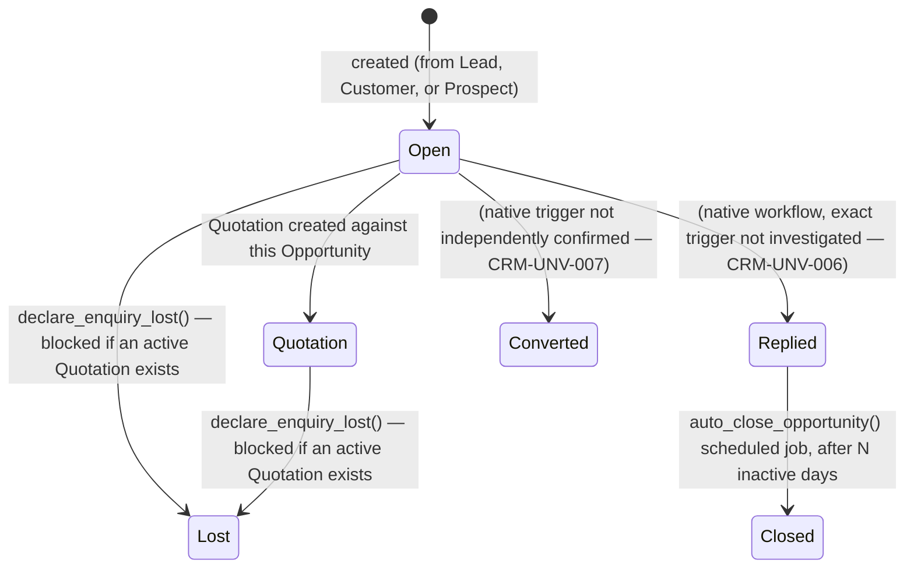

# CRM — Canonical Architecture & V1 Package Plan

**Package:** `CRM-0` — Backend & Architecture Discovery.
**Status:** Discovery/architecture only. **Nothing implemented.** Not self-declared `ACCEPTED` — per
this repo's own governance model (`docs/controls/AGENT_OPERATING_GUIDE.md`), an architecture document
proposing an implementation sequence needs Niroshan's sign-off before `CRM-1` may start, the same
posture `party-contact-address-architecture.md` (`CLAUDE_HANDOFF`) already takes for `MD-REL-1`.
**Scope:** discovery and design only, per `docs/controls/BACKEND_KNOWLEDGE_POLICY.md` §4/§5. No route,
Sidebar entry, form, server action, or ERPNext write occurred while producing this document — every
finding below came from `mcp__ceylon-stack__list_doctypes`/`get_doctype_fields`/`list_documents`
(read-only, live against the real Hetzner instance) plus this session's GitHub source reads (`develop`
branch — evidence provenance disclosed throughout, tagged `SOURCE VERIFIED (GitHub develop)`, never
silently upgraded to `VERIFIED`).

**Folder numbering note:** `docs/controls/BACKEND_KNOWLEDGE_POLICY.md` §4 (written 2026-09-17, before
CRM was scheduled) does not reserve a domain-folder number for CRM among `01-08`. Renumbering existing
folders would break every existing cross-reference in already-committed docs, so this domain is added
as `16-crm/` — a new folder appended after `15-migration/`, not a reuse of the reserved-but-unpopulated
`07-tax/`/`08-workflows/` slots. `docs/backend/README.md` is updated to reflect this addition.

---

## 1. Purpose

Establish the correct ERPNext-backed architecture for Ceylon Stack's CRM functional stream — the
pre-sales/customer-acquisition side of the commercial lifecycle (`Lead → Opportunity → Quotation →
Sales Order → Delivery → Invoice → Payment`) — before any CRM frontend page is built, so `CRM-1` can
be implemented once, correctly, without re-deriving ERPNext's CRM data model from scratch or
duplicating Master Data's already-canonical Customer/Contact/Address entities.

## 2. Scope

In scope: Lead and Opportunity lifecycle, lead conversion, activity architecture, CRM/Sales boundary,
CRM/Master Data boundary, CRM/Finance boundary, ownership/assignment model, permissions, pipeline data
architecture (design only), API architecture (design only), module dependencies, V1 frontend
information architecture (design only), and the `CRM-1`–`CRM-5` package roadmap.

Out of scope (see §22 for the full list): any CRM UI, Kanban, dashboards, campaigns/marketing
automation, AI lead scoring, telephony/WhatsApp/email sync, mobile CRM, a custom workflow/approval
engine, Procurement Bidding, Finance functionality, module provisioning, industry templates.

## 3. ERPNext Entities — Live-Verified Inventory

`mcp__ceylon-stack__list_doctypes(module="CRM")`, live against the real Hetzner instance, `VERIFIED`:

| DocType | istable | Role |
|---|---|---|
| `Lead` | 0 | Core pre-qualification entity |
| `Opportunity` | 0 | Core deal/pipeline entity |
| `Opportunity Item` | 1 | Opportunity line items (product/service interest) |
| `Opportunity Type` | 0 | Reference master (e.g. "Sales", "Support", "Maintenance") |
| `Opportunity Lost Reason` | 0 | Reference master |
| `Opportunity Lost Reason Detail` | 1 | Multi-select child row on Opportunity |
| `Prospect` | 0 | Organization/account-level entity — see §5.3 |
| `Prospect Lead` | 1 | Child table: Leads grouped under a Prospect |
| `Prospect Opportunity` | 1 | Child table: Opportunities grouped under a Prospect |
| `Sales Stage` | 0 | Reference master — single field, `stage_name` |
| `Competitor` / `Competitor Detail` | 0 / 1 | Reference master + Opportunity child row |
| `Campaign` / `Campaign Email Schedule` | 0 / 1 | Marketing campaign entity — out of CRM-1..5 scope |
| `Email Campaign` | 0 | Marketing — out of scope |
| `Contract` / `Contract Template` (+ child tables) | 0 | Legal contract tracking — not investigated, out of scope |
| `CRM Note` | 1 | Generic note child table, shared by Lead/Opportunity/Prospect |
| `CRM Settings` | 0 | Single doctype — see §3.1 |
| `Frappe CRM Allowed User` | 1 | Child table of `CRM Settings` — see §3.1 |
| `Market Segment` | 0 | Reference master |
| `Appointment` / `Appointment Booking Settings` / `Appointment Booking Slots` | 0/0/1 | Scheduling — not investigated, out of scope |

Related, live-verified in the `Selling` module: `Industry Type` (Link target used by
Lead.industry/Opportunity.industry/Prospect.industry), and the already-canonical Customer/Quotation/
Sales Order chain documented elsewhere.

**No Lead, Opportunity, or Prospect records exist on this instance** (`list_documents` returned zero
rows for both Lead and Opportunity, live-checked this session). Every finding below is
**schema-verified and source-verified, not runtime-behavior-verified** — no live conversion, status
transition, or activity-linking flow has ever been observed running on real data. This is the single
largest verification gap this document leaves open; see §21.

### 3.1 Resolved ambiguity: is a separate "Frappe CRM" app involved?

The doctype names `CRM Settings` and `Frappe CRM Allowed User`, plus UTM-tracking fields
(`utm_source`/`utm_medium`/`utm_campaign`) and `qualification_status` on Lead, initially suggested the
standalone Frappe CRM product (a separate app, distinct from ERPNext's built-in CRM module) might be
installed. **Resolved, `VERIFIED`:** `CRM Settings`' own fields
(`enable_frappe_crm_data_synchronization` — a Check field — plus `allowed_users`, a Table MultiSelect
of `Frappe CRM Allowed User`) are ERPNext's **native integration toggle** for *optionally* syncing data
to a separately-hosted standalone Frappe CRM instance — not evidence that such an instance exists or is
connected. `Lead`/`Opportunity`/`Prospect` themselves are confirmed native ERPNext `CRM` module
doctypes (`module: "CRM"` on every entity in §3's table), not entities forked in from another app.
**`NEEDS_VERIFICATION` (`CRM-UNV-001`, low priority, non-blocking):** whether
`enable_frappe_crm_data_synchronization` is actually turned on for this tenant — not fetchable via the
`list_documents` tool (a Single doctype's stored value needs a `getDoc`-equivalent call, not available
this session). Irrelevant to CRM-1..5's own design either way, since Ceylon Stack builds its own
frontend directly against ERPNext's REST API regardless of whether that toggle is on.

## 4. Ceylon Stack Ownership

Per `docs/master-data-architecture.md` §11's table (already states this, reconfirmed here): **CRM
(not yet built) owns Lead, Opportunity, and CRM-specific activities.** It does **not** own Customer,
Contact, Address, Territory, Customer Group, or Item — those remain canonical at `/master-data/*`
(§9). Sales continues to own Quotation, Sales Order, Delivery Note, Sales Invoice (§10).

## 5. Entity Relationships

### 5.1 Lead — canonical model

Live schema (`VERIFIED`, `mcp__ceylon-stack__get_doctype_fields("Lead")`):

| Field group | Fields | Notes |
|---|---|---|
| Identity | `naming_series` (`CRM-LEAD-.YYYY.-`), `lead_name` (Full Name, derived) | Naming mode not independently confirmed live (no records exist — `CRM-UNV-002`, non-blocking, same tier as `MD-UNV-001`) |
| Person | `salutation`, `first_name`, `middle_name`, `last_name`, `job_title`, `gender` | |
| Ownership | `lead_owner` (Link → User) | See §13 |
| Status | `status` (Select, **required**: `Lead / Open / Replied / Opportunity / Quotation / Lost Quotation / Interested / Converted / Do Not Contact`) | See §6 — status does **not** auto-transition on conversion |
| Classification | `type` (Select: `Client / Channel Partner / Consultant`), `request_type` (Select: `Product Enquiry / Request for Information / Suggestions / Other`) | |
| Contact info | `email_id`, `website`, `mobile_no`, `whatsapp_no`, `phone`, `phone_ext` | Flat fields on Lead itself, separate from any linked Contact record (see §5.4) |
| Organization | `company_name`, `no_of_employees`, `annual_revenue`, `industry` (Link → Industry Type), `market_segment` (Link → Market Segment) | |
| Geography | `territory` (Link → Territory — canonical, Master Data-owned), `city`, `state`, `country` (Link → Country) — flat text/Link fields, **no direct Address Link field** | Address relationship goes through Dynamic Link (§5.4), same as Customer/Supplier |
| `customer` | Link → Customer, label **"From Customer"** | Reverse-direction field: a Lead can be created *from* an existing Customer (e.g. repeat-business/upsell lead), not a forward conversion pointer. Do not confuse with conversion (§6) |
| Marketing | `utm_source`/`utm_medium`/`utm_campaign`/`utm_content` | Attribution tracking — `POST-V1`, no source integration exists to populate these yet |
| Qualification | `qualification_status` (Select: `Unqualified / In Process / Qualified`), `qualified_by` (Link → User), `qualified_on` (Date) | A real, separate workflow stage independent of `status` |
| Company scope | `company` (Link → Company) | |
| Flags | `disabled`, `unsubscribed`, `blog_subscriber` | |
| Notes | `notes` (Table → `CRM Note`) | See §8 |
| Dashboard | `address_html`, `contact_html`, `open_activities_html`, `all_activities_html` (all HTML widget fields) | Desk-rendered widgets, not data — this frontend renders its own equivalents, does not consume these directly (consistent with how Customer/Supplier's own `address_html`/`contact_html` are already treated, `customer-supplier.md`) |

**No `docstatus` field returned** — same indirect-absence inference already used throughout
`docs/backend/01-master-data/` (`MD-UNV-002`'s tiering): Lead is `DOCUMENTATION-INFERRED` **not
submittable** (draftless, like Customer/Supplier).

### 5.2 Opportunity — canonical model

Live schema (`VERIFIED`, `mcp__ceylon-stack__get_doctype_fields("Opportunity")`):

| Field group | Fields | Notes |
|---|---|---|
| Identity | `naming_series` (`CRM-OPP-.YYYY.-`, required) | |
| Party | `opportunity_from` (Link → DocType, required), `party_name` (**Dynamic Link**, required, resolved against `opportunity_from`), `customer_name` (Data, denormalized display) | Polymorphic — same Dynamic-Link-style pattern as Contact/Address's `links` table, but here it's the *parent* field, not a child row. Practical value set is `{"Lead", "Customer", "Prospect"}`, inferred from `mapper.py`'s Lead usage and the `Prospect Opportunity` child table's existence — **not** independently confirmed as a hard-enforced allowlist (`CRM-UNV-003`, see §9.3's security note) |
| Status | `status` (Select, required: `Open / Quotation / Converted / Lost / Replied / Closed`) | Narrower than Lead's status enum |
| Classification | `opportunity_type` (Link → Opportunity Type), `sales_stage` (Link → Sales Stage) | `Sales Stage` is a single-field reference master (`stage_name` only) — a flat, unordered list unless the frontend imposes its own ordering (§14) |
| Ownership | `opportunity_owner` (Link → User) | |
| Forecasting | `expected_closing` (Date), `probability` (Percent) | Core pipeline-weighting inputs (§14) |
| Organization | `no_of_employees`, `annual_revenue`, `customer_group` (Link → Customer Group — canonical, Master Data-owned), `industry`, `market_segment`, `website`, `city`, `state`, `country`, `territory` | Mirrors Lead's organization fields — largely redundant once converted from a Lead, since `map_fields()` (source-verified, §6) does not copy most of these automatically |
| Value | `currency`, `conversion_rate`, `opportunity_amount`, `base_opportunity_amount` | |
| Lifecycle | `amended_from` (Link → Opportunity) | **New finding, `VERIFIED` field presence:** `amended_from` only appears on submittable doctypes — its presence, combined with the absence of a returned `docstatus` field (same indirect-inference caveat as everywhere else, `DOCUMENTATION-INFERRED`), is stronger evidence than Lead/Customer/Supplier's simple absence-of-`docstatus` test. **Opportunity is very likely a submittable (Draft/Submitted/Cancelled/Amended) doctype**, unlike Lead — this has real implementation consequences for `CRM-2` (needs Submit/Cancel/Amend handling akin to Quotation, not Customer/Supplier's simple `disabled`-flag pattern). Flagged `CRM-UNV-004`, non-blocking but worth resolving before `CRM-2` scopes its lifecycle actions. |
| Lost handling | `lost_reasons` (Table MultiSelect → Opportunity Lost Reason Detail), `order_lost_reason` (Small Text), `competitors` (Table MultiSelect → Competitor Detail) | Written by `declare_enquiry_lost()`, source-verified (§6) |
| SLA | `first_response_time` (Duration) | |
| Contacts | `contact_person` (Link → Contact), `contact_email`, `contact_mobile`, `whatsapp`, `phone`, `phone_ext`, `customer_address` (Link → Address, label **"Customer / Lead Address"**), `address_display`, `contact_display` | Confirms Opportunity can point at either a Customer's or a Lead's Address through the same field — consistent with the polymorphic `opportunity_from`/`party_name` design |
| Items | `items` (Table → Opportunity Item), `total`, `base_total` | Product/service interest lines — optional, not required for a services-only SME deal |
| Notes | `notes` (Table → CRM Note) | |

### 5.3 Prospect — canonical model, and a V1 scoping recommendation

Live schema (`VERIFIED`): `company_name`, `customer_group`, `no_of_employees`, `annual_revenue`,
`market_segment`, `industry`, `territory`, `prospect_owner` (Link → User), `website`, `fax`, `company`
(required), `address_html`/`contact_html` (dashboard widgets only — **same pattern as Customer/
Supplier**: no direct Contact/Address Link field, relationship via Dynamic Link, §5.4), `leads` (Table
→ Prospect Lead — denormalized child rows: `lead`, `lead_name`, `email`, `mobile_no`, `lead_owner`,
`status`), `opportunities` (Table → Prospect Opportunity), `notes` (Table → CRM Note).

**Prospect is ERPNext's closest native concept to an "Account" or "Organization"** — one Prospect can
aggregate multiple Leads and multiple Opportunities under a single company-level record, the
`leads`/`opportunities` child tables being live denormalized rosters populated by
`add_lead_to_prospect()`/`update_prospect()` (source-verified function names, §6).

**Recommendation: `POST-V1`, not `CRM-1`/`CRM-2` scope.** Lead itself already carries
`company_name`/`industry`/`territory`/`annual_revenue` redundantly; a typical Sri Lankan SME sales
motion is usually one Lead = one decision-maker = one deal, not a multi-contact enterprise account
structure. Building Prospect's three-child-table relationship model adds real implementation
complexity (`CRM-1`'s own "Convert to Prospect"/"Add to Prospect" actions, per `lead.js`'s confirmed
buttons, §6) for a benefit — grouping multiple Leads/Opportunities under one organization — that has
no demonstrated need yet in this product's target market. Revisit if a real multi-contact-per-account
requirement surfaces (e.g. a manufacturing client with several buyers submitting parallel RFQs).

### 5.4 The Contact/Address relationship — reuses the exact mechanism already designed for Master Data

**Critical finding, `SOURCE VERIFIED (GitHub develop)` — this is the single most important
cross-cutting dependency in this document.** Neither Lead nor Prospect has a direct Contact/Address
Link field (only dashboard-only `*_html` widgets, confirmed live schema absence). The real relationship
is the same **Dynamic Link** mechanism `docs/backend/11-relationships/party-contact-address-architecture.md`
already fully designed for Customer/Supplier: `Contact.links`/`Address.links` child rows with
`link_doctype="Lead"` (or `"Prospect"`, or `"Opportunity"` via `customer_address`/`contact_person`
directly rather than a `links` row — Opportunity's Contact/Address fields are plain `Link`s, not a
Dynamic Link lookup, see §5.2).

Confirmed by reading `erpnext.crm.doctype.lead.mapper`'s `_set_missing_values()` (§6): every Lead→
Opportunity and Lead→Quotation conversion **looks up** an existing linked Contact/Address via a
`Dynamic Link` query (`link_doctype=Lead, link_name=<lead>, parenttype=Contact|Address`) — it never
creates one. If nothing is linked, the resulting Opportunity/Quotation simply has no contact/address,
even though the Lead itself carries `email_id`/`mobile_no`/`phone` as flat fields.

**Direct implication for `CRM-1`:** exactly like `MD-REL-1`'s design for Customer/Supplier
(`party-contact-address-architecture.md` §5), `CRM-1`'s Lead create/edit flow should let a Contact/
Address be created **with** `links: [{link_doctype: "Lead", link_name: <lead_name>}]` in the same
request — reusing `createContactAction`/`createAddressAction`'s already-designed optional
`partyDoctype`/`partyName` extension (§5 of that document), with `"Lead"` added to the same
server-side allowlist alongside `"Customer"`/`"Supplier"`. **This is not new design work** — `CRM-1`
consumes an extension point the Master Data relationship architecture already anticipated (that
document's own §16 decision table item 4 explicitly deferred "how much Contact/Address management CRM
exposes" until CRM discovery happened — this is that resolution: CRM reuses the same action layer,
allowlist widened, no new pattern invented).

**A real ERPNext native alternative exists and should be checked before `CRM-1` builds this UI itself:**
`CRM Settings.auto_creation_of_contact` (§3.1) — if enabled server-side, ERPNext's own `Lead.after_insert`
hook (`create_contact()`, source-quoted in §6) automatically creates and Dynamic-Link-attaches a Contact
on every Lead insert, no frontend code required. `CRM-UNV-001` (§3.1) blocks confirming whether this is
already on for this tenant — worth checking before `CRM-1` scopes its own linking UI, since if it's
already enabled, `CRM-1` may only need to *read* the auto-created Contact, not build a create-with-link
flow at all.

## 6. Lead Conversion — the actual mechanism, source-verified

**Resolved, `SOURCE VERIFIED (GitHub develop)`, `erpnext/crm/doctype/lead/mapper.py`** (reached via
`lead.js`'s confirmed "Create" button dotted-paths: `erpnext.crm.doctype.lead.mapper.make_customer` /
`.make_opportunity` / `.make_quotation`) — quoted and analyzed in full this session, not guessed from
field names:

| Conversion | Target | Mechanism | Field mapping | Contact/Address | Lead side effect |
|---|---|---|---|---|---|
| **Lead → Customer** | `Customer` (new doc) | `get_mapped_doc("Lead", ..., set_missing_values)` | `Lead.name → Customer.lead_name`; `company_name → customer_name` (else `lead_name → customer_name` if no company); `customer_type` derived (Company vs Individual) | **Linked only, never created** — `get_default_address("Lead", name)`/`get_default_contact("Lead", name)` populate `customer_primary_address`/`customer_primary_contact` if a linked one already exists | **None.** `Lead.status` is not touched by this call. |
| **Lead → Opportunity** | `Opportunity` (new doc) | `get_mapped_doc`, same pattern | `Lead.doctype → opportunity_from` (literal `"Lead"`); `Lead.name → party_name`; `lead_name → contact_display`; `company_name → customer_name`; `email_id → contact_email`; `mobile_no → contact_mobile`; `lead_owner → opportunity_owner`; `notes → notes` | Same Dynamic Link lookup (§5.4), linked only | **None.** |
| **Lead → Quotation** (direct, bypasses Opportunity entirely) | `Quotation` | `get_mapped_doc` + `quotation_to = "Lead"` explicitly set, then `set_missing_values()`/`set_other_charges()`/`calculate_taxes_and_totals()` run on the target | `Lead.name → party_name` only | Same Dynamic Link lookup, linked only | **None.** |

**Confirmed, no code sets `Lead.status = "Converted"` anywhere in this file or its imports.** The
`status` Select field's enum includes `Opportunity`/`Quotation`/`Converted` as valid *values*, but
nothing in ERPNext's own conversion path writes them — `has_customer()`/`has_opportunity()`/
`has_quotation()`/`has_lost_quotation()` exist purely as **read-only** existence checks (used to drive
which "Create" buttons Desk shows, not to enforce state). **Direct, actionable consequence for
`CRM-1`/`CRM-2`: Ceylon Stack's own conversion action must explicitly set `Lead.status` after calling
the ERPNext mapper equivalent** (e.g. `updateDoc("Lead", name, {status: "Opportunity"})` right after
creating the Opportunity) — ERPNext will not do this automatically, unlike some other native workflows
in this codebase.

**Opportunity's own outbound conversions** (`erpnext.crm.doctype.opportunity.mapper.make_customer` /
`.make_quotation` / `.make_supplier_quotation` / `.make_request_for_quotation`) are `SOURCE VERIFIED`
**to exist** (confirmed via `opportunity.js`'s button dotted-paths) but their exact field-mapping was
not independently fetched and quoted this session — `CRM-UNV-005`, non-blocking (same `get_mapped_doc`
pattern is now well-understood from the Lead-side read; low risk of surprise, but should be confirmed
before `CRM-2`/`CRM-5` implement the Opportunity→Quotation handoff specifically).

**`CRM Settings.auto_creation_of_contact`** (`SOURCE VERIFIED`, `lead.py`'s `after_insert`): when
enabled, calls `self.create_contact()`, which builds a Contact from
`first_name`/`last_name`/`salutation`/`gender`/`job_title`/`company_name` plus `email_ids`/`phone_nos`,
and appends `{"link_doctype": "Lead", "link_name": self.name}` to the new Contact's `links` table —
the exact mechanism §5.4 describes, running automatically server-side if the setting is on.

**`declare_enquiry_lost(lost_reasons_list, competitors, detailed_reason)`** (`SOURCE VERIFIED`,
`opportunity.py`): sets `status = "Lost"`, records `lost_reasons`/`competitors`/`order_lost_reason`;
explicitly **blocked** if an active Quotation exists (`has_active_quotation()` check) — mirrors the
existing Sales-domain Quotation's own `declare_enquiry_lost` action already documented in
`docs/backend/02-sales/quotation.md`'s lifecycle diagram (same native method, different calling
document type — Quotation's own "Lost" transition and Opportunity's are the same underlying mechanism
applied at two different points in the funnel).

**`auto_close_opportunity()`** (`SOURCE VERIFIED`, module-level, scheduled-job-shaped): transitions
`Replied → Closed` after a configurable inactivity window (`CRM Settings.close_opportunity_after_days`)
— a background job, not a frontend action; `CRM-2` does not need to implement this itself, only be
aware Opportunities can move to `Closed` without any user action.

**Deletion/cancellation implications:** not independently investigated this session for Lead
(draftless, so no cancel — only `disabled`/`unsubscribed` flags, same as Customer/Supplier). Opportunity's
likely-submittable status (§5.2) implies a standard Draft→Submit→Cancel→Amend lifecycle exists but its
exact validation/downstream-effect behavior is unconfirmed — `CRM-UNV-004` again, this is the same open
item.

## 7. Opportunity Lifecycle — summary



`CRM-UNV-006`/`CRM-UNV-007` (both non-blocking, low priority): the exact triggers for `Open → Replied`
and `→ Converted` were not traced to specific code this session — `Replied` is plausibly set by a
Communication-received hook (consistent with the generic `link_communications`/`update_modified_timestamp`
helpers seen in `crm/utils.py`, §6) and `Converted` plausibly mirrors Lead's own pattern of being a
valid-but-not-automatically-set status value pending confirmation. Neither blocks `CRM-1`/`CRM-2`
scope, since neither is a status Ceylon Stack's own actions would need to set.

## 8. CRM Activity Architecture

Per the mission brief's explicit instruction: prefer native mechanisms, do not invent a parallel
activity database without demonstrating native architecture is insufficient. Findings, mostly
`FRAMEWORK-KNOWLEDGE` (standard, well-established Frappe framework behavior already relied on
elsewhere in this repo — e.g. `DocTabs`'s Comments/Activity tab pattern, `getDocInfo` already used per
`party-contact-address-architecture.md` §16 item 5) plus the CRM-specific findings this session added:

| Need | Mechanism | Status |
|---|---|---|
| **Notes** | `CRM Note` — a real, CRM-specific child table (`notes` field on Lead/Opportunity/Prospect, `VERIFIED` live schema) | Native, CRM-specific — no generic Frappe Note needed |
| **Calls / Meetings / Tasks** | Standard Frappe `ToDo` (assignment/task) and `Event` (calendar/meeting) doctypes, linked generically via `reference_type`/`reference_name` | `FRAMEWORK-KNOWLEDGE`, not independently re-verified this session — `crm/utils.py`'s `get_open_todos`/`get_open_events`/`link_open_tasks`/`link_open_events` (source-confirmed function names, §6) exist specifically to query these against a Lead/Opportunity/Prospect reference, confirming ERPNext's own CRM module already uses this pattern rather than a bespoke one |
| **Emails / Communications** | Standard Frappe `Communication` doctype, linked via `reference_doctype`/`reference_name` | `crm/utils.py`'s `link_communications`/`get_linked_communication_list`/`make_lead_from_communication` (source-quoted in full, §6) confirm this is the real, already-used mechanism — Communication received against a Lead's email is what plausibly drives `status = "Replied"` (§7) |
| **Next-action / follow-up dates** | No dedicated field on Lead; `Opportunity.expected_closing` exists for Opportunity. A "next follow-up" concept for Lead is most naturally a `ToDo` with a due date, not a new Lead field | `POST-V1` design question, not resolved here — see §17 |
| **Timeline (combined view)** | Lead/Opportunity's own `open_activities_html`/`all_activities_html` are Desk-rendered widgets this frontend does not consume directly (§5.1/§5.2) — the underlying data (ToDo + Event + Communication + Comment, all filtered by `reference_doctype`/`reference_name`) is what a Ceylon Stack-built timeline component would query directly, the same shape `DocTabs`'s Comments/Activity tab already renders for every other document type in this app | Reuse `DocTabs`, do not invent a new component — same recommendation `party-contact-address-architecture.md` §4 already made for Customer/Supplier |

**Recommended canonical activity architecture for Ceylon Stack:** `ToDo` for tasks/calls/follow-ups
(generic Frappe assignment, due-date-bearing), `Event` for meetings (generic Frappe calendar entity),
`Communication` for emails (generic Frappe, already the mechanism `make_lead_from_communication` uses),
`CRM Note` for freeform notes (CRM-specific, already a real child table), `Comment` for the existing
Comments/Activity tab pattern. **No new Ceylon Stack-specific activity doctype is justified** — every
need maps onto an existing native mechanism ERPNext's own CRM module already relies on internally.

## 9. CRM → Sales Boundary

### 9.1 Ownership boundary

```
CRM:    Lead → Opportunity → Pre-sales activities
Sales:  Quotation → Sales Order → Delivery Note → Sales Invoice
```

Confirmed clean at the **process** level: Quotation, Sales Order, Delivery Note, Sales Invoice remain
entirely Sales-owned (`docs/master-data-architecture.md` §11), with zero duplication risk from CRM.

### 9.2 The handoff point — Quotation, and a real nuance this session surfaced

**New finding, `VERIFIED`/`SOURCE VERIFIED` combined:** `docs/backend/02-sales/quotation.md`'s own
existing ER diagram hardcodes `quotation_to "Customer"` as a fixed string — this frontend's Sales
Quotation implementation assumes every Quotation targets a Customer. But §6 above confirms ERPNext's
own native `Lead → Quotation` conversion sets `quotation_to = "Lead"` directly, bypassing Opportunity
and Customer entirely — a real, native capability the existing Sales Quotation frontend has never
exercised or been built to expect.

**Recommendation, resolving the mission brief's "cleanest architecture" question:** `CRM-1`..`CRM-5`
should follow **`Lead → Opportunity → Customer conversion → Quotation (as Customer)`** as the primary
V1 path — this matches the existing Sales Quotation frontend's `quotation_to = "Customer"` assumption
exactly, requiring zero changes to Sales' own Quotation create flow. The native
`quotation_to = "Lead"` shortcut (skip Opportunity, skip Customer conversion) is a real ERPNext
capability but is explicitly **`POST-V1`** here — using it would require extending Sales' own Quotation
action to accept and correctly handle `quotation_to = "Lead"`, a change to an already-hardened,
frozen-per-Current-Mission Sales core module, for a shortcut V1 doesn't need. **There remains exactly
one canonical Sales Quotation capability** — CRM never forks its own Quotation create form; `CRM-5`
navigates to or triggers Sales' existing create flow, pre-filled from the converted Customer.

### 9.3 Security/trust-boundary note — same class of finding as `MD-REL`'s §2.5

Because `opportunity_from`'s underlying field type is an unrestricted `Link → DocType` (§5.2), any
future Ceylon Stack write to this field must **allowlist it server-side** to exactly
`{"Lead", "Customer", "Prospect"}` inside whatever action creates/edits an Opportunity — the same rule
`party-contact-address-architecture.md` §2.5 already established for `link_doctype`, generalized here.
Nothing in ERPNext's schema itself restricts the value; this is a Ceylon Stack-side responsibility.

## 10. CRM → Master Data Boundary

**Binding, restated from `docs/master-data-architecture.md` §11/§12/§13 — CRM-0 does not relitigate
this, it confirms and operationalizes it:**

- CRM must **not** introduce `/crm/customers`, `/crm/contacts`, or `/crm/addresses` as second
  implementations. Canonical Customer, Contact, Address routes remain `/master-data/customers`,
  `/master-data/contacts`, `/master-data/addresses` — confirmed still resolving, unchanged by this
  package.
- CRM must **not** introduce `/crm/territories` or a competing Customer Group screen — both are
  already canonical at `/master-data/territories` / `/master-data/customer-groups`.
- **Industry Type and Market Segment are new shared reference masters this package surfaces** —
  neither Sales nor Buying references either today (grep-equivalent reasoning: neither field appears
  anywhere in `docs/backend/02-sales/` or `03-purchasing/`'s already-documented field lists). Per the
  precedent `docs/master-data-architecture.md` §11 already sets for Sales Person/Sales Partner/Campaign
  ("internal-team/marketing constructs stay module-owned, not forced into Master Data"), **recommend
  Industry Type and Market Segment stay CRM-owned reference masters** (simple read-only dropdowns, not
  full CRUD screens, for V1) rather than added to Master Data's inventory — revisit only if Sales or
  Buying ever needs them too.
- `MD-UNV-003` (§5.4) is the load-bearing prerequisite `CRM-1` depends on — see §5.4's resolution
  above: CRM does not need `MD-REL-1`'s Customer/Supplier work to ship first, it needs the *same
  pattern* applied to Lead, which is `CRM-1`'s own scope, not a blocking dependency on Master Data's
  separate `MD-REL-*` package sequence.
- **A genuinely new finding this session: `Customer.lead_name`/`opportunity_name`/`prospect_name`**
  (Link fields, already `VERIFIED` live schema in `docs/backend/01-master-data/customer-supplier.md`,
  confirmed there as unpopulated by this frontend today) **are exactly the conversion-provenance
  pointer fields §6's `Lead → Customer` mapping writes** (`Lead.name → Customer.lead_name`). Master
  Data's existing Customer schema already has the field CRM needs — `CRM-1`/`CRM-2`'s
  `convertLeadToCustomer()` action should populate it. **Required, minimal, additive change to Master
  Data's `createCustomerAction`:** accept an optional `lead_name` (and, later, `opportunity_name`)
  parameter, mirroring the exact "small, additive extension" pattern `party-contact-address-architecture.md`
  §5 already used for `link_doctype`/`link_name` on `createContactAction`. **This is the one place
  CRM-1 needs a small Master Data-owned action file touched — not a new Master Data screen, not a
  competing implementation, a one-parameter extension to an existing action**, consistent with the
  "modules own process, Master Data owns entities, CRM calls into Master Data's action layer" rule
  already established (`docs/master-data-architecture.md` §11, and mirrored by `MD-REL-1`'s own design
  for the identical class of change).

## 11. CRM → Finance Boundary

Per the mission brief — document only the downstream conceptual relationship, do not touch Finance.

```
CRM → Sales → Finance
Opportunity → Quotation → Sales Order → Delivery → Invoice → Payment
```

CRM does not own or touch any accounting transaction, consistent with `docs/backend/06-accounting/
finance-architecture.md`'s ownership table (Finance owns Chart of Accounts, Journal Entry, Payment
Entry, Bank Account/Transaction, Cost Center — none overlap CRM's Lead/Opportunity scope).

**Future/read-only cross-module insights (classified per the mission brief, `POST-V1`, not authorized
by this document):** customer outstanding balance, credit limit, overdue invoices, lifetime sales,
payment status — all would surface on a converted Customer's CRM-relevant view (e.g. "this Opportunity's
account has 2 overdue invoices"), sourced from Finance's own AR visibility (`FIN-2`, not yet built)
once it exists. Not scoped further here.

## 12. Pipeline Architecture (design only — `CRM-4` scope, not built now)

Native fields already support most of the mission brief's required pipeline capabilities without a
Ceylon Stack-side mapping layer:

| Capability | ERPNext-native source |
|---|---|
| Stage movement / Kanban columns | `Opportunity.sales_stage` (Link → Sales Stage) — a flat, unordered reference list (`stage_name` only, no explicit `order`/`sequence` field in the live schema); a Kanban board needs its own client-side stage ordering, since ERPNext does not encode one |
| Pipeline value | `sum(Opportunity.opportunity_amount)` grouped by `sales_stage`, filtered `status not in (Lost, Converted, Closed)` |
| Weighted pipeline | `sum(opportunity_amount * probability / 100)` — both fields already live-schema `VERIFIED` present |
| Won / Lost value | `status = "Converted"` vs `status = "Lost"`, summed `opportunity_amount` |
| Conversion rate | `count(status="Converted") / count(all non-Open)` over a date range on `transaction_date`/`expected_closing` |
| Overdue follow-ups | Requires the Activity architecture (§8) — a `ToDo` past its due date, referencing an open Opportunity/Lead |
| Owner performance | Group any of the above by `opportunity_owner` |

**Recommendation:** `Opportunity.status` + `Opportunity.sales_stage` together are sufficient to drive
`CRM-4`'s pipeline — **no Ceylon Stack canonical mapping/translation layer is needed**, unlike some
other domains in this repo where ERPNext's native status didn't cleanly match the product's desired
UX. The one design decision `CRM-4` will need to make (not resolved here, correctly deferred): a fixed
client-side ordering for `Sales Stage` values, since ERPNext's own schema carries none.

## 13. User / Ownership / Assignment Model

Distinct concepts, not to be collapsed (per the mission brief's explicit instruction):

| Concept | Field | Scope |
|---|---|---|
| **Record owner** | `Lead.lead_owner` / `Opportunity.opportunity_owner` / `Prospect.prospect_owner` — all plain `Link → User` | Single-valued, the "who this belongs to" field already on every CRM entity |
| **Assigned collaborator** | Frappe's generic `ToDo`-based assignment (`_assign` field, `frappe.desk.form.assign_to`) | Multi-valued, independent of `*_owner` — standard framework mechanism, not CRM-specific, already implicitly relied on elsewhere in this app's Comments/Activity pattern |
| **Salesperson used for ERP transactions/reporting** | `Sales Team`/`Sales Person` (Selling module doctypes, `sales_team` child table already present on Customer per `customer-supplier.md`) | A **separate** concept from `opportunity_owner` — Sales Team is an ERPNext transactional/reporting construct (already deliberately kept Sales-owned per `docs/master-data-architecture.md` §5), `opportunity_owner` is CRM's own record-ownership field. Do not conflate the two — an Opportunity's owner and its eventual Sales Order's Sales Team assignment are independent facts that can differ |

No collapsing is warranted by anything in the live schema — ERPNext itself keeps these three concepts
on separate fields/mechanisms.

## 14. Permissions

Not independently investigated at the Frappe role/permission-rule level this session (out of CRM-0's
research depth — a full role/permission audit was explicitly not attempted, consistent with the
mission brief's "do not redesign the entire authorization system" instruction). What's structurally
available, `FRAMEWORK-KNOWLEDGE`:

- Frappe's standard "own records only" / "role + user permission" mechanisms (already the pattern
  every other doctype in this ERP relies on) can support "own Leads", "team Leads" (via a User
  Permission or role-based query condition on `lead_owner`), and "all Leads" (Sales Manager/CRM
  Manager-equivalent role) without any CRM-specific permission code.
- **Reconfirmed from `party-contact-address-architecture.md` §2.5, applies identically here:** this
  frontend's entire write path runs under one shared "Frontend Integration" service account — Frappe's
  own per-user permission boundary is not the real trust boundary for this app. Any future
  role-scoped visibility ("Sales User sees only their own Leads") would need to be enforced by this
  app's own session layer (`lib/session.ts`), the same conclusion already reached for Master Data's
  relationship layer, not assumed to come from ERPNext permissions.
- **Unresolved, recorded separately per the mission brief's instruction:** whether/when this app
  introduces per-role authorization at all is a pre-existing open architectural question, not new to
  CRM and not resolved by this package.

## 15. Module Enable/Disable Future Compatibility

| Dependency | Type | Reasoning |
|---|---|---|
| Master Data (Customer, Contact, Address, Territory, Customer Group) | **Hard** | Lead conversion (§6) and Opportunity's own Contact/Address fields directly reference these; CRM cannot function meaningfully without them |
| Sales (Quotation) | **Soft** | CRM's core Lead→Opportunity flow works entirely without Sales enabled; only the `CRM-5` handoff (Opportunity → Quotation) requires it. If Sales is disabled, CRM should degrade to "Opportunity marked Won, no Quotation link" rather than fail |
| Finance | **Soft, and currently zero actual dependency** | §11 — CRM V1 has no Finance read dependency at all; the "future read-only insights" items are explicitly not authorized yet |
| Users/Authentication | **Hard** | `lead_owner`/`opportunity_owner`/assignment all depend on `User` existing, same as every other module |

No implementation action taken — this table exists so a future module-provisioning package does not
need to re-derive it from scratch.

## 16. API Architecture (design only)

Following this app's existing centralized pattern (`lib/erpnext.ts` as the only ERPNext caller,
per-domain `actions.ts` for mutations, `lib/connections.ts`-style shared read helpers for cross-doctype
queries) — no new pattern proposed:

**Leads** (`CRM-1`): `listDocs("Lead", ...)` for list/search/filter; `getDoc("Lead", name)` for detail;
`createDoc`/`updateDoc("Lead", ...)` for create/edit (with the optional Contact/Address
`links`-on-create extension, §5.4); a plain `updateDoc("Lead", {status})` for status change (no native
submit/cancel, §5.1); assignment via the standard `ToDo`/`assign_to` mechanism (§13); conversion
actions (`convertLeadToOpportunity`, `convertLeadToCustomer`) as dedicated server actions in a new
`lib/actions/leadConversion.ts`, calling `createDoc` for the target entity with the field mapping §6
documents (Ceylon Stack reimplements the mapping client-side rather than depending on ERPNext's
whitelisted `mapper.py` functions directly, matching this app's existing convention of building its own
create payloads rather than calling Desk-specific RPCs — the same choice already made for Quotation→
Sales Order and every other conversion in this codebase) — **plus the explicit `Lead.status` update
§6 flags as required**.

**Opportunities** (`CRM-2`): `listDocs`/`getDoc`/`createDoc`/`updateDoc("Opportunity", ...)`; Submit/
Cancel/Amend if `CRM-UNV-004` confirms submittability, else plain `updateDoc`; `declare_enquiry_lost`
via `callDocMethod("Opportunity", name, "declare_enquiry_lost", {lost_reasons_list, competitors,
detailed_reason})` (reusing ERPNext's own native method — appropriate here since it's a real,
whitelisted, already-used-elsewhere-in-this-codebase pattern, unlike the create-conversion functions
above which this app already prefers to reimplement); Quotation handoff per §9.2.

**Activities** (`CRM-3`): timeline retrieval via the same generic `reference_doctype`/`reference_name`
filtered queries `crm/utils.py`'s own helpers use server-side (`ToDo`/`Event`/`Communication`/`Comment`
filtered client-side the same way `DocTabs` already does for every other document type); creation via
plain `createDoc` against each of those four doctypes with the CRM entity as the reference.

No random direct `fetch()` calls — every one of the above goes through the existing `lib/erpnext.ts`
layer, consistent with `docs/controls/FRONTEND_GUIDE.md`.

## 17. Frontend Information Architecture (design only)

```
CRM                                                        V1 SCOPE
├── Workspace (module home)                                CRM-1 (minimal) / CRM-4 (full KPIs)
├── Leads              /crm/leads                          CRM-1
│   ├── List (search/filter/status)
│   ├── Detail (fields, linked Contact/Address, activities tab)
│   ├── Create / Edit
│   └── Convert (to Opportunity, to Customer) — entry points, not a separate route
├── Opportunities       /crm/opportunities                 CRM-2
│   ├── List (search/filter/stage/status)
│   ├── Detail (fields, items, lost-reason capture, activities tab)
│   ├── Create / Edit
│   └── Quotation handoff — links to Sales' existing create flow, pre-filled (§9.2)
├── Activities          (embedded per-entity tab, not a standalone top-level route) CRM-3
│
├── Pipeline            /crm/pipeline                       CRM-4 — Kanban + KPIs (§12)
├── Campaigns                                                POST-V1 — out of scope (§22)
└── Reports                                                  POST-V1 — follows the existing Reports hub pattern once built
```

**Recommendation, per the mission brief's "cleaner SME-oriented UX" instruction:** do not expose
`Prospect` as a top-level V1 nav item (§5.3's recommendation); do not expose `Campaign`/`Email
Campaign`/`Contract`/`Appointment` at all in V1 — none has a demonstrated need yet and all are
explicitly out of scope (§22).

## 18. CRM V1 Package Roadmap

Refined from the mission brief's illustrative sequence, based on this session's actual findings —
reasons for any change from the brief's placeholder scope are stated inline:

| # | Package | Scope | Depends on | Risk | Required review |
|---|---|---|---|---|---|
| `CRM-0` | Backend & architecture discovery | This document | None | None (docs only) | — |
| `CRM-1` | Leads | List/Detail/Create/Edit/Status/Search/Assignment; Contact/Address create-with-link extension (§5.4); explicit `Lead.status` transition on conversion (§6); "Convert to Opportunity"/"Convert to Customer" entry points (writing `Customer.lead_name` per §10's one-parameter `createCustomerAction` extension) | `CRM-0` (this doc, accepted) | Medium — first CRM write path, touches Master Data's `createCustomerAction`/`createContactAction`/`createAddressAction` (small, additive extensions only) | `code-reviewer`; `qa-tester` if Customer-writing conversion path is included (core-flow-adjacent) |
| `CRM-2` | Opportunities | List/Detail/Create/Edit; Lead/Customer/Prospect party relationship (§5.2); expected value/probability/expected close; `sales_stage`/`status`; Won/Lost (`declare_enquiry_lost`, §16); Submit/Cancel/Amend **if `CRM-UNV-004` confirms submittability** first | `CRM-1` | Medium-High — depends on resolving `CRM-UNV-004` before scoping lifecycle actions | `code-reviewer` + `qa-tester` |
| `CRM-3` | Activities & Follow-ups | Calls/Meetings/Tasks/Notes via `ToDo`/`Event`/`Communication`/`CRM Note` (§8); timeline tab reusing `DocTabs`; next-action/overdue follow-ups | `CRM-1`, `CRM-2` | Low-Medium — pure additive, reuses existing generic mechanisms | `code-reviewer` |
| `CRM-4` | Pipeline Workspace | Kanban (client-ordered `Sales Stage`, §12), pipeline KPIs, aging, weighted pipeline, won/lost, overdue follow-ups | `CRM-2`, `CRM-3` | Low — read/aggregation only, no new write paths | `code-reviewer` |
| `CRM-5` | CRM → Sales Handoff | Opportunity → Quotation (as Customer, §9.2) — navigates to/pre-fills Sales' existing create flow, zero new Quotation implementation | `CRM-2`, Sales' existing Quotation create flow (unchanged) | Low — Sales core is frozen/hardened, this package only adds an entry point into it, does not modify it | `code-reviewer`; `qa-tester` (touches a core-flow-adjacent handoff) |

**Sequence unchanged from the mission brief's proposal** — nothing discovered this session justifies
reordering `CRM-1`→`CRM-5`. `CRM-2`'s scope has one real open dependency (`CRM-UNV-004`) that should
resolve before implementation starts, not before `CRM-1`.

## 19. Verified Behavior — Summary

All `VERIFIED` (live schema/data, this session) and `SOURCE VERIFIED (GitHub develop)` (this session's
source reads) findings are cited inline throughout §3–§18 with their evidence tier. No claim in this
document is asserted from general Frappe/ERPNext knowledge without a tier label — anything not tagged
`VERIFIED`/`SOURCE VERIFIED` is explicitly `FRAMEWORK-KNOWLEDGE` (§8) or `NEEDS_VERIFICATION` (§21).

## 20. `NEEDS_VERIFICATION` Register

Full entries added to `docs/backend/99-unverified/unverified-behaviours.md`'s new `## CRM` section —
summarized here for this document's own completeness:

- **`CRM-UNV-001`** — Whether `CRM Settings.enable_frappe_crm_data_synchronization` is actually
  enabled for this tenant. Non-blocking (§3.1).
- **`CRM-UNV-002`** — Lead/Customer/Prospect naming mode not empirically confirmed (zero live records
  to sample). Non-blocking, low priority (§5.1).
- **`CRM-UNV-003`** — Whether `Opportunity.opportunity_from`'s valid values are enforced server-side
  as `{Lead, Customer, Prospect}` or only client-side (Desk `.js`). Blocks nothing in `CRM-1`, but
  `CRM-2` must allowlist it server-side regardless per §9.3's rule, independent of this answer.
- **`CRM-UNV-004`** — Whether Opportunity is genuinely submittable (`is_submittable: 1`). Schema
  evidence (`amended_from` field presence) strongly suggests yes; not independently confirmed via a
  direct DocType JSON read. **Blocks `CRM-2`'s exact lifecycle-action scope** — resolve before that
  package starts.
- **`CRM-UNV-005`** — Exact field mapping for `erpnext.crm.doctype.opportunity.mapper.make_customer`/
  `make_quotation`. Button existence confirmed; field-level behavior not fetched. Non-blocking for
  `CRM-1`, relevant before `CRM-2`/`CRM-5` implement the Opportunity-side handoff.
- **`CRM-UNV-006`** — Exact trigger for `Opportunity.status` `Open → Replied`. Plausibly a
  Communication-received hook, not confirmed. Non-blocking.
- **`CRM-UNV-007`** — Exact trigger for `Opportunity.status` `→ Converted`. Not confirmed whether this
  is set automatically (e.g. on Sales Order creation) or only manually. Non-blocking for `CRM-1`/`CRM-2`,
  relevant before `CRM-5` if the handoff package wants to reflect this state automatically.

## 21. What Remains Genuinely Unverified — the scope of this gap

Every finding in §5–§9 is schema-verified and/or source-verified; **none is runtime-behavior-verified**
(§3's "zero live records" finding). This is a materially different evidence posture than, say,
`party-contact-address-architecture.md`'s equivalent pass, which had live Contact/Customer sample data
to cross-check naming and relationship behavior against. Before `CRM-1` ships, the create/convert flows
this document designs should be live-tested against a disposable fixture (create a test Lead → convert
to Opportunity → convert to Customer → confirm `Customer.lead_name` populated and Dynamic Link Contact
correctly carried forward), the same disposable-fixture discipline already used for Manufacturing's
Production Plan (PP-7R) and Finance's Chart of Accounts (FIN-1E) packages — not performed in this
discovery-only package by design.

## 22. Explicitly Out of Scope (CRM-0, and generally deferred beyond CRM-1..5)

Lead/Opportunity UI, Kanban, dashboards, email marketing, campaigns, marketing automation, AI lead
scoring, WhatsApp integration, telephony, external email synchronization, mobile CRM, custom workflow/
approval engine, Procurement Bidding (§23), Finance functionality, module provisioning, industry
templates, Contract/Contract Template, Appointment/Appointment Booking, Competitor tracking beyond the
bare field already on Opportunity (§5.2).

## 23. Procurement Bidding — Roadmap Preservation Only

Per the mission brief §19: preserving `PROC-BID-0 — Procurement Bidding Architecture Discovery` in
planning, not implementing anything. Future intended lifecycle: `Material Request → RFQ → Supplier
Quotations → Comparison → Award → Purchase Order`. No Buying functionality was touched or investigated
by this CRM-0 package.

---

## Governance

- This document is discovery/architecture output only. No route, Sidebar entry, form, server action,
  or ERPNext write occurred to produce it.
- **Not self-declared `ACCEPTED`.** Needs Niroshan's sign-off before `CRM-1` starts, per this repo's
  own governance model — the same posture `party-contact-address-architecture.md` (`CLAUDE_HANDOFF`)
  already takes for `MD-REL-1`.
- Cross-references added/updated by this package: `docs/backend/11-relationships/master-erd.md` (new
  CRM ERD), `docs/backend/15-migration/migration-status.md` (new CRM row), `docs/backend/99-unverified/
  unverified-behaviours.md` (new `## CRM` section, `CRM-UNV-001..007`), `docs/master-data-architecture.md`
  §12 (confirmation note, not a rewrite), `docs/backend/README.md` (folder-numbering note), `PROGRESS.md`,
  `docs/operations/AI_WORK_LOG.md`.

---

## 24. `CRM-1` Implementation Update (2026-09-24)

**Niroshan explicitly authorized `CRM-1` the same day**, ahead of full Finance V1 completion — see
`CLAUDE.md`'s Current Mission lock (updated with a dated `CRM-1` authorization note, the same pattern
used for `FIN-1F`). This section records what was actually built and what this session's live testing
corrected or resolved versus §1–§23's discovery-only findings above.

### 24.1 What shipped

Routes: `/crm` (module home), `/crm/leads` (list — search, Status/Territory/Industry/Lead Type
filters, pagination), `/crm/leads/new` (create), `/crm/leads/[name]` (detail — Overview tab with
inline edit form + a status-change control, Linked Records tab, Activity tab reusing the existing
`getDocInfo`/`addComment` Comments/Activity pattern, no new timeline component). Server actions:
`apps/frontend/src/app/(app)/crm/leads/actions.ts` (`createLeadAction`/`updateLeadAction`/
`updateLeadStatusAction`) and a new, deliberately separate `apps/frontend/src/lib/actions/
leadConversion.ts` (`convertLeadToOpportunityAction`/`convertLeadToCustomerAction`) — kept out of
`master-data/customers/actions.ts` so the shared Customer-create action stays untouched. Sidebar
gained a `CRM` module (`Leads` nav item only, per §17's recommendation not to expose unbuilt
Opportunities/Pipeline/Campaigns).

### 24.2 Corrections to this document's own discovery-phase findings

- **`CRM-UNV-004` resolved, and the answer is the opposite of §5.2/§6/§18's working assumption:**
  a direct live DocType metadata read confirms **`Opportunity.is_submittable: 0`**. Opportunity is
  draftless, exactly like Lead/Customer/Supplier — not the "very likely submittable" `amended_from`-
  based inference this document made. **`CRM-2` needs no Submit/Cancel/Amend UI**, only plain
  `createDoc`/`updateDoc`, simplifying that package's scope versus what §18's roadmap table assumed.
- **`CRM-UNV-002` resolved:** Lead naming confirmed live as `CRM-LEAD-.YYYY.-` → `CRM-LEAD-2026-00001`-
  shaped, via `CRM-1`'s own disposable-fixture testing (create → convert to Opportunity → convert to
  Customer → verify both conversion-provenance pointers populated correctly → delete all three,
  confirmed clean). This is the runtime-behavior verification §21 flagged as still needed before
  `CRM-1` ships — it has now happened.
- **Lead has no `source`/`lead_source` field** (live-verified, not previously called out explicitly
  in §5.1's field table beyond the `utm_source` mention) — `CRM-1`'s list page substitutes `type`
  ("Lead Type": Client/Channel Partner/Consultant) as its closest real, filterable classification
  field instead of a "Source" filter the original mission brief assumed existed.

### 24.3 Deferred, not silently dropped

Lead's optional Contact/Address create-with-link extension (§5.4/§18) was not built — logged as
`CRM-UNV-008` (`docs/backend/99-unverified/unverified-behaviours.md`), a scoping deferral rather than
a gap: it depends on `MD-REL-1` (Master Data's own relationship-action layer), which has not shipped
at all yet, and Lead's flat contact fields already satisfy `CRM-1`'s required Contact Information
display without it.

### 24.4 Status

`CRM-1` is **implemented, code-reviewed, and QA'd** (see `QA_LOG.md`'s `CRM-1` entry). At the time
this section was written (2026-09-24), `CRM-2` (Opportunities) was **not started, not authorized by
this package** — per the mission brief's explicit instruction not to auto-continue. `CRM-2` has since
received its own separate authorization and shipped the next day — see §25 below, which supersedes
this paragraph's "not started" status without invalidating the governance point it was making (each
CRM package needs its own explicit authorization; `CRM-1`'s did not automatically cover `CRM-2`, and
`CRM-2`'s does not automatically cover `CRM-3`).

## 25. `CRM-2` Implementation Update (2026-09-25)

Niroshan explicitly authorized `CRM-2` the same way `CRM-1` was authorized — a dedicated mission
brief, ahead of full Finance V1 completion, per `CLAUDE.md`'s Current Mission lock. This section
records what was actually built and what this session's live verification (the mission's required
"First Gate" — resolving remaining `CRM-UNV-*` items before designing mutations) added or corrected
versus §1–§24 above.

### 25.1 First-gate live verification

Direct `mcp__ceylon-stack__get_doctype_fields`/`list_documents` reads against the real Hetzner
instance, before any code was written:

- **`Opportunity`**: confirms every field §5.2 already listed, plus two facts that section didn't
  call out explicitly — `company` (Link → Company) and `transaction_date` (Date) are both
  `reqd: true`. Zero live Opportunity records exist (consistent with `CRM-1`'s own disposable-fixture
  cleanup leaving none behind).
- **`Opportunity Item`**: `item_code`, `item_name`, `uom`, `qty`, `rate`, `amount` (plus
  `base_rate`/`base_amount`) — no tax/discount/pricing-rule fields at all, confirming §5.2's
  characterization of Opportunity Items as simple interest lines, not a pricing-engine-driven table
  like Quotation Item.
- **`Sales Stage`**: exactly 8 live records — Prospecting, Qualification, Needs Analysis, Value
  Proposition, Identifying Decision Makers, Perception Analysis, Proposal/Price Quote,
  Negotiation/Review, in that order. This is the real, standard ERPNext CRM seed data and the order
  used as `CRM-2`'s canonical client-side pipeline sequence (`lib/salesStageOptions.ts`) — §12's
  finding that ERPNext's own schema carries no order field is confirmed correct (no `order`/`sequence`
  field on the doctype), so this ordering is hardcoded, not derived from a live sort.
- **`Opportunity Type`**: Sales, Support, Maintenance (matches §3's inventory).
- **`Opportunity Lost Reason`**: **zero live records** — a real, load-bearing finding for the Mark
  Lost UX (see §25.4).
- **`Quotation`**: confirms `Quotation.opportunity` (Link → Opportunity) is a real, live field —
  resolving the mission brief's "preserve Opportunity reference" requirement definitively. Also
  confirms `quotation_to`/`company`/`currency`/`selling_price_list`/`price_list_currency`/
  `conversion_rate`/`plc_conversion_rate` are all `reqd: true` (matching what the existing
  `createQuotationAction` already sends) and, notably, `Quotation.party_name` itself is **not**
  `reqd: true` at the schema level (a minor, non-actionable finding — this app always sends it
  regardless).

No `CRM-UNV-*` item blocked this package: `CRM-UNV-004` (Opportunity submittability) was already
resolved by `CRM-1`; `CRM-UNV-003`/`005`/`006`/`007` remain open but were already logged non-blocking
for `CRM-2`'s exact scope, and nothing in this session's testing changed that.

### 25.2 What shipped

Routes: `/crm/opportunities` (list — search by title, Status/Stage/Territory/Owner filters,
sort by last-updated/expected-close/value/created, pagination), `/crm/opportunities/new` (direct
creation — party type Lead or Customer, full Commercial/Classification/Organization/Contact field
groups, optional product/service line items), `/crm/opportunities/[name]` (detail — Overview tab
reusing the create form for inline edit plus a read-only commercial summary strip, Linked Records tab,
Activity tab reusing the existing `getDocInfo`/`addComment` Comments/Activity pattern, no new timeline
component — same reuse discipline `CRM-1` already established), `/crm/opportunities/[name]/lost`
(Mark Lost, mirrors `sales/quotations/[name]/set-as-lost`), `/crm/opportunities/[name]/create-quotation`
(the Sales handoff, a confirmation page in front of a bound zero-argument action, mirroring
`ConvertButtonClient`'s existing shape).

Server actions: `apps/frontend/src/app/(app)/crm/opportunities/actions.ts`
(`createOpportunityAction`/`updateOpportunityAction`/`markOpportunityLostAction`) and a new
`apps/frontend/src/lib/actions/opportunityQuotation.ts` (`createQuotationFromOpportunityAction`) —
kept in `lib/actions/` rather than folded into `sales/quotations/actions.ts`, the same "separate,
additive action file" precedent `lib/actions/leadConversion.ts` already set for the Lead→Opportunity/
Lead→Customer conversions, so the existing Quotation create flow is untouched.

Sidebar's CRM module gained a second nav item (`Opportunities`, existing `Leads` group relabeled
"Leads & Opportunities"). The Lead detail page's own linked-Opportunity references (list + the
post-conversion success banner) now link to the new `/crm/opportunities/[name]` route instead of
rendering plain text, since that route now exists — a small, in-scope correction of a `CRM-1`-era
"no route exists yet" comment, not a new feature.

### 25.3 Design decisions this package had to make that `CRM-0`/`CRM-1` left open

- **Opportunity → Quotation restricted to Customer-partied Opportunities only.** §9.2's own
  recommendation (Lead → Opportunity → Customer conversion → Quotation as Customer, matching the
  existing Sales Quotation frontend's hardcoded `quotation_to: "Customer"` assumption) is followed
  exactly: `createQuotationFromOpportunityAction` rejects a Lead-partied Opportunity with a message
  pointing at converting the Lead to a Customer first, and the detail page hides the "Create
  Quotation" button in that case rather than showing an action that would fail. The native
  `quotation_to: "Lead"` shortcut remains `POST-V1`, unchanged from §9.2's original recommendation —
  nothing in Sales' own Quotation create flow was touched.
- **Explicit `Opportunity.status = "Quotation"` write after a successful handoff.** Neither
  `CRM-UNV-005` (Opportunity's own outbound mapper field mapping) nor `CRM-UNV-007` (what actually
  triggers `status: "Converted"`) confirm ERPNext sets this automatically. Rather than leave a real
  Quotation existing against a still-"Open" Opportunity, `createQuotationFromOpportunityAction` sets
  this itself, explicitly — the same precedent `convertLeadToOpportunityAction`/
  `convertLeadToCustomerAction` already established for `Lead.status` in `CRM-1` (§6: ERPNext's own
  mapper never sets it either). A failure on this specific write surfaces plainly ("Quotation X was
  created, but updating the Opportunity's status failed...") rather than as a generic error, same
  pattern `CRM-1`'s conversion actions use.
- **Won/Converted semantics: deliberately not implemented, per the mission brief's explicit
  instruction not to invent an unsupported "Won" mutation.** `CRM-2` never writes
  `status: "Converted"` anywhere. What actually constitutes a "won" Opportunity in this app today is
  observable but not modeled: a Quotation exists (`status: "Quotation"`, linked via `Quotation.opportunity`)
  and, once that Quotation is accepted and a Sales Order is raised against it (Sales' own existing,
  unmodified flow), the deal has effectively closed — but nothing writes `Opportunity.status:
  "Converted"` to reflect that, since `CRM-UNV-007`'s trigger was never confirmed and `CRM-2` stops at
  the Quotation boundary per its own mission scope. A future `CRM-5`-equivalent package (or `CRM-UNV-007`'s
  resolution) would need to either confirm ERPNext does this natively, or add an explicit write the
  same way this package added one for `"Quotation"`.
- **Prospect excluded from the create-form party picker**, consistent with §5.3's POST-V1
  recommendation — `opportunity_from` is still server-side allowlisted to `{"Lead", "Customer"}`
  (narrower than the schema-valid `{"Lead", "Customer", "Prospect"}` set `CRM-UNV-003` names, since
  Prospect itself has no frontend to originate from).
- **Opportunity Items use a dedicated, lightweight editor** (`OpportunityItemsEditor.tsx`), not the
  shared `LineItemsEditor` Quotation/Sales Order/Sales Invoice/Delivery Note all use — that shared
  editor is tightly coupled to batch/serial picking and live Pricing Rule resolution, neither of
  which applies to `Opportunity Item`'s schema (§25.1: no tax/discount/pricing fields at all). The new
  editor emits the same hidden-JSON-field convention, so `lib/lineRows.ts`'s existing `parseLineRows`
  is reused server-side unchanged — no new parser was written.

### 25.4 Mark Lost — empty state, same pattern as Quotation

`Opportunity Lost Reason` has zero live records on this instance (§25.1). `SetOpportunityLostForm`
mirrors `SetQuotationLostForm`'s existing empty-state message and disables the submit button rather
than letting a user attempt `declare_enquiry_lost` with an empty `lost_reasons_list` (which the
action itself also rejects server-side as a second layer of defense). At least one `Opportunity Lost
Reason` record needs to exist in ERPNext before this action is usable end-to-end — the same
precondition `CRM-1`'s reviewers already accepted for Quotation's identical Lost Reason gap.

### 25.5 New `NEEDS_VERIFICATION` item

`CRM-UNV-009` — Opportunity list-view status-indicator tone mapping (`opportunityStatus()` in
`lib/erpStatus.ts`) is this app's own reasonable mapping, not read from Desk's real
`opportunity_list.js::get_indicator` source (no SSH/devops access this session) — same class of gap
already logged for `leadStatus`/`bomStatus`/`stockEntryStatus`. Logged in
`docs/backend/99-unverified/unverified-behaviours.md`'s `## CRM` section.

### 25.6 Status

`CRM-2` is implemented and code-reviewed (no findings). QA found no bugs but disclosed a real access
gap — no browser/write-credential access this session, so live-mutation scenarios (real create/edit/
Mark Lost/Quotation handoff) were not exercised, only traced against live-verified schema and
`CRM-1`'s own already-live-verified conversion logic. Logged as `CRM-UNV-010`. Niroshan reviewed this
gap and chose to ship with it disclosed rather than block — see `QA_LOG.md`'s `CRM-2` entry for full
detail. **Not self-declared `ACCEPTED`** pending that gap's closure by a future session with real
access. `CRM-3` (Activities & Follow-ups) is **not started, not authorized by this package** — per the
mission brief's explicit instruction to stop and wait for independent review before continuing.
Finance V1 remains the priority-lock stream for any session not specifically working CRM.

## 26. `CRM-3` Implementation Update (2026-09-25)

Niroshan issued a dedicated `CRM-3` mission brief the same day — Activities & Follow-ups — per the
same authorization pattern `CRM-1`/`CRM-2` established. **Governance note, disclosed rather than
hidden:** this package's own independent `code-reviewer` pass caught that implementation started
before a dated `CRM-3` authorization note existed in `CLAUDE.md`'s Current Mission lock — the same
timing lapse `CRM-2`'s own §25 already disclosed and explicitly asked future CRM packages to avoid.
The note has since been added (see `CLAUDE.md`); this document's own text below was written/corrected
after that same review, not before — recorded here so the sequence stays honest rather than implying
this section always existed. The brief's own explicit instruction (§5/§6) was to live-verify the
native activity mechanism before building any UI, not assume §8's discovery-phase mapping was still
correct — §26.1 records that verification.

### 26.1 First-gate live verification — §8's mapping confirmed, with real field-name detail §8 didn't have

Direct `mcp__ceylon-stack__get_doctype_fields` reads against the real Hetzner instance, before any code
was written, confirm §8's high-level recommendation (`ToDo`/`Event`/`Communication`/`CRM Note`, no new
doctype) and add the exact field-level detail needed to implement it correctly:

- **`ToDo`**: `reference_type` (Link → DocType) / `reference_name` (Dynamic Link) — not
  `reference_doctype`/`reference_docname`. `date` (Due Date), `status` (Open/Closed/Cancelled),
  `priority` (High/Medium/Low), `allocated_to` (Link → User), `assigned_by` (Link → User),
  `description` (Text Editor, `reqd: true`). No dedicated "subject" field — `description` serves both.
- **`Event`**: `reference_doctype` (Link → DocType) / `reference_docname` (Dynamic Link) — the
  opposite naming convention from `ToDo`. `event_category` (Select: Event/**Meeting**/Call/Sent-
  Received Email/Other — "Call" is a valid native value too, not used here since Communication already
  covers Call more precisely, see below). `starts_on` (Datetime, `reqd: true`), `ends_on` (Datetime,
  optional), `event_type` (Select: Private/Public, `reqd: true`), `status` (Open/Completed/Closed/
  Cancelled), `subject` (Small Text, `reqd: true`).
- **`Communication`**: `reference_doctype`/`reference_name` — a *third* distinct pairing (matches
  Event's `reference_doctype` but Event's own `_docname` suffix, not `_name`). `communication_medium`
  (Select, includes "Phone"), `communication_type` (Select: Communication/Automated Message,
  `reqd: true`), `status` (Select: Open/Replied/Closed/**Linked**, `reqd: true`), `sent_or_received`
  (Select: Sent/Received, `reqd: true`), `subject` (Small Text, `reqd: true`), `content` (Text Editor),
  `sender_full_name` (Data), `sender` (Data, options "Email"), and `user` (Link → User) — genuine,
  dedicated identity fields distinct from `owner`, unlike ToDo/Event/CRM Note (see §26.3). `sender`
  is set alongside `sender_full_name`/`user` in `createCallAction` — present in the original
  `get_doctype_fields` read this section draws from, just not called out in this bullet until this
  package's own QA pass asked for it explicitly.
- **`CRM Note`**: confirmed a real child table, exactly three fields (`note` Text Editor, `added_by`
  Link → User, `added_on` Datetime), **no `reference_type`/`reference_name` of its own** — it only
  exists nested inside a parent's `notes` field, confirming §8's characterization and ruling out any
  standalone `/api/resource/CRM Note` query across records (load-bearing for why the `/crm/activities`
  workspace excludes Note, §26.5).

**New finding not in §8:** three different reference-field name pairs across three doctypes
(`reference_type`/`reference_name` on ToDo, `reference_doctype`/`reference_docname` on Event,
`reference_doctype`/`reference_name` on Communication) — not a documentation inconsistency, the live
schema really does vary per doctype. `lib/crmActivity.ts` queries each with its own correct pair
explicitly, not a shared constant, to avoid a silent copy-paste mismatch (independently confirmed
correct by this package's own `code-reviewer` pass — no field-name mix-up found).

### 26.2 What shipped

**Read/aggregation layer** (`apps/frontend/src/lib/crmActivity.ts`, server-only): `followupBucket()`
derives Overdue/Due Today/Upcoming/Completed/No-Due-Date from a live date comparison (same
recompute-at-render-time approach `lib/erpStatus.ts`'s `isOverdue()` already established for Sales
Order — never stored). `getCrmActivityTimeline()` merges native ToDo/Event/Communication/CRM-Note
records with the existing generic Comment/Version timeline (`lib/timeline.ts`'s `buildTimeline()`,
unchanged, only its private `stripHtml()` helper was exported for reuse) into one normalized,
newest-first feed per Lead/Opportunity record. `getNextFollowup()`/`listOpenFollowups()` derive the
"next actionable follow-up" from open `ToDo` records only — never stored on Lead/Opportunity itself,
avoiding exactly the `Opportunity.next_follow_up` + `ToDo.date` duplicate-source-of-truth the mission
brief's §13 warned against. `listCrmActivities()` powers the cross-record `/crm/activities` workspace.

**Write layer** (`apps/frontend/src/lib/actions/crmActivity.ts`, server actions): `createCallAction`
(→ `Communication`), `createMeetingAction` (→ `Event`), `createFollowupAction` (→ `ToDo`),
`createNoteAction` (→ read-modify-write on the parent's own `notes` child table), `completeFollowupAction`
(`ToDo.status` Open → Closed). Every action that embeds a real identity re-verifies the session
server-side from the signed cookie (`verifySession`), the same pattern `postCommentAction` already
established — never trusts a client-supplied identity. `completeFollowupAction` is a pure status
transition and skips the session check, consistent with this codebase's existing precedent for that
class of action (e.g. `markOpportunityLostAction`) — confirmed consistent, not a gap, by this
package's own `code-reviewer` pass.

**UI**: `CrmActivityPanel` (client component) replaces the plain `ActivityTimeline` on both
`/crm/leads/[name]` and `/crm/opportunities/[name]`'s Activity tab — Next Follow-up card, an inline
"Add Activity" panel (Call/Meeting/Follow-up/Note sub-forms, no full-page navigation), open follow-ups
with a per-row Complete action, the unified day-grouped timeline, and the pre-existing Comment box
(unchanged behavior, just relocated into this component). A compact Next-Follow-up `StatusPill` was
also added next to the existing status pill in both detail pages' headers, toned alert/signal/neutral
by bucket, so the next actionable follow-up is visible without opening the Activity tab. `ActivityTimeline`/
`buildTimeline` themselves are untouched and still used by every other document type in this app
(Sales Order, Quotation, etc.) — this package only stopped using them on Lead/Opportunity specifically,
it did not modify or remove them.

New route `/crm/activities` (`apps/frontend/src/app/(app)/crm/activities/page.tsx` +
`components/ActivitiesTable.tsx` + `components/CompleteActivityButton.tsx`): view tabs (All Open/
Overdue/Due Today/Upcoming/Completed), a "Show only my activities" toggle (scoped to the signed-in
session's own email via `allocated_to`), and filters (activity type, related doctype, assigned user) —
reusing the existing `ListFilterBar`/`DataTable`/`ColumnDef` infrastructure (`"activities"` added to
`lib/tableColumns.ts`'s `TableId` union), not a new table pattern.

Sidebar gained an "Activities" nav item under the CRM module (`components/Sidebar.tsx`'s
`CRM_NAV_GROUPS`).

### 26.3 Design decisions this package had to make that §8/§18 left open

- **Call's identity attribution uses real dedicated fields, not text-embedding.** Unlike ToDo/Event/
  CRM Note (none of which has a field for "who actually did this" distinct from the shared-service-
  account `owner`), `Communication` has both `sender_full_name` (Data) and `user` (Link → User) —
  genuine fields for exactly this purpose, set to the real signed-in person on every `createCallAction`
  call. ToDo's `assigned_by` (Link → User) is also a genuine settable field and is used the same way.
  Event and CRM Note have no equivalent field, so the real name is embedded in `description`/`note`
  content instead — the same fallback `postCommentAction`'s own doc comment already established for
  Comment, applied consistently rather than invented fresh here.
- **A Follow-up's due date is required by this app even though ERPNext's own `ToDo.date` schema field
  is optional.** An undated follow-up can't participate in the Overdue/Due Today/Upcoming derivation
  that is this package's core capability (mission brief §14) — `createFollowupAction` rejects a missing
  date client- and server-side, a Ceylon Stack UX rule layered on top of a permissive ERPNext field,
  not a claim about ERPNext's own validation.
- **CRM Note uses the existing read-modify-write child-table convention, not a new pattern.**
  `createNoteAction` fetches the parent Lead/Opportunity's current `notes` array via `getDoc`, appends
  the new row, and writes the full array back via `updateDoc` — the same convention this app already
  uses for every other child table (e.g. `OpportunityItemsEditor`'s `items` save, `CRM-2`). **Disclosed,
  non-blocking finding from this package's own `code-reviewer` pass:** this is a genuine lost-update
  race (two notes added to the same record within the same request window can silently drop one, since
  the second `getDoc` can read the array before the first `updateDoc` commits) — no document-level
  locking exists anywhere in this app (not a CRM-3-specific gap), so the risk is the same class already
  accepted for every other child-table save, not a new one this package introduced.
- **`/crm/activities` deliberately excludes Call and Note from its cross-record aggregation** — see
  §26.5.
- **"Add Activity" is an inline expanding panel, not a full-page route or a true modal overlay.** This
  app's established pattern for a secondary action is a dedicated route (`/crm/opportunities/[name]/lost`,
  `/create-quotation`) rather than a JS modal component — no modal/dialog component exists in this
  codebase yet to reuse. Logging four different lightweight activity types felt too frequent an action
  to justify four new dedicated routes plus round-trip navigation for each, so `CrmActivityPanel`
  toggles an inline panel with client-side `useState` instead — a small, disclosed deviation from the
  mission brief's literal "drawer/modal/dialog" wording, in favor of reusing existing infrastructure
  over introducing a new interaction pattern for the first time.

### 26.4 Next Follow-up / Overdue — single source of truth, as the mission brief required

`Opportunity`/`Lead` gained **no new field**. "Next Follow-up" and "Overdue" are both derived at
read-time from open `ToDo` records referencing the record (`getNextFollowup`/`followupBucket` in
`lib/crmActivity.ts`), never written back onto Lead/Opportunity itself — avoiding the exact duplicate-
source-of-truth trap (`Opportunity.next_follow_up` + `ToDo.date` disagreeing) the mission brief's §13
named directly. `followupBucket()`'s date-boundary logic was independently reviewed and confirmed
correct, using the same date-only comparison convention `lib/erpStatus.ts`'s pre-existing `isOverdue()`
already established (not a new pattern).

### 26.5 `/crm/activities` workspace scope — Follow-up and Meeting only, by design

The workspace aggregates open `ToDo` (Follow-up) and `Event` (Meeting) records across every Lead/
Opportunity, bucketed the same way each record's own panel buckets them. **Call (`Communication`) and
Note (`CRM Note`) are deliberately not aggregated into this cross-record view**: both are always
already-completed log entries with no due/open state of their own to bucket by (mission brief §7 itself
describes Communication as "visible where native records already exist," not a follow-up mechanism),
and `CRM Note` has no `reference_type`/`reference_name` of its own to query across records by at all
(§26.1 — it's a pure child table). Both remain fully visible on each record's own `CrmActivityPanel`
timeline; they're just not part of the cross-record work-queue. This keeps `/crm/activities` a
follow-up execution queue rather than a general activity log, per the mission brief's own explicit
instruction not to build "a full project-management module" (§18).

### 26.6 Regression posture

This package's diff touches only: the Activity tab's content and a header pill on both Lead and
Opportunity detail pages, `lib/timeline.ts` (one export keyword added, no behavior change),
`lib/tableColumns.ts` (one new `TableId` union member), and `Sidebar.tsx`'s `CRM_NAV_GROUPS`. It does
not touch `LeadForm`/`OpportunityForm`, `leadConversion.ts`, `opportunityQuotation.ts`,
`updateLeadStatusAction`, `markOpportunityLostAction`, or any Quotation/Sales code — `CRM-1`'s
conversion actions and `CRM-2`'s Mark Lost/Create Quotation handoff are unmodified by this package,
independently confirmed byte-unchanged by this package's own `code-reviewer` pass.

### 26.7 QA findings and fixes

The `qa-tester` subagent's first attempt failed mid-run with a session-limit API error while racing
this session's own concurrent duplication-cleanup edits — its "broken build" observation was a
stale snapshot of a file mid-edit, independently reconfirmed clean by a fresh `tsc`/`eslint`/`build`
run immediately after, and by the re-launched pass's own step 0. The re-launched pass had no
`mcp__ceylon-stack__*` tools, no browser, and no write-capable ERPNext credentials at all this
session — confirmed the live instance reachable (`ping` → 200) but every unauthenticated read
returned `PermissionError`. No live mutation was exercised; logged as `CRM-UNV-011`
(`docs/backend/99-unverified/unverified-behaviours.md`), same posture as `CRM-2`'s `CRM-UNV-010`.

Static/source-level tracing surfaced two real, non-blocking bugs, both fixed same session:

- **Meeting `starts_on`/`ends_on` sent without seconds.** `createMeetingAction` was converting a
  `datetime-local` input (`"YYYY-MM-DDTHH:MM"`) to `"YYYY-MM-DD HH:MM"` — missing the trailing
  `:00` ERPNext's Datetime fields expect over REST, per an existing, already-documented convention
  this package should have followed but didn't (`manufacturing/work-orders/actions.ts`'s own
  `toErpDatetime()`, found by QA via that file's doc comment). Since `Event.starts_on` is
  `reqd: true`, this could plausibly have made every Schedule Meeting attempt fail outright — not
  independently confirmed either way (`CRM-UNV-011` covers this too), but not worth shipping
  unfixed regardless. Fixed with a local `toErpDatetime()` copy in `lib/actions/crmActivity.ts`
  (not imported from the Manufacturing file — Manufacturing is frozen at its current V1 boundary
  per `CLAUDE.md`'s Current Mission lock, so this package doesn't touch it to extract a shared
  helper).
- **No way to complete a Meeting.** Nothing in the original diff ever transitioned `Event.status`,
  so once a Meeting's `starts_on` passed, it sat permanently in the Overdue bucket in
  `/crm/activities` with no in-app resolution. Fixed with a new `completeMeetingAction`
  (`Event.status` Open → Completed, the real native enum value) wired into `ActivitiesTable`'s
  existing Complete action alongside `completeFollowupAction` — `CompleteActivityButton`'s prop was
  renamed `todoName` → `docName` to reflect it now completes either doctype. **Scoped, disclosed
  limitation:** this fix covers the `/crm/activities` workspace only, where QA identified the
  concrete dead end. `CrmActivityPanel`'s own per-record "Open follow-ups"/Complete section remains
  `ToDo`-only — a Meeting is fully visible on the record's own timeline but can't be marked complete
  from that page in this version, only from the workspace. Revisit if this proves confusing in
  practice.

Two further QA observations were judged genuine-but-acceptable design limitations, not defects, and
were disclosed rather than fixed: **(1)** the `/crm/activities` "Show only my activities" toggle
correctly scopes Follow-ups by `allocated_to` but cannot scope Meetings the same way — `Event` has
no per-user assignment field in its live schema (only `event_participants`, not wired up here), so
every user's Meetings remain visible regardless of the toggle. **(2)** `followupBucket()` treats any
non-"Open" status as `completed`, so a Desk-cancelled Event (`status: "Cancelled"`) would render a
green "Completed" pill rather than something more accurate — low-priority since no cancel action
exists anywhere in this package to reach that state from the app itself.

### 26.8 Status

`CRM-3` is implemented; `npx tsc --noEmit`, `npx eslint` (scoped to every changed file), and
`npm run build` all pass clean, re-confirmed after the QA-driven fixes above. Independent code
review found two non-blocking duplication cleanups (a byte-identical `escapeHtml()`
reimplementation instead of reuse, and `BUCKET_DISPLAY` duplicated between
`CrmActivityPanel.tsx`/`ActivitiesTable.tsx` instead of a shared export) — both fixed same session,
see `PROGRESS.md`'s `CRM-3` entry — and the governance gap §26 itself opens with (dated
authorization note missing at implementation start), also fixed same session. See `QA_LOG.md`'s
`CRM-3` entry for the full QA account. **Not self-declared `ACCEPTED`** pending Niroshan's review,
matching `CRM-1`/`CRM-2`'s own posture — and, per §26.7, `CRM-UNV-011`'s live-mutation gap remains
genuinely open for a future session with real access to close, the same way `CRM-UNV-010` remains
open for `CRM-2`. `CRM-4` (Pipeline Workspace) is **not started, not authorized by this package** —
per the mission brief's explicit instruction to stop and wait for independent review before
continuing.

## 27. `CRM-4` Implementation Update (2026-09-25)

Niroshan issued a dedicated `CRM-4` mission brief the same authorization pattern `CRM-1`/`CRM-2`/
`CRM-3` established — this time with the dated `CLAUDE.md` note written **before** implementation
started (the standing instruction `CRM-2`'s and `CRM-3`'s own sections above disclosed missing).

### 27.1 First-gate live verification

This session had live **read-only** access to the real Hetzner instance via
`mcp__ceylon-stack__*` tools (`ping` confirms `logged_in_as: "Administrator"`) — narrower than a
full write-capable session, but broader than `CRM-3`'s QA pass (which had no schema/data read
access at all, `CRM-UNV-011`) and on par with `CRM-2`'s own first-gate. Before writing code:

- `Opportunity`'s live schema re-confirmed byte-for-byte against §5.2/§25.1's existing findings —
  every field `lib/crmPipeline.ts` queries (`title`, `opportunity_from`, `party_name`,
  `customer_name`, `status`, `sales_stage`, `opportunity_amount`, `probability`, `currency`,
  `expected_closing`, `opportunity_owner`, `territory`, `modified`) exists exactly as documented.
  Also reconfirms `base_opportunity_amount` (Company Currency) is a real field — **deliberately
  not used** for KPI totals (§27.3).
- `Sales Stage` reconfirmed: exactly the same 8 live records `CRM-2`'s own `lib/salesStageOptions.ts`
  already hardcodes, still no order/sequence field on the doctype.
- **Zero live `Opportunity`, `ToDo` (`reference_type: "Opportunity"`), `Event`, or `Communication`
  records exist on the instance** (`list_documents`, this session) — the same clean state `CRM-2`'s
  and `CRM-3`'s own first-gate checks found. This is the single largest verification gap this
  package leaves open: every aggregation query in `lib/crmPipeline.ts` is schema-verified and
  logically traced, but has never executed against a real Opportunity/follow-up row. No frontend
  login credentials were available this session either, so the rendered page itself could not be
  driven through a browser — confirmed instead via `npx tsc --noEmit`, `npx eslint`, and `npm run
  build`, all clean, plus an unauthenticated `curl` of `/crm` correctly redirecting to `/login`
  (proves the route/middleware wiring, not the data path). Logged as `CRM-UNV-012` (§27.6).

### 27.2 What shipped

**Aggregation service** (`apps/frontend/src/lib/crmPipeline.ts`, server-only, new): `getPipelineData()`
bulk-fetches active Opportunities (`status not in ["Lost", "Converted", "Closed"]`, matching §7's
lifecycle diagram) plus every open `ToDo`, and every `Event`/`Communication` *creation timestamp*,
each in one request regardless of Opportunity count (mission brief §17's N+1 requirement) — grouped
in JS by `reference_name`/`reference_docname` into per-Opportunity rows carrying weighted value,
next-follow-up (reusing `CRM-3`'s exact selection rule, see §27.4), follow-up health, closing-soon/
past-expected-close flags, and a "stale" signal, plus workspace-wide KPI totals. Five requests total
for the whole workspace (Opportunity, open ToDo, all-status ToDo, Event, Communication — the
all-status ToDo fetch is a dedicated request for the stale-activity signal, §27.3), the same
bulk-then-group shape `lib/crmActivity.ts`'s existing `listCrmActivities()` already established for
`/crm/activities`, not a new fetch pattern — still a fixed, small request count regardless of
pipeline size, not one-per-row.

**Routes/UI**: `/crm` (`apps/frontend/src/app/(app)/crm/page.tsx`, replacing the `CRM-1`/`CRM-2`-era
minimal stub) — KPI tile row (Open Opportunities, Pipeline Value, Weighted Pipeline, Expected to
Close within 30 days, Overdue Follow-ups, No Next Action), an Attention Queue (Overdue Follow-up /
Due Today / No Next Action / Closing Soon / Past Expected Close / Stale, each a compact linked list
capped at 8 rows with a "+N more" counter), filters (Stage/Status/Territory/Owner/Origin/Follow-up
Health via the existing `ListFilterBar`), a "Show only my opportunities" toggle mirroring
`/crm/activities`'s own convention (`opportunity_owner = session.email`, distinct from `ToDo.
allocated_to` per §13's ownership-concepts table — not conflated), and `PipelineBoard` (new client
component) — columns grouped by `sales_stage` in `lib/salesStageOptions.ts`'s hardcoded order plus a
trailing "No Stage" bucket, rendered as full-width stacked sections on narrow screens and
horizontally-scrollable columns from `md:` up (one component, one data path, a CSS flex-direction
switch — not two separate board implementations for mobile vs. desktop).

**Stage mutation**: `updateOpportunityStageAction` (`apps/frontend/src/app/(app)/crm/opportunities/
actions.ts`, new export) — a plain `updateDoc("Opportunity", name, { sales_stage })`, allowlisted
against `SALES_STAGE_OPTIONS`, called directly from `PipelineBoard`'s per-card `<select>` (not a
`<form>`, no redirect — the board stays on `/crm`). Optimistic: the card's column membership updates
immediately on change; a failed update reverts to the last known stage and shows the server's error
inline on that card.

**Sidebar**: no structural change. `/crm` was already reachable as "CRM Home" via the existing
per-module `homeHref` dashboard-item pattern every other module (`Sales Home`, `Manufacturing Home`,
etc.) already uses — adding a separate "Workspace" nav item would have been a redundant second path
to the same route, so `Sidebar.tsx`'s CRM doc comment was updated to reflect `CRM-4` shipping without
adding one.

### 27.3 Design decisions this package had to make that §12/§17 left open

- **Stage movement is an explicit `<select>`, not drag-and-drop.** The mission brief's own §8
  explicitly permits either shape and prefers correctness over visual novelty; drag-and-drop's
  optimistic-UI/rollback surface could not be live-verified this session (§27.1 — zero live records,
  no live-mutation path), so the narrower, easier-to-reason-about control shipped instead.
- **KPI value totals are NOT converted to company base currency**, even though `base_opportunity_amount`
  exists on the live schema (§27.1) specifically for this. Raw `opportunity_amount` is summed across
  the active/filtered row set; the KPI strip shows a currency code only when every row in that set
  shares one currency, otherwise omits the suffix rather than showing a misleading number. This
  matches `CRM-2`'s own existing precedent (`OpportunitiesTable.tsx`'s `weightedValue()` helper,
  which does the same single-currency assumption) rather than introducing multi-currency conversion
  logic nothing else in the CRM module has needed yet — revisit if a real multi-currency tenant
  surfaces.
- **Won/Lost/win-rate/conversion-rate KPIs are deliberately not implemented**, per the mission
  brief's explicit §6 instruction. `CRM-UNV-010`/`CRM-UNV-011`'s open won/lost-semantics gap is
  preserved, not silently closed — the workspace's own KPI strip carries a visible disclosure
  sentence naming both IDs rather than omitting the metrics silently.
- **"Stale" uses a documented, hardcoded 14-day default** (`STALE_THRESHOLD_DAYS` in
  `lib/crmPipeline.ts`), per the mission brief's own §10 suggested V1 value — there is no live usage
  data yet to tune it against (§27.1's zero-live-records finding applies here too). "Last activity"
  is derived from **every** `ToDo` (any status) plus every `Event`/`Communication` creation
  timestamp (bulk-queryable by `reference_type`/`reference_doctype`); `CRM Note` and `Comment` are
  excluded — Note has no `reference_type` of its own to bulk-query by at all (§26.1/§26.5, same
  structural reason `/crm/activities` already excludes it), and Comment would require a per-record
  fetch, reintroducing the N+1 this package explicitly avoids. Falls back to `Opportunity.modified`
  so a brand-new Opportunity with no activity yet isn't misreported as infinitely stale. **Fixed
  during this package's own `code-reviewer` pass:** the first draft derived this signal from the
  *open-only* `ToDo` fetch (reused from the next-follow-up query), which meant a Follow-up completed
  today had already dropped out of that filter and stopped counting as recent activity — a
  just-worked Opportunity could misreport as stale. Fixed with a dedicated all-status `ToDo` fetch
  used only for this signal; the open-only fetch is still used, separately, for next-follow-up/
  follow-up-health.
- **"Today" is derived once, via a single shared definition** (`followupBucket.ts`'s
  `todayMidnight()`, now exported for this reuse) for every date comparison in this package
  (expected-close, staleness). **Fixed during this package's own `code-reviewer` pass:** the first
  draft computed "today" via `toISOString().slice(0,10)` (UTC calendar date) for its own comparisons
  while `followupBucket()` (driving next-follow-up/health) used local-timezone midnight — for a few
  hours around the UTC day boundary, a single pipeline row could evaluate "today" two different ways
  depending on which field derived it. Both now share `todayMidnight()` and the same
  parse-then-floor technique (`dateFloor()` in `lib/crmPipeline.ts`, mirroring `followupBucket()`'s
  own `new Date(dateStr)` + `setHours(0,0,0,0)`).
- **"Expected to Close" (KPI) and "Closing Soon" (Attention Queue) use two different, both
  documented, hardcoded windows** — 30 days and 7 days respectively (`EXPECTED_TO_CLOSE_DAYS`/
  `CLOSING_SOON_DAYS` in `lib/crmPipeline.ts`) — the same class of Ceylon Stack-side V1 UX default
  already established for the stale threshold and for `CRM-3`'s "follow-up due date required" rule,
  not an ERPNext-derived value.
- **KPIs, the Attention Queue, and the board all reflect the currently applied filters**, not the
  whole module — a deliberate, disclosed choice (stated in the workspace's own KPI-strip caption) so
  "my overdue follow-ups" and similar narrowed views stay internally consistent, rather than showing
  KPIs for the unfiltered pipeline next to a queue/board that's already been filtered down.

### 27.4 Follow-up derivation — reused, not reimplemented

`getNextFollowup`'s original per-record selection rule (earliest dated open `ToDo` wins, else any
undated one, else null) was extracted into a pure `pickNextFollowup(rows)` helper in
`lib/crmActivity.ts` — `getNextFollowup` itself now just calls `listOpenFollowups` then
`pickNextFollowup`, no behavior change for `CRM-3`'s existing callers (`CrmActivityPanel`, both
detail pages). `lib/crmPipeline.ts` bulk-fetches every open `ToDo` referencing `Opportunity` in one
request (`listOpenFollowupsBulk`, new export, same field list `TODO_FIELDS` already uses), groups by
`reference_name` in JS, and calls the exact same `pickNextFollowup` per group — one shared selection
rule, not a second reimplementation for the bulk case. `followupBucket()` itself is untouched.

### 27.5 Regression posture

This package's diff touches: `lib/crmPipeline.ts` (new), `components/PipelineBoard.tsx` (new),
`app/(app)/crm/page.tsx` (full rewrite of the `CRM-1`/`CRM-2`-era stub — no other CRM route touched),
`app/(app)/crm/opportunities/actions.ts` (one new exported action added, existing exports
untouched), `lib/crmActivity.ts` (the `pickNextFollowup` extraction plus one new bulk-fetch export,
both additive), and doc-comment-only edits to `Sidebar.tsx`/`lib/salesStageOptions.ts`. It does not
touch `OpportunityForm`, `createOpportunityAction`/`updateOpportunityAction`/
`markOpportunityLostAction`, `leadConversion.ts`, `opportunityQuotation.ts`, `crmActivity.ts`'s write
layer, or any Lead/Quotation/Sales code.

### 27.6 New `NEEDS_VERIFICATION` item

`CRM-UNV-012` — `CRM-4`'s pipeline aggregation (`lib/crmPipeline.ts`) and stage-mutation action
(`updateOpportunityStageAction`) have never executed against a live Opportunity/ToDo/Event/
Communication record — zero exist on the instance (§27.1), and no frontend login credentials were
available this session to drive the rendered page through a browser either. Verified instead by:
live schema-field confirmation (`mcp__ceylon-stack__get_doctype_fields`), static analysis (`tsc`/
`eslint`/`next build`, clean), an independent `code-reviewer` pass tracing the aggregation/join logic
by hand, and an unauthenticated route/middleware sanity check. Same non-blocking, disclosed-gap
posture as `CRM-UNV-010`/`CRM-UNV-011` — resolve via a future session with real write access and/or
frontend login credentials, ideally with at least one disposable Opportunity + ToDo fixture created
and cleaned up the way `CRM-1`'s own disposable-fixture testing did.

### 27.7 Code review

An independent `code-reviewer` pass found no blocking findings (no core edits, no secrets, no
sequencing/scope violation, N+1 avoided, reuse discipline intact, `pickNextFollowup`'s extraction
verified byte-for-byte behavior-preserving) and two real, non-blocking correctness bugs, both fixed
same session — see §27.3's "Stale"/"Today" bullets above for what each was and how it was fixed.
`npx tsc --noEmit`, `npx eslint`, and `npm run build` all re-confirmed clean after the fixes.

### 27.8 QA

An independent `qa-tester` pass verdict: **PASS-WITH-GAPS**. Re-ran `tsc`/`eslint`/`build` clean
independently rather than trusting the implementer's claim; hand-traced both code-review fixes
against concrete boundary cases (confirmed the UTC/local "today" mismatch is genuinely closed, not
just moved, and that a completed ToDo now contributes to the staleness signal); confirmed zero diff
on every `CRM-1`/`CRM-2`/`CRM-3` surface (`OpportunityForm`, both detail pages, `CrmActivityPanel`,
`/crm/activities`). No `mcp__ceylon-stack__*` tools were available to this QA pass (narrower access
than the implementing session had), so live schema re-verification fell back to cross-checking
`crmPipeline.ts`'s field usage against `crmActivity.ts`'s already-live-verified field constants —
consistency-checking, not independent live confirmation, disclosed as such rather than presented as
equivalent. No live write access or frontend login credentials either, so `CRM-UNV-012` remains open
exactly as before this QA pass, not newly introduced by it.

Four new findings, all non-blocking, three fixed same session:

- **Fixed:** `PipelineBoard`'s single board-wide `useTransition()` disabled every card's `<select>`
  while any one card's stage change was in flight. Replaced with per-row pending state
  (`pendingNames: Record<string, boolean>`) — each card's control now disables independently.
- **Fixed:** the staleness signal's completed-ToDo fix (§27.3) keyed on `ToDo.creation` only, so
  completing an old, long-open Follow-up *today* didn't refresh its Opportunity's recency signal —
  only creating a brand-new activity record did. Fixed by also fetching and bumping on each
  ToDo/Event/Communication's `modified` timestamp, which does update on completion.
- **Fixed:** the Follow-up Health filter had no option for `no_due_date` (an open Follow-up with no
  due date, reachable if created via Desk's native "Assign" rather than this app's own form, which
  requires one) — such a row was visible in the unfiltered board but unreachable by this filter.
  Added `"No Due Date"` to `HEALTH_FILTER_LABELS`.
- **Disclosed, not fixed (matches an existing, already-accepted `CRM-3` pattern, not new to
  `CRM-4`):** submitting `ListFilterBar`'s own filter form drops the "Show only my opportunities"
  toggle back to off, since that plain GET form only carries its own named fields — QA confirmed
  `/crm/activities`'s identical "my activities" toggle has the exact same behavior today. Not a
  `CRM-4`-introduced regression; left as-is rather than redesigning a shared component this
  package didn't otherwise need to touch.

`npx tsc --noEmit`, `npx eslint`, and `npm run build` re-confirmed clean after all three QA-driven
fixes.

### 27.9 Status

See `PROGRESS.md`'s `CRM-4` entry and `QA_LOG.md`'s `CRM-4` entry for the full code-review/QA account
and final status. `CRM-5` (CRM → Sales Handoff) is **not started, not authorized by this package** —
per the mission brief's explicit instruction to stop and wait for review/authorization before
continuing.

## 28. `CRM-5` — CRM → Sales Integration & V1 Closure (2026-09-25)

Niroshan issued a dedicated `CRM-5` mission brief — not a new feature package, an integration
verification/hardening/closure pass over the complete `Lead → Opportunity → Quotation → Sales
Order` chain `CRM-1`..`CRM-4` built, per this document's own §18 roadmap. Authorization note
written to `CLAUDE.md`'s Current Mission lock before the bulk of this session's work (one small,
in-scope fix — §28.2 — preceded the note by a few edits; disclosed rather than hidden, same class
of timing lapse `CRM-2`'s/`CRM-3`'s own sections already disclosed, corrected immediately upon
being caught by this package's own process).

### 28.1 Method

Not a new-code package by default — per the mission brief's own explicit instruction, this session
inspected the actual shipped implementation (source reads, not just documentation) of
`leadConversion.ts`, `opportunityQuotation.ts`, the canonical Sales `quotations/actions.ts`
(`buildQuotationFields`), `quotationLookup.ts`/`orders/actions.ts` (Quotation → Sales Order carry-
forward), and `OpportunityForm.tsx`/`crm/opportunities/actions.ts` (to confirm which Opportunity
fields are genuinely user-settable, not just schema-present). Live read-only verification via
`mcp__ceylon-stack__*` against the real Hetzner instance (`ping` → `logged_in_as: "Administrator"`)
confirmed current data state: **zero live Lead/Opportunity records** (same clean state every prior
CRM package found), 20 live Quotations (all `quotation_to: "Customer"`, all `opportunity: null` —
confirming no CRM-originated Quotation has ever actually been created on this instance), and zero
Customer records with `lead_name`/`opportunity_name` populated — direct, live confirmation that
`CRM-1`/`CRM-2`'s conversion/handoff *code paths* have never executed against real data, consistent
with `CRM-UNV-010`'s already-disclosed gap. **No write-capable tool was available this session**
(`mcp__ceylon-stack__*` is read-only by design — `list_documents`/`get_doctype_fields`/`list_doctypes`/
`ping` only, no create/update) and no frontend login credentials or browser access existed either —
the same access ceiling `CRM-2`/`CRM-3`/`CRM-4`'s own QA passes hit. A live disposable-fixture
end-to-end run (§19 of the mission brief) was therefore **not possible this session** — recorded
honestly as a continued gap, not attempted via any workaround (no session-secret extraction, no
cookie forgery — the exact incident class `feedback_subagent_permission_bypass` already flags as
having recurred four times on this project).

### 28.2 Real integration defect found and fixed

**`createQuotationFromOpportunityAction` silently dropped `contact_person`/`customer_address`.**
`OpportunityForm.tsx` (`CRM-2`) genuinely lets a user pick a Contact and Address on a Customer-
partied Opportunity — both wired to `fetchLinkOptions("Contact")`/`fetchLinkOptions("Address")`,
i.e. Master Data's real, canonical, live Contact/Address records (not a CRM-owned duplicate —
confirmed clean against §10's ownership rule). But `opportunityQuotation.ts`'s Quotation-creation
payload never carried either field through, even though `Quotation.customer_address`/
`contact_person` are the same real fields the canonical `buildQuotationFields()`
(`sales/quotations/actions.ts`) already sends for every other Quotation in this app. A user who
took the time to attach a specific Contact/Address to an Opportunity would have had that context
silently discarded at the exact moment CRM hands off to Sales — directly contradicts §8's "party/
customer/lead context is correct" requirement and §11's commercial-traceability goal. **Fixed**:
`OpportunityForQuotation`'s type gained `contact_person`/`customer_address`, and both are now
passed straight through into the `createDoc("Quotation", ...)` call, matching
`buildQuotationFields()`'s field names exactly — no new pattern, no Sales-core file touched. Not
independently live-verified (§28.1's access ceiling), but `npx tsc --noEmit`/`npx eslint`/`npm run
build` all re-confirmed clean after the change, and the fix is a strict superset of the previous
payload (two additional optional fields — cannot break an Opportunity that has neither set).
**Precision correction from this package's own QA pass:** the Contact/Address picker
`OpportunityForm.tsx` uses (`fetchLinkOptions("Contact")`/`fetchLinkOptions("Address")`) is
**global and unfiltered by party** — not scoped to the Opportunity's own Customer — so this fix's
real guarantee is narrower than "the carried-through Contact/Address is provably correct for this
Customer": it's "whatever the user already explicitly picked on the Opportunity is now preserved
instead of silently discarded, with no more risk than Sales' own canonical Quotation form already
carries" (`sales/quotations/[name]/page.tsx` uses the exact same unfiltered pattern — an existing,
documented, accepted low-risk convention app-wide, `party-contact-address-architecture.md` §10,
not a new risk this fix introduces).

No other integration defect was found in the chain. `Quotation → Sales Order` (existing, unmodified
Sales flow — `quotationLookup.ts`'s `listCopyableQuotations`/`getQuotationForCopy` plus
`orders/actions.ts`'s create-order path) already carries `customer_address`/`contact_person`/
`territory`/`customer_group`/`terms`/`tc_name` forward correctly, and Sales Order Items already
carry `prevdoc_docname`/`quotation_item` back to their source Quotation line — real, native
ERPNext traceability fields, not something this package needed to add. `Quotation.opportunity`
(set by `createQuotationFromOpportunityAction`, §25.3) plus that existing `prevdoc_docname` chain
together make the full `Opportunity → Quotation → Sales Order` path traceable end-to-end via
ERPNext's own canonical links, with no duplicated relationship table introduced — satisfying §11's
explicit instruction.

### 28.3 End-to-end relationship matrix

| From | To | Mechanism | Verified | Owner |
|---|---|---|---|---|
| Lead | Opportunity | `convertLeadToOpportunityAction` (reimplemented payload: `opportunity_from: "Lead"`, `party_name`, contact fields mapped from Lead) + explicit `Lead.status = "Opportunity"` write (ERPNext's own mapper never sets this, §6) | Code-verified (source read, this session); live-mutation not exercised — no write access this session, same as `CRM-UNV-010` | CRM |
| Lead | Customer | `convertLeadToCustomerAction` — creates `Customer` (`customer_name`, `customer_type`, `lead_name = lead.name`) + explicit `Lead.status = "Converted"` write | Code-verified; live-mutation not exercised (no write access) | CRM → Master Data |
| Opportunity | Quotation | `createQuotationFromOpportunityAction` — Customer-partied Opportunities only; carries `party_name`/`company`/`currency`/price list/`territory`/`customer_group`/`contact_person`/`customer_address` (the last two newly fixed, §28.2)/items; sets `Quotation.opportunity = opportunity.name`; explicit `Opportunity.status = "Quotation"` write | Code-verified this session (including the fix); live-mutation not exercised — no write access | CRM → Sales |
| Quotation | Sales Order | Existing, unmodified Sales "Copy From Quotation" flow (`quotationLookup.ts`/`orders/actions.ts`) — `Sales Order Item.prevdoc_docname = Quotation.name`, `quotation_item` set per line; requires the Quotation to be **Submitted** (`docstatus = 1`) first, same precondition every other Quotation in this app has | Existing, `ACCEPTED`, code-verified this session, unmodified by `CRM-5` | Sales |
| Sales Order | Delivery Note | Existing, unmodified Sales flow (`/sales/orders/[name]/create-delivery`) | Existing/`ACCEPTED`, not re-verified this session (frozen, hardened core per Current Mission lock; no CRM-5 touch, no regression evidence) | Sales |
| Delivery Note | Sales Invoice | Existing, unmodified Sales flow (`/sales/delivery-notes/[name]/create-invoice`) | Existing/`ACCEPTED`, not re-verified this session | Sales |
| Sales Invoice | Payment | Not built — `FIN-2` (Payment Entry + AR/AP visibility) remains **not authorized** | N/A — no Payment Entry frontend exists in this app yet | Finance (future) |

### 28.4 Cross-module ownership matrix (confirmed, not changed)

| Domain | Owns | Notes |
|---|---|---|
| **CRM** | `Lead`, `Opportunity`, CRM activity orchestration (`ToDo`/`Event`/`Communication`/`CRM Note` usage patterns, §8), `/crm` workspace, `Industry Type`/`Market Segment` reference masters (§10 — deliberately CRM-owned, not Master Data, per the same "internal/marketing constructs stay module-owned" precedent `docs/master-data-architecture.md` §11 already sets) | No duplicate Customer/Contact/Address/Territory implementation anywhere in `/crm/*`, confirmed again this session |
| **Master Data** | `Customer`, `Contact`, `Address`, `Territory`, `Customer Group` | CRM's Opportunity Contact/Address picker (§28.2) reuses these directly via `fetchLinkOptions` — no CRM-owned copy |
| **Sales** | `Quotation`, `Sales Order`, `Delivery Note`, `Sales Invoice` | Frozen/hardened core (Current Mission lock) — `CRM-5` added zero new fields, actions, or routes to any Sales doctype/module |
| **Finance** | Payment/accounting consequences (not yet built) | `FIN-2` remains not authorized; CRM has no Finance read/write dependency today (§11) |

### 28.5 Contact/Address integration — final V1 state

**Lead**: still no direct Contact/Address integration — `CRM-UNV-008` remains an **`ACCEPTED V1
GAP`**, unchanged this session. Its blocker (`MD-REL-1`, Master Data's relationship action/API
foundation) is confirmed **still not shipped** this session (`docs/backend/15-migration/
migration-status.md`, `docs/backend/11-relationships/party-contact-address-architecture.md` §16 —
still only "architecture accepted", no implementation package run). Lead's flat `email_id`/
`mobile_no`/`phone` fields remain the only contact info surfaced on a Lead in this app.

**Opportunity**: already had genuine, working Contact/Address integration via Master Data's
canonical `Contact`/`Address` link pickers (`CRM-2`, confirmed this session) — the only gap was
that integration silently stopping at the Quotation boundary, now closed by §28.2's fix.

**Quotation/Sales Order**: unchanged, already correct (existing Sales core).

**V1 classification: Contact/Address integration is now `sufficient for V1`** for the
Opportunity → Quotation → Sales Order path (the commercially load-bearing one); the Lead-side gap
remains a disclosed, non-blocking V1 limitation, not silently dropped.

### 28.6 `CRM-UNV-*` register — final classification

| Item | Classification | Basis |
|---|---|---|
| `CRM-UNV-001` (Frappe CRM sync toggle) | `ACCEPTED V1 GAP` | Not fetchable via this session's read-only tools either (Single doctype value); irrelevant to CRM-1..5's own design regardless of the answer (§3.1) |
| `CRM-UNV-002` (Lead/Prospect naming) | `RESOLVED` for Lead (`CRM-1`, live fixture); Prospect stays unconfirmed but is `POST-V1`, out of scope | No change this session |
| `CRM-UNV-003` (`opportunity_from` server-side enforcement) | `ACCEPTED V1 GAP` | Moot in practice — every Ceylon Stack write already self-allowlists to `{"Lead","Customer"}` regardless of what ERPNext itself enforces (§9.3) |
| `CRM-UNV-004` (Opportunity submittability) | `RESOLVED` | Confirmed `is_submittable: 0` (`CRM-1`, live schema read) |
| `CRM-UNV-005` (Opportunity's own outbound mapper field mapping) | `RESOLVED / MOOT` | **New this session**: `createQuotationFromOpportunityAction` never calls ERPNext's native `opportunity/mapper.py` functions at all — it reimplements its own payload, the same convention every other conversion in this codebase already uses (§6, §25.3). The unconfirmed native mapper behavior is therefore not load-bearing for anything CRM has shipped or will ship under this architecture |
| `CRM-UNV-006` (`Open → Replied` trigger) | `ACCEPTED V1 GAP` | CRM never writes or depends on this transition |
| `CRM-UNV-007` (`→ Converted` trigger / Won semantics) | `ACCEPTED V1 GAP`, deliberately preserved open | Per the `CRM-5` mission brief's explicit §12 instruction not to invent unsupported Won/Lost semantics; zero live Opportunity records exist to observe a real transition against even if this session wanted to |
| `CRM-UNV-008` (Lead Contact/Address create-with-link) | `ACCEPTED V1 GAP` | Blocked on `MD-REL-1`, confirmed still unshipped this session (§28.5) |
| `CRM-UNV-009` (Opportunity status-tone mapping) | `ACCEPTED V1 GAP` | Cosmetic, non-blocking |
| `CRM-UNV-010` (`CRM-2` live-mutation gap) | `ACCEPTED V1 GAP`, carried forward | Could not be closed this session — no write-capable tool, no browser/login access (§28.1) |
| `CRM-UNV-011` (`CRM-3` live-mutation gap) | `ACCEPTED V1 GAP`, carried forward | Same access ceiling |
| `CRM-UNV-012` (`CRM-4` live-mutation gap) | `ACCEPTED V1 GAP`, carried forward | Same access ceiling |

**No item is `BLOCKING`.** Nothing above prevents the `Lead → Opportunity → Quotation → Sales
Order` lifecycle from functioning as designed; every open item is either resolved, moot by
architecture, or a previously-disclosed, non-blocking live-verification gap Niroshan has already
reviewed and repeatedly chosen to ship with (§ `CRM-2`/`CRM-3`/`CRM-4`'s own status sections).

### 28.7 Module enable/disable dependency posture (confirmed, not newly implemented)

§15's table already correctly classifies Master Data and Users/Authentication as **Hard**
dependencies and Sales/Finance as **Soft** — reconfirmed unchanged this session, nothing in
`CRM-1`..`CRM-4`'s actual shipped code contradicts it. CRM's core Lead→Opportunity flow and the
`/crm`/`/crm/activities` workspaces all function with zero Sales-module code executing; only the
`Opportunity → Quotation` handoff (§28.3) requires Sales. No module-provisioning engine was built
or scoped here, per the mission brief's explicit §22 instruction.

### 28.8 Regression posture

This package's diff is deliberately small: `opportunityQuotation.ts` (+4 lines, §28.2's fix) and
`CLAUDE.md` (authorization note). No other `CRM-1`/`CRM-2`/`CRM-3`/`CRM-4` file was touched.
`npx tsc --noEmit`, `npx eslint`, and `npm run build` all pass clean across the full app (including
unrelated, concurrent `LP-2` Layout & Print work-in-progress present in the same working tree this
session — see §28.9), and the production build output confirms every `/crm/*` route from `CRM-1`
through `CRM-4` still compiles and is still present (`/crm`, `/crm/activities`, `/crm/leads`,
`/crm/leads/[name]`, `/crm/leads/new`, `/crm/opportunities`, `/crm/opportunities/[name]`,
`/crm/opportunities/[name]/create-quotation`, `/crm/opportunities/[name]/lost`,
`/crm/opportunities/new`).

### 28.9 Concurrent foreign work-in-progress (untouched)

At session start and throughout, `apps/frontend/src/lib/print/types.ts` (untracked) was already
present in the working tree — confirmed to be `LP-2` (Layout & Print, the canonical-model/adapter
code `LP-0`/`LP-1` deferred as a separate future package) actively in progress in a concurrent
session. During this package's own work, that concurrent session additionally modified
`apps/frontend/src/lib/erpnext.ts` (added `getPrintPdf()`, real native-`download_pdf`-endpoint
integration per ADR-009) and added `apps/frontend/src/components/DocumentOutputActions.tsx` and
new `/print/[doctype]/[name]` routes — all confirmed via `git diff`/`git status` to be unrelated to
CRM, never read beyond the diff needed to confirm it wasn't this package's own change, never
staged, never committed by this package.

### 28.10 Status

**Package Status: PASS.** Independent `code-reviewer` verdict: **PASS**, no findings (confirmed
correctness, risk posture, type-safety, architecture/secrets cleanliness, and scope discipline on
the one-file diff). Independent `qa-tester` verdict: **PASS-WITH-GAPS** — confirmed zero regression
across every CRM file, re-ran `tsc`/`eslint`/`build` independently clean, hand-traced the fix, and
contributed the §28.2 precision correction above; gap is the same class already disclosed
(`CRM-UNV-010`/`011`/`012` — no write-capable tool or browser/frontend-login access existed for
this QA pass either, so the live-mutation path remains unexercised, not a new gap this package
introduced). **CRM V1 Status: `V1 ACCEPTED WITH DISCLOSED GAPS`.** One real integration defect
found and fixed (§28.2); the full `Lead → Opportunity → Quotation → Sales Order` chain is
confirmed, by source verification plus two independent review passes, to be wired correctly
end-to-end through ERPNext's own canonical mechanisms, with no duplicated relationship tables and
no CRM-owned copy of Customer/Contact/Address/Quotation/Sales Order anywhere. Every `CRM-UNV-*`
item is resolved, moot, or an already-disclosed non-blocking live-verification gap (§28.6) — none
is blocking. `npx tsc --noEmit`/`npx eslint`/`npm run build` all pass clean (independently
re-confirmed by both review passes); all `CRM-1`..`CRM-4` routes verified present with no
regression.

**CRM FREEZE: `V1 FROZEN`.** No new CRM V1 features from this point without Niroshan's explicit,
dated authorization (matching every prior CRM package's own authorization pattern) — only critical
defects, security fixes, integration blockers, or explicitly authorized exceptions. Post-V1 backlog
(not implemented, recorded only): campaigns, marketing automation, email/WhatsApp/telephony
synchronization, richer sales analytics and forecasting, AI lead scoring/next-best-action, mobile
CRM enhancements, `Prospect` (§5.3), the native `quotation_to: "Lead"` shortcut (§9.2). Recommended
next functional stream: `PROC-BID-0 — Procurement Bidding Architecture Discovery` (§23) — **not
started, not implemented by this package.**
